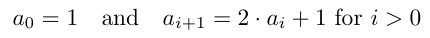

## Introduction to Python

### Numeric Variable Types
Today we are going to learn about base numeric variable types in Python, and learn how to write scripts (programs) that can compute useful things.

There are a number of base numeric variable types built into Python. The ones that we will be looking at today are `ints` (short for integers), `floats` (short for floating point decimal numbers), and `complex`, which contain real and imaginary parts stored as floats.

Let's experiment with using these types in the IPython console. Type the number 7 and hit enter. You should see something like this.

```python
In [1]: 7
Out[1]: 7
```

The IPython console will accept arbitrary Python commands, entered after the `In [#]:`, and execute them, handing you back the results of the computation, displayed after the `Out[#]:`.

You can test this out with other numbers. Try one with a decimal and another by passing two numbers to the `complex()` constructor (we will talk about what these things are later).

```python
In [1]: 7.5
Out[1]: 7.5

In [2]: complex(3, 4)
Out[2]: (3+4j)
```

One thing that is important to note about Python is that it is a duck typed language. What does this mean? The name duck comes from the classic "If it walks like a duck, and quacks like a duck, then it must be a duck" adage. As applied to our situation, it simply means that Python will determine what it thinks is the best type to call a variable when you use it, unless explicitly told otherwise.

To inspect what type Python thinks a number (or anything else is), you can pass it to the `type()` function. Let's see what we get out when we pass numbers of various types to this function.

#### Types

```python
In [1]: type(7)
Out[1]: int

In [2]: type(7.5)
Out[2]: float

In [3]: type(complex(3, 4))
Out[3]: complex
```

As you can see, Python assumes that a number with no decimal point is an `int`, those with a decimal point a `float`, and (surprise!) those from the `complex()` constructor as `complex`.

While very frequently these subtle differences wont matter too much, there are plenty of occasions where Python hiding this implementation detail will make you think that something will work, when really it won't. Making sure you know how to check is very important.

### Numeric Operations

At its base level Python is really just an awesome calculator that can do way more stuff than addition and subtraction. But let's focus on that functionality for now.

All of the simple operations that you think should be available are. Addition, subtraction, multiplication, division and exponentiation are all accessible via `+`, `-`, `*`, `/` and `**`, respectively.

```python
In [1]: 7 + 8
Out[1]: 15

In [2]: 7 - 8
Out[2]: -1

In [3]: 7 * 8
Out[3]: 56

In [4]: 7 / 8
Out[4]: 0

In [5]: 7 ** 8
Out[5]: 5764801
```

All of these operations output exactly what we think they would, except one. The fourth one, where we divided 7 by 8, gave us 0, even though we know that it should be 0.875. This happened because the input on both sides of the `/` were integers, so Python decided to cast the output as an integer. Let's visit all aspects of this problem.

```python
n [1]: 7 / 8
Out[1]: 0

In [2]: 7 / 8.0
Out[2]: 0.875

In [3]: 7 / 8.
Out[3]: 0.875

In [4]: int(7 / 8.)
Out[4]: 0

In [5]: 7 // 8.
Out[5]: 0.0
```

Notice that once we made one of the numbers in the operation a `float`, Python realized that it should return a `float` from the operation, and we got 0.875 as expected. This exact same procedure was followed the third time, but the trailing 0 on the `float` version of 8 was left off. Python doesn't need to see anything following the decimal point to know it should be interpreting the number as a `float`, so long as the "." is there. Similarly, we can manually cast the output of the 4th operation as an `int` by passing the result directly to the `int()` constructor. Manually casting in this way can be very useful when Python is interpreting things differently than you would like it to. The last operation that we performed is called floor division, `//`. Really, all it does is perform division and truncate the result. So, where `7 / 8.` gave us `0.875`, `7 // 8.` cuts off after the `0.` giving us `0.0`.

The last operation that we will go over is the modular division operator, `%`. This operation is the sibling to `/`. Where `71 / 7` gives us the integer number of times that 7 goes into 71 (10), `71 % 7` gives us the remainder from that integer division (1).

### Variables

One of the most powerful constructs in programming is the ability to store arbitrary values in what we call variables. You can think of variable assignment as giving a name to something so that it can be accessed later by different parts of your program.

In Python, variable assignment occurs with the `=` operator. So to assign a value to a variable name (i.e. declare it), you simply put the variable name on the left side of the `=` and the value you want to associate with that variable name on the right hand side. Now that this has happened, you can access the value in the variable simply by using it's name somewhere later in your code or IPython session.

```python
In [1]: x = 1

In [2]: x
Out[2]: 1

In [3]: x + 1
Out[3]: 2
```

The name you can give a variable can technically be any contiguous set of characters, but there are some conventions followed in Python and programming in general. Python follows a variable naming convention called snake case. To write something in snake case simply use a `_` anywhere you would use a space and make sure every word is lower case. For example, `this_is_a_variable`. Giving variables good names makes your code more readable and therefore maintainable. There is a big difference between seeing a variable called `degrees` and one called `y`. You should strive to give your variables well-defined, succinct names.

There are of course cases where using less than descriptive variable names follows convention and is, therefore, just fine to use. One that comes to mind is the use of `i` to keep track of an index (we will cover this idea next week, but it wouldn't be surprising if you understood the concept already). Because of its prevalent usage for this purpose, it is usually easy to understand what is happening in that context, and the lack of descriptiveness is okay. The important thing is that the code is **understandable**.

Note that we saw no output from the first command above. This is because the return value that would have been printed to the console for output was assigned to the variable `x`. This is why we had to view it in the next line with a simple call to `x`.

A large part of the power of variables is the fact that they can change. This allows us to use a single variable name to keep track of a single thing throughout the life of a program. The exact same syntax can be used to change the value stored in the variable.

Say we want to add 5 to `x` from the previous code example and store it in `x`.

```python
In [1]: x = x + 5

In [2]: x
Out[2]: 6
```

Notice how the first line is formatted. Python knows that the `=` means variable assignment, so when it sees the first line it evaluates the right side of the equals and then puts that value in `x`, even though `x` is part of the calculation on the right side.

Changing variables in this way occurs so commonly that there is built-in shorthand for it. The result of the first line could have been achieved with `x += 5`. This *syntactic sugar* is available for all the simple operations `+`, `-`, `*`, `/`, `**`, and `%` that we covered earlier.

### Logic

Now that we have a thorough understanding of base numeric types and how to play with them and store them in Python, let's keep building our tools so that we can use them to control the flow of our program.

The most simple way to control the flow of your Python program is with an `if` statement. From a high level, an `if` statement allows us to check whether or not a certain condition is true, and perform operations specific to that situation if the condition is true.

For example, say we're asked to write a program that takes a bunch of numbers and gives back to us those that are even. We would need to write an `if` statement that identifies whether or not a number is even (we'll talk about how to do this), and then give back only those that meet the even condition. This is a program that will be entirely within our ability to implement at the end of next week; for now though, let's focus on the `if` statement.

The general syntax of an `if` statement in Python is:

```python
if condition:
    if_block_statement
```

Notice how the `if` statement ends in a colon `:`. This is the way that Python declares the start of an indentation block. The purposes of indentation blocks manifest themselves in many different ways, but with our `if` statement just know that they mark a section of code that is run under specific circumstances.

#### Conditionals

Let's tackle this one part at a time. What does it mean to be a condition? Really, all an `if` is checking is whether the conditional evaluates to `True` or `False`. If the condition is true, then the body of the `if` statement is executed. If the condition is false, the `if` block is skipped. Intuitively, true and false are concepts that make perfect sense to us. But we should take the time to clearly define them in a programming context here.

`True` and `False` are what we call booleans in logic (`bool` for short), and what Python calls them. They are a special variable type with many potential uses; mainly they are used as a way to put a label on the truth of a statement. There are two specifically reserved words for bools in Python, `True` and `False`. Note that these begin with capital letters.

```python
In [1]: type(True)
Out[1]: bool

In [2]: type(False)
Out[2]: bool
```

In addition, a wide variety of statements can evaluate to booleans. The ones that we will focus on today are the equalities, *equal to* and *not equal to*, and the inequalities, *less than*, *greater than*, *less than or equal to* and *greater than or equal to*. These comparisons are available in Python via `==`, `!=`, `<`, `>`, `<=` and `>=`, respectively.

```python
In [1]: 1 == 2
Out[1]: False

In [2]: 1 != 2
Out[2]: True

In [3]: 1 < 2
Out[3]: True

In [4]: 1 > 2
Out[4]: False

In [5]: 1 <= 2
Out[5]: True

In [6]: 1 >= 2
Out[6]: False
```

#### Using the If

Now that we understand conditionals, let's talk about how we can use them with variables to make our programs dynamic. Consider the following code block.

```python
if x > 5:
    x += 10
print x
```

**Note**: The print function simply pipes the value passed to it to the console.

In the above code we don't need to know what the value of `x` is, but we can say that if it's greater than 5, it will come out of the code block 10 greater than before the `if` statement.

From what we know so far, this functionality isn't super useful. So let's quickly go over a way that we can make our Python more flexible. Until now, we've had to hard code any variable or value that we want to use in our program. Python has a built in way to accept input from the user of a program. Let's examine this now. Consider that the following code was stored in a file named `print_number.py`.

```python
x = raw_input('Please enter a number: ')
print(x)
```

If we then ran the script from IPython, we would would see:

```python
In [1]: run print_number.py
Please enter a number:
```

**Note**: The `raw_input()` function accepts character input from the keyboard, printing the message it is passed as a prompt.

We can then type a number followed by enter, and the script will print that number.

```python
In [1]: run print_number.py
Please enter a number: 3
3
```

**Note**: `raw_input()` halts the execution of your script, so nothing will happen until you type something and press enter.

Now that we have a way to get arbitrary input from the user of our program, we can begin to see the full power of the `if`. Let's combine the last two code blocks from above, and say we stored it in a script named `print_number_with_if.py`.

```python
x = int(raw_input('Please enter a number: '))
if x > 5:
    x += 10
print(x)
```

**Note**: `raw_input()` actually interprets the input as strings, so we have to manually tell Python to treat the number we pass as an integer with `int()`. We'll talk about strings more next week.

If we then ran the script from IPython as above, let's look at two ways we could interact with it.

```python
In [1]: run print_number_with_if.py
Please enter a number: 3
3

In [2]: run print_number_with_if.py
Please enter a number: 8
18
```

Notice that the first time we run `print_number_with_if` and give it 3, it acts just like `print_number`. However, the second time, when we give it 8, it adds 10 and prints 18. Why did it do this? Because 8 is greater than 5, so our program added 10 to it before it was printed.

This may seem like a trivial example, and therefore, not very exciting. Let me assure you, though, that what you have just learned is amazingly powerful! So congratulations!

#### Building on the If

Ok, so, the `if` is cool. But it seems like, due to it's structure, there are only so many things you can do with it. Let's summarize this with what's known as a *flow diagram*.


You can see that there are two branches created by the `if` statement, one when the condition is true, and the other when it is false. In the former case, the conditional code is executed, and in the latter, the conditional code is ignored. But what if we wanted to check more than one thing (i.e. have more than two branches in our flow diagram)?

Python gives us two ways to do this. One by offering other conditionals, `elif` and `else`, and the other by allowing us to combine conditions with logicals `and`, `or` and `not`.

##### Elif and Else

In addition to the `if`, Python provides us with two other statements to build out those logical trees, the `elif` and the `else`. The `elif` is just like the `if` - it accepts a condition to check the truth of and has an indented code block that is executed when that condition evaluates to `True`. The `else` is similar, but it doesn't accept a condition. Instead, it mainly acts as a catch all for any other situation that you don't need to cover with your `if`s and `elif`s. Note that there can only be a single `if` and up to a single `else`, but any number of `elif`s in an `if`-`elif`-`else` block. Let's take a closer look at this in the following code block that we'll store in `if_elif_else.py`.

```python
x = int(raw_input('Please enter a number: '))
if x < 0:
    print('You entered a negative number.')
elif x > 0:
    print('You entered a positive number.')
else:
    print('You entered the number 0.')
```

Running the program and passing a number when prompted will cause the conditions to be checked and result in the following output.

```python
In [1]: run if_elif_else.py
Please enter a number: 10
You entered a positive number.

In [2]: run if_elif_else.py
Please enter a number: -10
You entered a negative number.

In [3]: run if_elif_else.py
Please enter a number: 0
You entered the number 0.
```

Let's specifically talk about how the `if`-`elif`-`else` statements work. The programmers of Python designed these statements so that they would execute highly efficiently. They achieved this by making it so that when Python is going through your `if`-`elif`-`else` statements and encounters a condition that evaluates to `True`, it will execute the corresponding conditional code block and then skip to the line directly following the last conditional block. Let's examine this in the following code saved again in `if_elif_else.py`.

```python
x = int(raw_input('Please enter a number: '))
if x > 5:
    print('You entered a number bigger than 5.')
elif x > 0:
    print('You entered a positive number.')
elif x < 0:
    print('You entered a negative number.')
else:
    print('You entered the number 0.')
```

Running this program produces slightly unexpected results. But, they will soon make perfect sense, and knowing what is going on will allow you full control over the flow of your programs.

```python
In [1]: run if_elif_else.py
Please enter a number: 5
You entered a positive number.

In [2]: run if_elif_else.py
Please enter a number: 6
You entered a number bigger than 5.
```

In the first example we got something unsurprising. The only condition that evaluates to true when `x` is 5 is the second one. However, the second example yields only 'You entered a number bigger than 5.', even though 6 is greater than 0. This shows that only one of the conditional blocks in an `if`-`elif`-`else` statement will ever be evaluated, and once this happens the rest are skipped.

**Note**: The `else` part of the statement is actually optional. If it is not included, then we'd notice that at most one of the conditional blocks in an `if`-`else` statement will be evaluated.

##### And, Or and Not

There are plenty of times when we want to execute some specific code when more than one condition is true. Check out the following code snippet.

```python
if x > 5:
    if x < 10:
        print x
```

We can see that what this **nested** `if` statement is checking for are numbers that lie in the interval (5, 10), and if it finds one it prints it. We can intuitively guess that there is a better way to check for this condition. And there is!!!

Python gives us full access to what are known as boolean operations. The ones that we will use most often are `and`, `or` and `not`. Both `and` and `or` take two conditions as inputs, while `not` takes only a single condition. They all return a single boolean, with `and` requiring both conditions to be `True` to return `True`, and the `or` requiring only one of the conditions to be `True` to return `True`. The `not` switches the truth of the input condition. These operations are derived from formal logic, and you can find a full discussion of their intricacies found [here](https://en.wikipedia.org/wiki/Truth_table).

What this means is that we now have a natural way to combine conditions. The previously nested `if` statement can now be written as a simple `if x > 5 and x < 10`. We can also chain other interesting conditionals together.

```python
if x > 10 or x < 5:
    print(x)

if not (x <= 10 and x >= 5):
    print(x)
```

Notice how the first `if` in the above code snippet uses an `or`, printing `x` if it is greater than 10 or less than 5. Inherently this statement is also saying that it will print `x` if `x` is not between 5 and 10, which is expressed in the second `if` statement. This illustrates an important point - there is always more than one way to accomplish the same thing in programming.

### Looping

We are now prepared to learn about another extremely powerful programming construct. Everything that we learned in the last section on logic is part of an idea called **control flow**. Flow refers to the order in which statements in your program are executed. Controlling this flow can be done in many ways; so far we have learned about `if`-`elif`-`else` statements, but there are a number of others.

One thing that we find in programming is that we want to do something over and over (and over), possibly under the same circumstances each time, but frequently under slightly different circumstances each time. With the tools that we currently possess, we have to write out a line of Python for each time that we want to do that something. Let's go through a more concrete example.

Consider that you are asked to write a program to calculate the sum of the numbers between 1 and 8 (without the use of any built-in Python functions). We could write an extremely simple program to do this for us.

```python
sum_1_8 = 1 + 2 + 3 + 4 + 5 + 6 + 7 + 8
print(sum_1_8)
```

While this definitely works, there are a couple of things I want to draw your attention to (which will become themes about how to analyze how well code is written). First, what happens if we want to add the numbers 1 through 9 together? Not that hard, just add 9 to `sum_1_8` you say. Ok, fine. What if you want to add 2 through 9 together? Now we could take `sum_1_8`, add 9 and subtract off 1. And that works, but it involves some thinking to make this new idea work with the existing code that we have written.

Instead of having all of these **hard coded** values in our definition of `sum_1_8`, we could instead **abstract** away part of our problem. What is this abstraction? In programming, we talk about abstraction when we want to refer to an idea whose implementation is more general and/or hidden from us. In the above example, we see exactly what we're doing to sum the numbers 1 through 8. This isn't abstracted at all. So how are we to solve this problem more abstractly?

This is a question that you will frequently be faced with; how do you do something... in code? A good strategy to solve these problems is to approach the problem from a high level (i.e. in plain English, no code).

So let's do that with our coding problem above. We were asked to add together the numbers 1 through 8. This can be thought of as given a starting number, 1, and then adding on the next number, 2, to get 3. Then we can repeat this process, taking the next number, 3, and adding it on, giving us 6. We could then continue this process until we reach the final number, 8, and then stop. (This is inherently what we were doing in that single line of Python when we said `1 + 2 + 3 + 4 + 5 + 6 + 7 + 8`, but that implementation is what we call **brittle** - it only works for that specific case and breaks whenever we want to do something even slightly different.)

#### While Loops

Notice how in our high level description of the problem solution, we kept saying "and then". This repetitious language brings us to our next control flow tool, loops. There are two types of loops in Python, but today we're going to focus on `while` loops. `while` loops are an amazing tool which simply allow us to have a predefined chunk of code which we tell Python we want to run over and over under certain conditions.

So what are these conditions? They are in fact the conditions we learned about in the logic section (i.e. any expression that is evaluated to a boolean). So how does this work with `while`? Let's take a look at the structure of a `while` statement.

```python
while condition:
    while_block_statement
```

As with  `if`, a `while` statement has a condition; unlike the `if`, the while block will execute over and over again as long as the condition is `True`. This is where we get the name `while` loop from - as long as the condition evaluates to `True`, we will execute the code inside the `while` block, looping over it. The `while` condition is checked each time before the `while` statement block is executed.


Let's look at how we can harness this new structure to solve our previous problem. Take a look at the following code.

```python
total, x = 0, 1
while x <= 8:
    total += x
    x += 1
print(total)
```

Let's break down this code to see what is going on. On the first line, we declare a couple of variables (here you see the Python syntax used to do multiple assignments in a single line), `total` and `x`. `total` is the variable that we are going to aggregate our sum into, and `x` is the first number that we start our adding at. The next line declares the start of our newly learned `while` block. It's condition is x <= 8, and naturally reads as: "while x is less than or equal to 8", do stuff in the block. The block then says we are to add the current value of `x` to total, then add one to `x`.

We know that this `while` statement will loop through the `while` block many times, but the values of `total` and `x` will change each time through the loop. So, let's take a look at what the values of both of these variables are throughout the execution of the loop.

| After loop #  |   total   |   x   |   x <= 8   |
| ------------- |:---------:|:-----:|:----------:|
| 1             |  1        |   2   |    True    |
| 2             |  3        |   3   |    True    |
| 3             |  6        |   4   |    True    |
| 4             |  10       |   5   |    True    |
| 5             |  15       |   6   |    True    |
| 6             |  21       |   7   |    True    |
| 7             |  28       |   8   |    True    |
| 8             |  36       |   9   |    False   |

We see that as we continue through the loop, `total` is growing by the value of `x` from the previous execution of the loop, and this continues until the condition `x <= 8` evaluates to `False`. This happens when `x` is 9, at which point we exit the loop, and `total` has accrued the sum of the numbers 1 through 8. Magic!!

To solidify this idea in the framework of control flow, take a look at the structure of the `while` loop as a flow diagram.


We see that the trick to the loop, in terms of control flow, is that we return to check the condition each time after the `while` block is executed to determine if we should execute it again.

#### Infinite Loops

While the power of this looping construct is undeniable, there is one extraordinarily important thing that should be on your mind when you're writing `while` loops.

Notice that our condition in the `while` loop example made sense because we were changing the value of `x` each time through the loop (with the line `x += 1`). What would happen, though, if we didn't do this incrementing (other than not calculating the correct value for `total`)?

Let's take a look at what the loop table would look like in this situation.

| After loop #  |   total   |   x   |   x <= 8   |
| ------------- |:---------:|:-----:|:----------:|
| 1             |  1        |   1   |    True    |
| 2             |  2        |   1   |    True    |
| 3             |  3        |   1   |    True    |
| 4             |  4        |   1   |    True    |
| Etc.          |  Etc.     |  Etc. | **Always** True |

Aside from the obvious problem that we aren't finding the sum of the values 1 through 8, we run into another, very egregious issue. Will the condition `x <= 8` ever evaluate to `False`? No. So will the loop ever finish executing?? It won't!!

We call this idea getting stuck in an **infinite loop**. They are almost *always* bad, and they usually manifest themselves as your program running for way longer than you would expect it to run, at which point you realize that something weird is happening. The common cause of these infinite loops is almost always having a condition that always evaluates to `True`.

#### More Control Flow

##### Continue

So what if we want even more control over how the body of our loop is executed? Let's motivate this idea with a problem. Say we want to add all the numbers from 1 to 8... but not 5. Again, we could solve this with our current solution, and then subtract off 5. But, again, that takes a lot of manipulation. Instead, we can use the main structure of our current loop and add in a new condition with an `if` and use a new tool to interrupt our program's flow.

Enter `continue`. What `continue` does is simply tell Python that it should skip the rest of the body of the `while` block, and jump (`continue`) to the next iteration of the loop. Let's take a look at `continue` in action.

```python
total, x = 0, 1
while x <= 8:
    if x == 5:
        x += 1
        continue
    total += x
    x += 1
    print total, x
print total
```

In this updated program we can see that we will, at each iteration of the loop, check to see if the current value that we're about to add on to `total` is 5. If it isn't, we go on with our aggregation of `total`. If `x` is 5, we add one to `x` (do you see why we need to do this?), and skip adding `x` to total by executing a `continue`, jumping immediately to the next iteration of the loop. Let's see how this would look in the loop table.

| After loop #  |   total   |   x   |   x <= 8   |    x == 5   |
| ------------- |:---------:|:-----:|:----------:|:-----------:|
| 1             |  1        |   2   |    True    |    False    |
| 2             |  3        |   3   |    True    |    False    |
| 3             |  6        |   4   |    True    |    False    |
| 4             |  10       |   5   |    True    |    True     |
| 5             |  10       |   6   |    True    |    False    |
| 6             |  16       |   7   |    True    |    False    |
| 7             |  23       |   8   |    True    |    False    |
| 8             |  31       |   9   |    False   |    False    |

During the fourth iteration of the loop, when `x` is 5, we see that `total` does not get 5 added to it.  Therefore, the final answer is, as we'd expect, 31.

##### Break

In addition to the continue, we have another, more aggressive, method to control the flow of our programs - `break`. Where `continue` allowed us to skip the rest of the loop's code block and jump directly to the next iteration of the loop, `break` allows us to manually leave the loop entirely.

Time for an illustrative example. Consider trying to write a program that adds the numbers 1 to 8, but only up to 25. If the sum exceeds 25, the total is set to 25 and the message, "The sum exceeded the max value of 25." is printed. We could certainly complete this task with the tools that we already possess, but `break` is better suited to meet the needs of this situation. Let's take a look at what this implementation would look like.

```python
total, x = 0, 1
while x <= 8:
    if total > 25:
        total = 25
        print('The sum exceeded the max value of 25.')
        break
    total += x
    x += 1
print(total)
```

At this point I'm confident that you are tired of looking at tables of values, but let's do this one last time for consistency under the above program specifications.

| After loop #  |   total   |   x   |   x <= 8   | total > 25  |
| ------------- |:---------:|:-----:|:----------:|:-----------:|
| 1             |  1        |   2   |    True    |    False    |
| 2             |  3        |   3   |    True    |    False    |
| 3             |  6        |   4   |    True    |    False    |
| 4             |  10       |   5   |    True    |    False    |
| 5             |  15       |   6   |    True    |    False    |
| 6             |  21       |   7   |    True    |    False    |
| 7             |  28       |   8   |    True    |    True     |

At this point `total` is set to 25 and the message "The sum exceeded the max value of 25." is printed. The loop is exited and then 25 (the value of `total` now) is printed to the screen.

##### Pass

There's one more statement that allows us control over our programs - `pass`. All `pass` does is tell Python to do nothing. Because of this, it is rarely used for control flow, since the same result could be achieved by doing nothing. Instead, it is frequently offered as a place holder, since Python will complain about empty code blocks.

So while you're building up the skeleton of a program, `pass` can be useful as a method to get the framework written up without focusing on implementation. To illustrate...

```python
if x < 0:
    pass
elif x > 0:
    pass
else:
    print('x is the value of 0.')
```

In the above example, we have set it up so that if `x` is 0, then our program tells us so. Otherwise, we know that we're going to do something specific when `x` is positive and something different when `x` is negative.  We have used pass to suggest that we either haven't figured those things out yet, or simply haven't implemented them.


## Warm-ups

1. Multiplication can be thought of as repeated additions. Write a script that takes as input two positive integers, `a` and `b`, and returns `a * b`. Do this without using the `*` operator.
2. Integer division can be done with repeated substraction, similar to how multiplication can be done with addition. Write a script that takes as input two positive integers, `a` and `b`, and returns `a / b`. Do this without using the `/` operator.
3. Exponentiation is repeated multiplication. Write a script that takes as input two positive integers, `a` and `b`, and returns `a ** b`. Do this without using the `**` operator.
4. For two integers, `a` and `b`, `a` divides `b` if `a / b` has no remainder. Write a script that takes as input two positive integers, `a` and `b`, and says whether `a` divides `b`.
5. `while` loops and conditionals give you a lot of power. Try and create a game where a user is repeteadly asked to guess a number. If they get it wrong, they are asked to guess again, and if they are correct, they are told and the game ends. For extra credit, have the game tell the user whether their guess was high or low.


# Time to do Python

## Workflow
There's no better way to learn a programming language than to try and solve real problems with it. To that end, this assignment will present a good workflow for working with IPython to iteratively test code while you create your scripts in a text editor.

Let's walk through an example. You should make sure to follow along so you get some hands on practice. Consider the problem:

    Write a script that prints the sum of the whole numbers between 1 and a user inputted number.

Alright, first we want to open up IPython and our favorite text editor (Atom if you followed our advice from day 1). I prefer to have these two side by side so that it's easy to look at and work in each.

We're going to have to start a new file in our text editor to store our script. You should give your script a short name that quickly describes what it does. Python scripts are appended with the file extension `.py`. So, for this problem I would name my script something like `sum_whole_numbers.py`. Now we're off to the races.

At this point, I start thinking about how I'm going to solve my problem. Most of the time this means that I want to experiment with potential solutions/approaches. This is exactly what IPython is great for. It allows you to interact with Python one step at a time and remembers what you've done for the entire time the *session* has been open.

With that in mind, I want to give myself a variable to play with as I solve this problem. Let's call it `my_num` and set it to 7 in IPython.

**Note**: If you want to look at the variables currently in the namespace of your IPython session, simply type the command `whos` into the console.

```python
In [1]: my_num = 7

In [2]: whos
Variable   Type    Data/Info
============================
my_num     int     7
```

Now that I have a number to work with, it's time to think about how to solve the problem. I know that I'm going to need a variable to store my sum result in and another to keep track of the number I'm going to add to that sum result. I'll call these `sum_result` and `current`, respectively.

```python
In [3]: sum_result = 0

In [4]: current = 1
```

I know that I'm going to need a while loop that terminates when `current` is greater than `my_num` (i.e. keeps running while `current` is less than or equal to `my_num`).

```python
In [5]: while current <= my_num:
   ...:     
```

Notice that when we start a `while` loop IPython knows that we're going to want to write the `while` block, so it prompts for that with the `...:`. What is this `while` going to do at each iteration? Well, we need to add the value of `current` (remember we will only make it into the loop if `current` is less than or equal to `my_num`) to `sum_result`, and then increment `current` by one. Let's let IPython know what we want to do now!

```python
In [5]: while current <= my_num:
   ...:     sum_result += current
   ...:     current += 1
   ...:     
```

Ok, so, what happened? IPython didn't show us anything, did it even work?? It did, actually! We just have to check `sum_result` to see what we got.

```python
In [6]: sum_result
Out[6]: 28
```

### Tying it All Together

This is great! Now that we know how we're solving our problem in Python, we can go back to writing our script. Let's take what we've written and put it in our text file, `sum_whole_numbers.py`.

```python
my_num = 7
sum_result = 0
current = 1
while current <= my_num:
    sum_result += current
    current += 1
```

But wait, weren't we asked to take input from the user? And didn't we need to print the result? These aren't hard fixes; remember the `raw_input()` function to get numbers from the user? Let's use that. All we need to do to print the value we computed is pass `sum_result` to `print()`.

```python
my_num = int(raw_input('Enter a number to find the sum up to: '))
sum_result = 0
current = 1
while current <= my_num:
    sum_result += current
    current += 1
print(sum_result)
```

Now we can simply run our new script from IPython. Know that IPython needs to know where the script you wrote is in your file structure. If you open IPython from the same directory that your script is saved in, there should be no problem. Otherwise, you'll need to give IPython a path to the script.

```python
In [7]: run sum_whole_numbers.py
Enter a number to find the sum up to: 7
28

In [8]: run sum_whole_numbers.py
Enter a number to find the sum up to: 9
45
```

This is awesome! We now have a script that will solve a problem for arbitrary input! Congratulations, you've written your first dynamic program! The process we worked through above is generally iterative; as you test and find chunks of code that you know work in IPython, you iteratively add them to your script.

## Assignment Questions

1. Write a script that takes a user inputted number and prints whether it is positive, negative or zero, with "The inputted number is (positive/negative/zero)" depending.
2. Write a script that takes two user inputted numbers and prints "The first number is larger" or "The second number is larger" depending on which is larger. (**Hint**: you'll need to use `raw_input()` twice.)
3. Write a script that computes the sum from 0 to a user inputted number. This time though, start at the user inputted number and work down. This answer will look very much like the example above, you'll just need to change a couple of things.
4. Write a script that computes the factorial of a user inputted number. If you don't know what a factorial is or need a review, check [this](https://en.wikipedia.org/wiki/Factorial) link out. Again, your solution is going to look a lot like the code above. Things you should think about:
    * What is the process of computing a factorial if you were to compute it by hand?
    * What is the common starting place when trying to compute the factorial of any number?
5.  Write a script that computes and prints all of the divisors of a user inputted number. If you don't know what a divisor is or need a review, check out [this](https://en.wikipedia.org/wiki/Divisor) link. Things to think about:
    * How do you determine if a single number is a divisor of another?
    * How do you do this multiple times (**Hint**: it involves a while loop)?
    * When do you stop the loop?
6.  Write a script that computes the greatest common divisor between two user inputted numbers. If you don't know what a greatest common divisor is, check out [this](https://en.wikipedia.org/wiki/Greatest_common_divisor) link. Things to think about:
    * How do you get two numbers from the user?
    * Where should you start your search for the GCD?
    * Where/how should you end your search?
7.  Write a script that computes the least common multiple between two user inputted numbers. If you don't know what a least common multiple is or want a review check [this](https://en.wikipedia.org/wiki/Least_common_multiple) out. Things to think about:
    * How do you get two numbers from the user?
    * Where should you start your search for the LCM?
    * Where/how should you end your search?
8. Write a script that determines whether or not a user inputted number is a prime number and prints `'The number you inputted is (not) a prime number.'` depending on what your script finds. If you don't know what a prime number is or need a review, check out [this](https://en.wikipedia.org/wiki/Prime_number) link. Things to think about:
    * How do you check if a number is divisible by another number?
    * What numbers are a prime number divisible by?
    * How do you check all of the numbers a number could be divisible by (**Hint**: use a loop)?
    * When do you stop the loop?
9.  One can use loops to compute the elements of a mathematical series. Series can be defined recursively with the value of each element depending on the one that comes before it. Consider the series created by the rules:  

      

    Write a script that prints the `nth` element in the series as determined by input from the user. e.g. If the user inputs the number `3`, your script should print the 3rd element in the series, `15`. You're welcome to check the math! Things to think about:
    * You know you're going to use a loop to solve this problem, how?
    * How do you store each of the elements as you calculate them with the loop?
    * How many elements do you need to keep track of at any one time?
    * How do you know when to stop the loop?


## Introduction to Strings and Lists

Last week, we learned about how to use Python's power with `while` loops and conditionals, operating on some simple built in numeric types. Today, we are going to learn about a couple of data structures that will continue to build up your power in Python, and we'll learn about a new type of loop.

### Strings

First, we are going to learn about another common data type, strings. From a high-level perspective, a string is just a bit of text. This could be text that you have read in from a file, html that you have pulled from the Internet, or any other text. From Python's perspective, a string (type `str`) is simply a collection of encoded characters. Wait, what's an encoding...?

An encoding is just a fancy way of us saying that the characters in our string follow a certain format, or structure. The reason it matters for us in terms of our Python programs, though, is that Python expects our strings to be in one of a couple of different encodings (either `ASCII`, `utf-8`, or `unicode`). This isn't something you will run into often, and especially not when defining your own strings (it's probably most prevalent when pulling text from the Internet). However, it's worth noting because there is a good chance that sometime in your Python career, you will end up with Python telling you it doesn't recognize a certain character in one of your strings, and an unexpected encoding will most likely be at the heart of that error.

In Python, strings are recognized as a collection of characters surrounded by a set of either single quotation marks (`'...'`) or double quotation marks (`"..."`). So long as you open and close your string with a **matching** set of single or double quotation marks, you are free to use either. The single caveat to that is that if you are writing an expression with a single quotation mark in it (such as "Don't do that"), you will **have to** use a matching set of **double** quotation marks. Let's experiment with some strings in the IPython console...

```python
In [1]: 'This is a string.'
Out[1]: 'This is a string.'

In [2]: "This is another string, but this time with double quotation marks."
Out[2]: 'This is another string, but this time with double quotation marks.'

In [3]: 'They told me not to do this, but I didn't listen.'

SyntaxError: invalid syntax
```

Just like we expected, we can use both single and double quotation marks. What happened in the 3rd case there? Well, we opened the string with a single quotation mark, and Python started looking for the next single quotation mark to close the string. When it found that quotation mark in the word `didn't`, it assumed the string was closed after `didn`. As a result, this left `t listen.'` just hanging out, and Python didn't know how to interpret that, resulting in our error. The solution to this, as mentioned above, is to use double quotation marks in any case where your text will have single quotation marks in it. For example...

```python
In [1]: "Now that I've got double quotes, I can use all the contractions!"
Out[1]: "Now that I've got double quotes, I can use all the contractions!"

In [2]: "Can't, won't, didn't, don't... all the contractions!"
Out[2]: "Can't, won't, didn't, don't... all the contractions!"
```
As a final note before we dive into string operations, we can store strings in variables in the exact same way that we can store an `int`, `float`, or `complex`.

```python
In [1]: my_str_variable = 'This is a string variable.'

In [2]: my_str_variable
Out[2]: 'This is a string variable.'
```

#### String Operations

Surprisingly, a couple of our standard mathematical operations will work on strings, namely `+` and `*`. We can use the `+` operator to add two strings together (this is known as string **concatenation**), and we can use the `*` operator to repeat a string a given number of times. Let's take a look...

```python
In [1]: 'My first string' + 'My second string'
Out[1]: 'My first stringMy second string'

In [2]: 'Repeating string' * 3
Out[2]: 'Repeating stringRepeating stringRepeating string'
```

Note that Python didn't put spaces between the strings with either the `+` operator or the `*` operator. Why not? Because it wasn't told to! In this case, and in programming in general, we have to be extremely explicit about what we want the computer to do. To fix this, we can add a space in the middle of the first case, and then add a space to the end of our string in the second case.

```python
In [1]: 'My first string' + ' ' + 'My second string'
Out[1]: 'My first string My second string'

In [2]: 'Repeating string ' * 3
Out[2]: 'Repeating string Repeating string Repeating string '
```

That looks much better! But, what about that pesky little space at the end of our second string: `'Repeating string Repeating string Repeating string '`. Is there a way to remove this? It turns out there is! One of the methods (a name for a function that is attached to a particular object) that we can call on strings is the `strip()` method. Methods are something that we will cover in much more depth later, but for now just note that we call them on our objects through **dot notation**. We simply place a `.` at the end of our object (`str`, `int`, `float`, any variable, etc.), and then call the method like we would call a function. Here's how the use of this **dot notation** looks in practice.  

```python
In [1]: 'Repeating string Repeating string Repeating string '.strip()
Out[2]: 'Repeating string Repeating string Repeating string'

In [1]: ' Repeating string Repeating string Repeating string '.strip()
Out[2]: 'Repeating string Repeating string Repeating string'
```

So, what did the `strip()` method do? In the first example, it removed the trailing space from the string. In the second example, it removed both the leading and trailing spaces. This is exactly what the `strip()` method does - by default (without any arguments) it removes leading and trailing whitespace (*note, the method can actually remove any leading or trailing characters if you pass them to `strip()`, but whitespace is the default character that it removes*).

Are there other things that we can do with strings? There are tons! Let's store our string in a variable below, so we can get some exposure working with strings in variables.

```python
In [1]: my_str_variable = 'this IS my STRING to PLAY around WITH.'

In [2]: my_str_variable.capitalize()
Out[2]: 'This is my string to play around with.'

In [3]: my_str_variable.upper()
Out[3]: 'THIS IS MY STRING TO PLAY AROUND WITH.'

In [4]: my_str_variable.lower()
Out[4]: 'this is my string to play around with.'

In [5]: my_str_variable.replace('STR', 'fl')
Out[5]: 'this IS my flING to PLAY around WITH.'

In [6]: my_str_variable.split()
Out[6]: ['this', 'IS', 'my', 'STRING', 'to', 'PLAY', 'around', 'WITH.']
```

These are some of the most commonly used string methods. You can see above what they do by default: `capitalize()` capitalizes the first letter of the string and lowercases the rest; `upper()` converts all the letters in the string to uppercase, and `lower()` to lowercase; `replace()` replaces a given substring in your string with another given substring; finally, `split()` splits the string by an inputted string (whitespace by default, just as with `strip()`). There are many more string methods available, and you can check them out in the [docs](https://docs.python.org/2/library/stdtypes.html#string-methods).

Alternatively, you can find out what methods are available to call on strings from the IPython terminal itself (this is one of the really awesome features of IPython)! Using tab completion, if you have a string stored in a variable, you can type the variable name followed by a period, and then use tab complete to see all the methods available for strings!

```python
In [1]: my_str.  # Hit tab now!

my_str.capitalize  my_str.isalnum     my_str.lstrip      my_str.splitlines
my_str.center      my_str.isalpha     my_str.partition   my_str.startswith
my_str.count       my_str.isdigit     my_str.replace     my_str.strip
my_str.decode      my_str.islower     my_str.rfind       my_str.swapcase
my_str.encode      my_str.isspace     my_str.rindex      my_str.title
my_str.endswith    my_str.istitle     my_str.rjust       my_str.translate
my_str.expandtabs  my_str.isupper     my_str.rpartition  my_str.upper
my_str.find        my_str.join        my_str.rsplit      my_str.zfill
my_str.format      my_str.ljust       my_str.rstrip      
my_str.index       my_str.lower       my_str.split
```

**Note**: This works for all of our variable types! Not only that, but we can also tab complete the names of the variables that IPython currently knows about (those in the **namespace**).

#### Working with individual characters in strings

We know how to work with an entire string via some of the methods that we've discussed, but what if we wanted to work with the individual characters? There are a couple of ways to do this, but the first we'll focus on is through indexing. We know that to Python, a string is just a collection of characters. It turns out that we can access the individual characters simply by asking Python for a given numbered element in our collection (i.e. the string).  We do this by placing the element number that we want in square brackets, `[]`,  right after our string (or variable, if it's stored in one). This element number is referred to as the **index** of the character (or element, if it's not a string - more on this soon).

```python
In [1]: my_str_variable = 'Test String'

In [2]: my_str_variable[1]
Out[2]: 'e'

In [3]: my_str_variable[5]
Out[3]: 'S'

In [4]: my_str_variable[-1]
Out[4]: 'g'

In [5]: my_str_variable[-3]
Out[5]: 'i'
```

Using indices like this, we can access any element of a string. But why is the element at index 1 `e`, and not `T`? After all, `T` is the first element in the string. Also, what are those negative numbers doing? In the case of the former, it turns out that Python (and many programming languages) starts indexing at 0, which means that the first element in our string (and any collection that supports indexing) is accessed via indexing at 0. We refer to languages that work this way as **zero indexed**. As for the negative numbers, this is a way to access elements starting from the end of the string, rather than the beginning. Indexing from the end starts from -1 and continues downwards from there. So, we would use -2 to access the `n` in the string.

Note that we can also access any given number of the characters (any **substring**) by combining multiple index numbers separated by a colon `:`. For example:

```python
In [1]: my_str_variable = 'Test String'

In [2]: my_str_variable[1:3]
Out[2]: 'es'

In [3]: my_str_variable[5:9]
Out[3]: 'Stri'

In [4]: my_str_variable[-6:-1]
Out[4]: 'Strin'

In [5]: my_str_variable[1:]
Out[5]: 'est String'

In [6]: my_str_variable[:-1]
Out[6]: 'Test Strin'
```

This indexing turns out to be pretty useful. You might notice, though, that when indexing from `[1:3]`, only the letters at index 1 and 2 are returned; when indexing from `[5:9]`, we get the letters at indices 5, 6, 7, and 8. This is because the indices that you pass in are inclusive on the left side, and exclusive on the right side. This means that when you index, you will grab letters from the starting index that you give up to but not including letters at the ending index that you give.

What about those last two examples, where there isn't an ending index or a starting one? If you don't give an ending index, then Python assumes that your ending index is the last index in the string. Similarly, if you don't give a starting index, Python assumes that your starting index is the first index in the string. Remember, this is the zeroth index in Python (don't worry if this feels confusing, you'll get used to it quickly).

Is there a way to grab elements at regular intervals in a string? For example, what if we wanted to grab every second letter? Python allows us to do this by passing in an optional third number while indexing. This optional third number, also separated by a colon (`:`), tells Python the step size by which to move through the string when indexing. So, if we wanted to grab every second letter from the beginning to end, we could index with `[::2]`. If we wanted to grab every 3rd letter from the letter at index 2 to the letter at index 10, we could use the indexing `[2:10:3]`.

```python
In [1] my_str_variable = 'Test String'

In [2]: my_str_variable[::2]
Out[2]: 'Ts tig'

In [3]: my_str_variable[2:10:3]
Out[3]: 'sSi'
```

Got it, enough indexing already! Is there a way to cycle (or step through) each one of the letters one by one, and do something with the conditional logic we learned, rather than just grabbing a certain letter or group of letters? Of course! (Why would I ask a question for which the answer was no? That would be lame.)

#### Iteration and Strings

We can cycle through all of the letters in our string (a process called **iteration**) in one of a couple of different ways. Let's first look at cycling through with a `while` loop, since we worked with those last week.

```python
my_str, idx = 'hello', 0
while idx < 5:
    print my_str[idx]
    idx += 1
```

This while loop will **iterate** over the letters of our string `hello`, printing each one until `idx` reaches the value 6. Since we knew the length of our string (i.e it's 5 letters long), we knew that we could use the condition `while idx < 5:` for our loop checking, and ensure that all the letters would be printed. What if we didn't know the length ahead of time, though? There is actually a function that we can use to figure this out (we'll talk much more about functions and how they work later). It's `len()`, and we simply call `len()` with our string passed as an argument, and it returns the length of our string.

```python
In [1]: my_str = 'hello'

In [2]: len(my_str)
Out[2]: 5
```

Now, we can write our `while` loop to be a little bit more general:

```python
my_str, idx = 'hello', 0
while idx < len(my_str):
    print my_str[idx]
    idx += 1
```

Great! But we did mention that there are other ways to iterate over the letters in our string, and in general we try to stay away from `while` loops in Python.

The other way that we can iterate over the letters in our string is to use a `for` loop. `for` loops are built off of the same idea of `while` loops (doing something over and over again), but instead of continuing until some condition is no longer met, `for` loops operate directly on iterables. This leaves the concern about when to stop for Python to figure out. With a `for` loop, we don't have to care how many iterations/cycles the loop will go through. Let's look at the syntax of a `for` loop.   

```python
my_str = 'hello'
for idx in range(len(my_str)):
    print my_str[idx]
```

**Note**: the `range()` function (which we will cover in more depth when we get to functions) as used above simply gives us a list of numbers from 0 up to but not including the inputted number. In the case above, since `len(my_str)` is 5, `range(len(my_str))` returns a list of integers from 0 to 4.

This `for` loop does the exact same thing as the `while` loop we wrote above, but with slightly different syntax. How does it work? At each iteration of the loop, `idx` is assigned one of the values in `range(len(my_str))`, and then the code within the indented block is run with that value of `idx`. How does Python know what the values of `idx` will be? Python simply goes through the values of whatever is after the `in` statement **in order**, and assigns those values to `idx`, one at a time through each iteration of the loop. Since `range(len(my_str))` returns to us a list of integers from 0 to 4, those values get assigned to `idx` as we run through the `for` loop. Let's look at one of our favorite kinds of tables to view this:

| After loop # | idx | What's Printed |
| ------------ |:---:|:--------------:|
|      1       |  0  |       'h'      |
|      2       |  1  |       'e'      |
|      3       |  2  |       'l'      |
|      4       |  3  |       'l'      |  
|      5       |  4  |       'o'      |

Note that with our `for` loop, the `idx` variable is automatically changed, rather than us having to manually update it (like we did in the `while` loop). This is one of the incredibly nice aspects of `for` loops! But wait, it gets even better!

It turns out that the above implementation of our `for` loop is actually considered to be non-Pythonic. This is because the way that `for` loops are constructed allows us to achieve the same output as above by writing the following:

```python
my_str = 'hello'
for char in my_str:
    print char
```

What's going on here!? Well, instead of iterating over all of the integers in a `range(len(my_str))` call like we did in our first `for` loop, we've gotten Python to simply iterate over all of the individual characters in our string, `my_str`. In each iteration of this `for` loop, `char` stores a different letter of `my_str`, and then the call `print char` prints that character. In the end, we get the same result as either of our `while` loops above, and the less Pythonic `for` loop that we wrote above. This way is considered to be the Pythonic way to iterate over a string (or other iterable, which we'll cover next class), and so it's an important concept to grasp.

Why is it more Pythonic? That's a good question. When we say that something is more "Pythonic", this means that we are using the language in such a way that makes your code both more readable and simultaneously uses Python's power to make your solutions more optimal. Let's look at how this applies to the final implementation of our `for` loop.

We can see that it is more readable since we don't have to index into our string anymore. This means that there is less to follow along with and keep track of; rather than keeping track of both the current index we are on and what letter that index corresponds to in our string, all we have to keep track of is the current letter we're on. We can also note that our code just looks cleaner and more simple, too. In terms of making our code more optimal, since we no longer have to index into the string to grab characters, we have fewer steps in each iteration of the loop. This means less work for Python to do.

#### A Quick Aside on String Formatting

There's one more thing that we should talk about before moving on from our discussion of strings - string formatting. String formatting is going to allow us to format strings in certain ways. Probably most usefully, it's going to allow us to insert variable contents into strings dynamically. We'll get an idea of how and when this is most useful as we work through this course. For now, let's just look at the syntax of it all.  

```python
In [1]: my_name = 'Sean'

In [2]: print 'Hello %s' % my_name
Hello Sean

In [3]: print 'Hello {}'.format(my_name)
Hello Sean
```

How is this working? Well, in each case, it's filling in a given part of our string with the value of our variable. In the first case, we use a `%` sign to denote where the replacement should happen, followed by a letter to denote what type of variable will be passed in there (`s` is used for string, `d` is for a decimal, etc.). You can find what each letter denotes [here](https://docs.python.org/2/library/stdtypes.html#string-formatting). In the second case, we use brackets `{}` to denote where the replacement should take place. We can also place numbers, or even variable names themselves inside these brackets and referece them in the `format()` method...

```python
In [1]: print 'Hello {0}'.format(my_name)
Hello Sean

In [2]: print 'Hello {name}'.format(name=my_name)
Hello Sean
```

This is something that we don't use much past pretty simple cases, but there are many more things you can do with it - you can read about them [here](https://docs.python.org/2/library/string.html#format-specification-mini-language). In general, though, string formatting is much more readable and dynamic as compared to a bunch of concatenation.

### Lists

We've been talking about this idea of iterables for a while now and have seen our first example of it already when looking at strings. What other data structures does Python have for us to iterate through?

#### Intro to Lists

Lists are a more complex type of data structure. From a high level, lists are collections of ordered items. These items can be of any type, and a list can contain items of different types (or all the same type). You can construct a list in one of two ways. The first is simply by passing an arbitrary number of items into square brackets, `[]`, separated by commas. The second is by passing an iterable into the `list()` constructor (we'll discuss exactly what an iterable and constructor are later). For example...

```python
In [1]: my_first_lst = [1, 'hello', 3, 'goodbye']

In [2]: my_first_lst
Out[2]: [1, 'hello', 3, 'goodbye']

In [3]: my_second_lst = list('hello')

In [4]: my_second_lst
Out[4]: ['h', 'e', 'l', 'l', 'o']
```

Note that when we pass an iterable to the `list()` constructor, it breaks up each individual element in the iterable into a separate element in the list. Also, note again that we are able to place multiple different types of data structures into our lists. If we wanted to, we could even create a list of lists (and later we'll see we can make lists of any of the other data structures we learn).  

```python
In [1]: my_lst_of_lsts = [[1, 2, 3], ['str1', 'str2', 'str3'], [1, 'mixed', 3]]

In [2]: my_lst_of_lsts
Out[2]: [[1, 2, 3], ['str1', 'str2', 'str3'], [1, 'mixed', 3]]
```

#### List Operations

Just as we have operations (methods) that we can use on strings, we also have some for lists! Here are some of the most common operations that we have available for lists...

```python
In [1]: my_lst = [1, 2, 3, 4]

In [2]: my_lst.append(5)

In [3]: my_lst
Out[3]: [1, 2, 3, 4, 5]

In [4]: my_lst.pop()
Out[4]: 5 # my_lst now holds [1, 2, 3, 4]

In [5]: my_lst.remove(4)

In [6]: my_lst
Out[6]: [1, 2, 3]

In [7]: my_lst.reverse()

In [8]: my_lst
Out[8]: [3, 2, 1]

In [9]: my_lst.sort()

In [10]: my_lst
Out[10]: [1, 2, 3]
```

For most of these, you might be able to guess what they do: `append()` adds an element to the end of the list; `pop()` removes the last element from the list and returns it; `remove()` will remove a given element from the list; `reverse()` will reverse the elements of the list, in place; and `sort()` will sort the elements of the list, in place. For a more detailed discussion and/or to see all of the methods available for lists, see the [docs](https://docs.python.org/2/tutorial/datastructures.html#more-on-lists).

Just as we can use tab complete in IPython to see all the available methods for strings, we can also do this with lists!

```python
In [1]: my_lst. # Hit tab now!

my_lst.append   my_lst.index    my_lst.remove   
my_lst.count    my_lst.insert   my_lst.reverse  
my_lst.extend   my_lst.pop      my_lst.sort
```

#### Working with Individual Elements in Lists

Working with individual elements in a list works the same way as working with characters in strings.

```python
In [1]: my_lst = [1, 2, 'hello', 'goodbye']

In [2]: my_lst[1]
Out[2]: 2

In [3]: my_lst[2:3]
Out[3]: ['hello']

In [4]: my_lst[:]
Out[4]: [1, 2, 'hello', 'goodbye']

In [5]: my_lst[-1]
Out[5]: 'goodbye'
```

**Note**: Remember that the ending index is non-inclusive.

Just as with strings, we can also add a 3rd number to our list indexing to step through the list and only grab elements at regular intervals.

```python
In [1]: my_lst = [1, 2, 3, 4, 5, 6, 7, 8, 9, 10]

In [2]: my_lst[::3]
Out[2]: [1, 4, 7, 10]

In [3]: my_lst[4::2]
Out[3]: [5, 7, 9]

In [4]: my_lst[:4:3]
Out[4]: [1, 4]
```

#### Lists and Iteration

We can also iterate through lists in the same way that we can iterate through strings. I'll only show the final, efficient way that we use to iterate through lists below.

```python
In [1]: my_lst = [1, 2, 3, 4, 5]

In [2]: for num in my_lst:
   ...:     print num

1
2
3
4
5
```

Just as in the case of iterating through our strings, our `for` loop iterates over all of the values in our iterable (this time a `list`), and then places those values into the variable name we give (`num`) at each iteration of the loop.

What if I absolutely need the indices, though? Is there a way that I can still iterate through using a for loop without `range()` and `len()`, the way you're telling me is Pythonic, and still get the indices?? Yes!

There is a function, `enumerate()`, that will allow us to iterate through a list or string (grabbing each of the individual elements in the list or characters in the string) while at the same time keeping track of the index. The trick is that instead of using just one variable (such as `num` above) to store the elements of the list as you loop through them, we use two variables. The first of these variables stores the current index, and the second stores the corresponding element in the list. Let's see how it works...

```python
In [1]: my_lst = [1, 2, 3, 4, 5]

In [2]: for idx, num in enumerate(my_lst):
   ...:     print idx, num
   ...:
0 1
1 2
2 3
3 4
4 5
```

The trick here is that when we call `enumerate()` on our list, `enumerate()` gives us back two values at each iteration through the loop. The first value is the current index (which we chose to store as `idx` above), and the second value is the current element of the list (which we chose to store as `num`). Note how `idx` tracks one behind `num`... this is because `idx` starts at 0 and `num` starts at 1.

### The Magic of Iterables

Strings and lists are two kinds of iterables that we have looked at today. There are many other kinds of iterables that we'll work with in Python, and you can even define your own iterable if you'd like. The important thing that we want to note for now, though, is that the `for` loops that we have looked at today will work for any iterable. You can simply write `for <variable name> in <iterable>:`, and at each iteration through the loop you will be able to access another element from that iterable via `variable name`. Also, as mentioned above, the `list()` constructor accepts any iterable as an argument, and then creates a `list`, where each element in the iterable is a single element in the `list`.


# Instructions

Tonight we'll be working through problems designed to get your hands on everything you learned tonight - strings and lists (and their methods), along with iteration using for loops. The goal of tonight is to get more comfortable with Python, and working with its data structures. We're also going to work on getting more familiar with some of the methods that are available to us for interacting with strings and lists. Remember that from the IPython terminal, we can find any of the methods that are available on an object via tab completion. That should come in handy tonight!

# Warm-up

The first thing you going to do is work through some problems that will get you in the mindset necessary to solve tonight's assignment problems. The starter code for these warm-up questions is located in the `warmups/` folder for this day. Feel free to edit the scripts in that folder in any way you need to solve these problems. Each question will ask you to add, remove, or change the code in the scripts. As you do so, run your scripts in order to test your changes. At the end of each change, your script should run from top to bottom, so make sure your aren't removing any code that it needs to run.

1. String Warm-up
    1. Look at the code in `warmup1.py`. What is the letter at index 14 of `my_str`? Think about this first, then feel free to print just that letter to check your answer.
    2. In line 1 of `warmup1.py`, change the definition of `my_str` to use the contraction "wasn't" instead of "was not". What letter is at index 14 now?
    3. Change `warmup1.py` to print `my_str` with only lowercase letters.
    4. Add a line between lines 1 and 2 that adds the string `"oR wAs it??"` to the end of `my_str`. When you print `my_str` with no uppercase letters now, it should display: `this string wasn't chosen arbitrarily...or was it??`. (**Hint**: use string concatenation with `+=` to redefine `my_str`)
    5. Using indexing, print only the `"oR wAs it"` in `my_str`. You're going to have to use `[start_index:end_index]` notation to do this.
    6. Find a different way to index into `my_str` to print only the `"oR wAs it"`. This time, though, print all the letters in uppercase.
    7. Add the line `user_input = raw_input('Add "oR wAs it??" (y/n)? ')` at the top of `warmup1.py`. This will prompt the user to enter a `y` or an `n`. Now add an `if` statement to your code that only adds the string `"oR wAs it??"` to `my_str` if the user inputs a `y`. If the user inputs an `n`, don't add `"oR wAs it??"` to `my_str`. Print `my_str` at the end of the script.
    8. Change the first line of `warmup1.py` to `user_input = raw_input('String to add to end of my_str: ')`. Add `user_input` to the end of `my_str` instead of `"oR wAs it??"` and print `my_str`. Note, you'll have to remove the `if` you have in your code from the previous question.
    9. Now, only add `user_input` to `my_str` if it's shorter than 10 characters. No matter what, print `my_str`.

2. List Warm-up
    1. Look at the code in `warmup2.py`. What is going to be printed to the console? Change the print statement so that the first element in `my_list`, `1`, is printed. What's the reason that we have to make this change?
    2. Now change the print statement so that only the words `"hello"`, `"there"`, and `"list"` are grabbed from `my_list` and printed. You should do this with indexing. What do you expect the type of the thing that is printed to be?
    3. Put a line between lines 1 and 2 that adds the number `4` to the end of `my_list`.
    4. Change the print statement so that only the numbers in `my_list` are printed. Again, do this with indexing.
    5. Add another line after the one with `append()` that [removes](https://docs.python.org/2/tutorial/datastructures.html) the word "list" from `my_list`. What do you think `my_list` looks like now? Print it to check.
    6. Now, using indexing, print only the elements in `my_list` at odd indices. You should see: `['hello', 'there', 4]` Is this what you'd expect? If not, consider how you've transformed `my_list`, and convince yourself that this makes sense.
    7. Remove the lines that modify `my_list`. Now add the line `user_input = raw_input('Add the number 4 to mylist (y/n)? ')` at the top of `warmup2.py`. Modify the rest of `warmup2.py` so that if the user inputs a `y`, it will add the number 4 to the end of `my_list`, and otherwise it will do nothing. At the end, print `my_list`. Play around with different inputs. Do they work the way you'd expect?
    8. Modify `warmup2.py` so that it will accept any user inputted string. If the length of that string is less than 8, your script should add it to `my_list`, and other wise it should add the number 4 to the list. Print `my_list` at the end to see what it is.

3. For Loop Warm-up
    1. Look at the code in `warmup3.py`. As in `warmup2.py`, we are printing a list. This time, though, it is displayed differently. What do you think will be printed to the console? Why does it look like this, as opposed to the format we saw in `warmup2.py`?
    2. Change the code in `warmup3.py` so that it also prints the indices of the elements in `my_list`.
    3. Add an `if` to the for loop so that only the elements at odd indices are printed, along with their index.
    4. Change your if statement to only print the elements that are longer than 4 characters, again along with their index. Why can you just `len()` to do this?
    5. Now, instead of just printing the elements to the console, change the script so that it adds the elements that are longer than 4 characters to a new list, called `longer_elements`. This means that you will have to create an empty list with that name before the list. Print `longer_elements` at the end of the script.
    6. Try printing `longer_elements` inside the for loop you created above. What do you expect to see when you run your script? Make sure you understand why you're getting this output.
    7. Add the line `user_number = int(raw_input('Min length to be printed: '))` to the top of `warmup3.py`. Now, change your script so that it only adds words that are longer than a user inputted number to `longer_elements`. You can include the statement printing `longer_elements` inside the loop if you want. Print `longer_elements` after the loop.

# Assignment Questions

### Part 1 - Practice with `For` Loops

For the first part here, take a couple of the scripts we wrote in the `intro_python_assignment.md` in Week 1, Day 2, and change them from using `while` loops to using `for` loops. Start out and just do the first two (for extra practice you could do this with the rest of the problems we worked through):  

1. Write a script that computes and prints the factorial of a user inputted number.
2. Write a script that determines whether or not a user inputted number is a prime and prints 'The number you inputted is a prime/ not a prime number.' depending on what your script finds.

Remember, the goal is to write these by using `for` loops.

### Part 2 - Practice with Strings

Now you're going to work with strings, along with your knowledge of `for` loops and iteration. Remember that you can tab complete to find helpful methods that you can use to operate on strings! For some of these problems, you may not use anything new, but for others, there may be a helpful string method. As a last note, just like with many programming problems, there will be multiple ways to solve these problems.

1. Write a script that obtains the count of a user inputted letter in a user inputted string (**Hint**: Use `raw_input()` twice to get both of the user inputs). Make sure to build this in such a way that it ignores the case of the inputted string and letter.
2. Write a script that checks if a user inputted string ends in an exclamation point. **If it does**, then print the string in all capital letters. **If it doesn't**, print the string in all lowercase letters.  
3. Write a script that removes all of the vowels in a user inputted string.
4. Write a script that makes every other letter of a user inputted string capitalized.

### Part 3 - Practice with Lists

1. Write a script that creates a list of only the even numbers between 0 and a user inputted number.
2. Write a script that creates a list of only numbers divisible by a user inputted number that are between 0 and a user inputted number (**Hint**: Use `raw_input()` twice to get both of the user inputs).
3. Given the list `[0, 3, 6, 9, 10, 2, 5]` and `[2, 6, 4, 7, 8, 1, 15]`, write a script that finds the common elements between them. Store them in a list, and print that list, sorted, as the final output (if you'd like you can go ahead and hard code those lists in your script).  
4. For a user inputted number, write a script that outputs a list of multiples of that number from 0 up to another user inputted number. For example, given the numbers 4 and 20, your script should print the numbers 4, 8, 12, and 16.

### Extra Credit

Alter your script in Part 3, Question 3 to accept arbitrary lists. Build it such that the user has to enter 7 numbers (each separated by an enter at the command line) for each list.


## Data Structures Continued

Up till now you have learned about some very useful data structures in Python: numeric types, strings, and lists. However, the fun doesn't stop there! Today we are going to talk about some other data structures that will allow us to solve very different problems from those that we have been solving so far.

### Mutability

One thing that will come up as an important distinction in the structures we learn about today is the concept of mutability. **Mutability** refers to the capability of an object to be changed after it has been instantiated. With lists, we can change the contents at any arbitrary index and even grow the list dynamically...

```python
# Declare a simple list
l = range(10)  # [0, 1, 2, 3, 4, 5, 6, 7, 8 , 9]

# Change the element at the 4th index, the fifth in the list, to 0
l[4] = 0  # [0, 1, 2, 3, 0, 5, 6, 7, 8 , 9]

# Add the number 1 to the end of the list
l.append(1)  # [0, 1, 2, 3, 0, 5, 6, 7, 8 , 9, 1]
```

Mutability is nice, but there are times when you won't want your data structure to be mutable. For example, if you're allowing a user of your program to have access to a data structure, one way to ensure that they won't mess with it (sometimes users do this out of malice, and we want to try and prevent it) is to make the structure **immutable**. There are many more reasons why immutability is a desired trait, and we will discuss plenty more of them throughout the rest of the course.

Let's quickly discuss the mutability of objects you already know about. The first types you learned about were various numerics (`int`, `float`, `complex`) - these are all immutable. What?! Immutable you say? But I can change a value in a variable after it's been declared. Consider the following simple code.

```python
# First mention of x
x = 1

# Change the value of x
x = 2
```

How can numerics be immutable while at the same time allowing us to change the value of a variable that holds a numeric? What's really going on under the hood when you assign a value to a variable is that Python puts that value or data structure in memory, and then simply associates the variable name with that value or data structure. Changing a variable, then, simply amounts to associating that name with a different thing in memory.

Using this same logic, it shouldn't be too hard to explain to yourself why strings are immutable as well. The contents of that string are put in memory, and the variable name you want to use is associated with that string. When you want to change the variable to a different string, Python simply associates that name with a different, also immutable string.

**Note**: The discussion of Python having names [here](http://python.net/~goodger/projects/pycon/2007/idiomatic/handout.html#python-has-names) is really good if you're looking for more clarification.

Lists, on the other hand, are mutable. What this really means is that you can change the structure of the list in addition to the names of the things that are in the list (notice the specific use of names there, we'll come back to that in the next section).

### Tuples

Tuples are simply the immutable brother of the `list`. Tuples are immutable ordered collections. This means that once a tuple is instantiated, all you can do is access its contents. You cannot make a tuple longer. You cannot reassign what is in a tuple (there are some subtleties to this which we will discuss presently). Similar to lists, tuples are declared by passing an iterable to the `tuple()` constructor, with the syntactic sugary parenthesis, or without parenthesis (this works because Python automatically interprets comma separated things that aren't specifically specified otherwise as tuples).

```python
my_first_tuple = tuple([1, 2])
my_other_tuple = (1, 2)
my_third_tuple = 1, 2
```

Alright, thats all well and good. But what are the direct implications of using a tuple versus a list. Well, suppose we are trying to grab the even numbers, stored in some collection, somewhere. If we were to do this with a list, that might look like the following...

```python
evens = []
for element in some_collection:
    if element % 2 == 0:
        evens.append(element)
```

We could try to do this with evens as a tuple instead of a list with `evens = ()`, but once we tried to run our code we would immediately get an error that says `AttributeError: 'tuple' object has no attribute 'append'`. The error message is pretty self explanatory. In plain English, it tells us that tuples have no ability to append. This is just as we expected given that they are immutable.

You might be asking yourself what a tuple can store? The answer is, just as with lists, anything! Just as with lists, the elements of tuples can be accessed via zero-based indexing, and looped through with a `for` loop. And just as with lists, the elements in a tuple can be either homogeneous or heterogeneous (know though, that there are structures in Python that enforce homogeneity). Let's stick with looking at tuples for now, and take a look at some of the things we can store.

```python
In [1]: t = (1, 3.5)

In [2]: type(t[0])
Out[2]: int

In [3]: type(t[1])
Out[3]: float

In [4]: t = (1, [1, 2])

In [5]: type(t[1])
Out[5]: list

In [6]: t = (1, (1, 2))

In [7]: type(t[1])
Out[7]: tuple
```

One tricky thing about tuples is that even though they are immutable, if they are storing any mutable data types, those structures **can** be changed!

```python
In [1]: t = (1, [1, 2])

In [2]: t[1].append(3)

In [3]: t
Out[3]: (1, [1, 2, 3])
```

**Note**: This is the first time that you've seen the `append()` method used directly on something that doesn't look like a list. This works because Python, upon accessing the contents of `t` at index 1, will find a list. It will then immediately call the `append()` method on that structure. This concept of being able to act on data structures that you don't necessarily know the contents of is very powerful, and we will use it time and again.

One last thing to note is that since tuples are immutable, they have very few methods associated with them - only `count()` and `index()`. For this reason we say that they are very lightweight; they don't take up much space in memory, but also don't have much built in functionality.

### Dictionaries

So far, the only collections that we have talked about are ordered.  These are great as containers if there is some intrinsic order to the data that we're storing. However, there are plenty of times when we don't care about order, either because it simply doesn't matter or because the data are associated with each other in a different way. For example, say we have a bunch of state names and we want to associate each state's name with its capital. How would we do this in a list? One way would be to have tuples that store pairs of states and their capitals.

```python
states_caps = [('Georgia', 'Atlanta'), ('Colorado', 'Denver'), ('Indiana', 'Indianapolis')]
```

There are limits to how intuitive this storage method is, though. Consider that if we wanted to find the capital of Indiana, we would have to search through the entire list, checking to see if Indiana is in the first position of each tuple. If/when we found it, we would then have to grab the second position of that tuple.

```python
search_state = 'Indiana'
capital = 'State not found'
for state_cap in states_caps:
    if state_cap[0] == search_state:
        capital = state_cap[1]
        break
print(capital)
```

While this isn't horrible, we can do better. Python to the rescue!!!

The dictionary data structure in Python allows us to store data in a way that is more intuitive for this problem. Dictionaries allow us to store a value associated with a keyword. In the example above, we wanted to store the capital as the value, where that capital value was associated with its state keyword. There are many ways to instantiate a dictionary. Let's look at the simplest way first.

```python
In [1]: states_caps_dict = {'Georgia': 'Atlanta', 'Colorado': 'Denver', 'Indiana': 'Indianapolis'}

In [2]: states_caps_dict
Out[2]: {'Colorado': 'Denver', 'Georgia': 'Atlanta', 'Indiana': 'Indianapolis'}
```

This looks very similar to the way that we made lists and tuples, except now we use curly braces, and there is this new use of colons (`:`). On the left side of each colon we have the keyword, and on the right the value associated with it. Each *key-value* pair, as we call them, is separated by a comma.

So how do we use these things once we have them? Let's take the example from above and say we're trying to find the capital of Indiana. With a list of tuples, we had to search through the list of tuples from the beginning to find the one with 'Indiana' in the first position, and then grab the second entry in that tuple. With dictionaries it's much easier!

```python
In [1]: states_caps_dict = {'Georgia': 'Atlanta', 'Colorado': 'Denver', 'Indiana': 'Indianapolis'}

In [2]: states_caps_dict['Indiana']
Out[2]: 'Indianapolis'

In [3]: states_caps_dict['Washington']
___________________________________________________________________________
KeyError                                  Traceback (most recent call last)
<ipython-input-3-fac88f6748> in <module>()
    > 1 states_caps_dict['Washington']

KeyError: 'Washington'
```

All we had to do was index into the dictionary, like we did with lists, but this time with the key. The dictionary then returns the associated value. Notice that if we tried to find a key that wasn't already in the dictionary with `[]` indexing, we get a `KeyError` telling us that that key is not stored in the dictionary.

This shouldn't happen too frequently, because we often know the keys in our dictionaries. However, there are times when we don't know if a key is in the dictionary already. For these times, we luckily have the `get()` method. This method takes the key you're trying to find and a default return value to hand back if the key doesn't exist.

```python
In [4]: states_caps_dict.get('Washington', 'State not found')
Out[4]: 'State not found'
```

Above, we asked `states_caps_dict` for the value associated with the key `'Washington'`, and told it to return `'State not found'` if the keyword wasn't in the dictionary. And lo-and-behold, we get back `'State not found'`, which makes sense because we knew that `'Washington'` wasn't in the dictionary.

#### Mutability of Dictionaries

At this point, a question that could be on your mind is whether or not dictionaries are mutable? Well, first, great question. And, second, yes, yes they are! Before we talk about how to mutate them, let's describe dictionaries in the language that we used for lists and tuples. A dictionary is defined as an unordered collection of key-value pairs that requires unique keys.

With that in mind, let's recall how we mutated a **list**. To change an element at an existing index, we just indexed into the list and did assignment. To make them bigger, we used the `append()` method. This method of mutation made a lot of sense, considering that lists are ordered. In the unordered paradigm where dictionaries live, to change/add a key-value pair, all you have to do is index into it with the existing/new key and assign a value to it. Let's take a look.

```python
In [1]: my_dict = {'thing': 1, 'other': 2}

In [2]: my_dict['thing']
Out[2]: 1

In [3]: my_dict['thing'] = 3

In [4]: my_dict['thing']
Out[4]: 3

In [5]: my_dict['thingy'] = 4

In [6]: my_dict['thingy']
Out[6]: 4

In [7]: my_dict
Out[7]: {'other': 2, 'thing': 3, 'thingy': 4}
```

#### Caveat to Dictionary Keys, More on Mutability

We have learned that dictionaries make it easy to store key-value relationships in a single data structure that is designed for easy value retrieval. So, what are the restrictions on things you can put in a dictionary? As for the values, like in lists, there are none! But in terms of the keys those values are associated with, that's a different story.

Keys in dictionaries **must** be an immutable type, and if that type is a container, then the container cannot contain any mutable types. Why is this the case? The answer lies in the way that dictionaries store values and associate them with a key.

Python dictionaries are an implementation of what's known as a *hash map* or *hash table* ([here's](https://en.wikipedia.org/wiki/Hash_table) the wikipedia page for them if you want to learn more). This computer science idea is basically a function that relates any input, in our case the keys, to a location in memory. Thus, retrieval of a value from a dictionary is entirely dependent on the key. The consequence of this is that, if we were to use a mutable type as the key for a dictionary and later change what that key looked like by mutating it, the dictionary wouldn't be able to find the value it was supposed to associate with that key (since the key has now changed). Let's take a gander at what this type of incorrect usage would look like, but know, the code below will **not** run.

```python
# Original key
my_bad_key = ['key']

# Dictionary declared with a list as a key (won't work)
my_dict = {my_bad_key: 'This wont work'}

# Let's append to our mutable 'key'
my_bad_key.append('other_key')

# How is the dictionary supposed to know what we're looking for???
my_dict[my_bad_key]
```

This idea is so important that Python doesn't leave it up to you to remember to make keys immutable types. It just flat out won't let you do it.

```python
In [1]: my_bad_key = ['key']

In [2]: my_dict = {my_bad_key: 'This wont work'}
___________________________________________________________________________
TypeError                                 Traceback (most recent call last)
<ipython-input-2-a1fb4b3621ba> in <module>()
    > 1 my_dict = {my_bad_key: 'This wont work'}

TypeError: unhashable type: 'list'
```

The above code attempts to set a list as a key to a dictionary. Luckily, it throws an error as soon as we try, telling us that it can't hash a list (read: list's aren't immutable).

#### Getting More Out of Dictionaries

We now know how to make and alter dictionaries and how to use them to store arbitrary key-value pairs; let's talk about how to use them with loops.

As with lists and tuples, dictionaries are iterables in Python. This means that Python knows how to traverse everything that's stored in the collection. The way we did this with list was with a `for` loop. We will again use the `for` loop with dictionaries, but there are a few changes in how it's implemented, since dictionaries are unordered, key-value pairs whereas lists are ordered collections of values.

Let's revisit how we traverse a list with a `for` loop. Consider the following code that only prints the even numbers between 0 and 9.

```python
for element in range(10):
    if element % 2 == 0:
        print(element)
```

This specific syntax makes sense, since we want to check each value in the list, one at a time.  Each time we grab a number from the list, we give it the name `element`, check if it's even, and then print that value if it is. It's the one at a time part that I want to call you're attention to. Lists are an ordered collection of values; dictionaries, on the other hand, have keys and values that are tied together. However, if we were to traverse a dictionary with a for loop, we would expect to only get one of these out. Naturally, it's the keys.

```python
In [1]: states_caps_dict = {'Georgia': 'Atlanta', 'Colorado': 'Denver', 'Indiana': 'Indianapolis'}

In [2]: for thing in states_caps_dict:
   ...:     print(thing)

Georgia
Indiana
Colorado
```

Notice when we access the keys, they are not printed in order. Remember that dictionaries are unordered. Here we see a direct ramification of that fact; we are not guaranteed any particular order when accessing a dictionary's keys. It's not necessarily a problem, just a random fact we keep in our pocket for a rainy day.

The natural question that follows is whether we can loop through all of the values? This can be done with the aptly named `values()` method on dictionaries.

```python
In [1]: states_caps_dict = {'Georgia': 'Atlanta', 'Colorado': 'Denver', 'Indiana': 'Indianapolis'}

In [2]: for value in states_caps_dict.values():
   ...:     print(value)

Atlanta
Indianapolis
Denver
```

We can see that all of the capitals (the values in the dictionary) are printed, again in no particular order. One thing to know is that there is an analogue to `values()` for keys, `keys()`.

This is a very useful feature, but it gets even better! One of the most useful ways to loop through the contents of a dictionary is by getting each key-value pair together in turn within the loop. The `items()` method does exactly this. To use it we will employ a similar syntax to what we used with `enumerate()`.

```python
In [1]: states_caps_dict = {'Georgia': 'Atlanta', 'Colorado': 'Denver', 'Indiana': 'Indianapolis'}

In [2]: for state, capital in states_caps_dict.items():
   ...:     print(state, capital)

Colorado Denver
Indiana Indianapolis
Georgia Atlanta
```

This is awesome! But as a learning tangent, let's see what's happening when we use this syntax. As above we are going to use the `items()` method, but this time not store the output in both a `state` *and* `capital` variable.

```python
In [1]: states_caps_dict = {'Georgia': 'Atlanta', 'Colorado': 'Denver', 'Indiana': 'Indianapolis'}

In [2]: for thing in states_caps_dict.items():
   ...:     print(thing)

('Georgia', 'Atlanta')
('Indiana', 'Indianapolis')
('Colorado', 'Denver')
```

Now that we're only using a single variable to grab the output of `items()`, we can clearly see that the method is outputting a tuple. So what was happening when we used `state` and `capital` to grab the output?? Very frequently we want to put the separate values from ordered collections into different variables. This happens so frequently, in fact, that Python has a built way to do it quickly (called **unpacking**).

So, when, Python sees the two variable names `state` and `capital` in the first implementation, it knows to take the values in the tuple returned from `items()` and put the first one in `state` and the second in `capital`. This is what was happening when you called `enumerate` - it returned a tuple with the index it was on, as well as the value itself. It is up to you whether or not to grab those values in a single variable as a tuple or have Python unpack it for you into two variables.

**Note**: Python will not allow you to "unpack" a collection containing a single item into multiple variables.

### Sets

There is one more data structure that we're going to take a look at today, the `set`. A set combines some of the awesome features of both the `list` and the `dictionary`. A set is defined as an unordered, mutable collection of unique items. What does this mean? It means that a set is a data structure where you can store items and not care about their order, knowing that there will always be at most one of them in the structure.

This description, while highly informal, is rather spot on. Sets in Python are actually analogous to sets that you would see in a mathematical setting. For this reason, much of the jargon and functionality that you will hear about when learning and talking about Python sets is similar to, if not exactly the same as, that which applies to mathematical sets ([here's](https://en.wikipedia.org/wiki/Set_(mathematics)) the wiki on sets if you want a quick overview of them).

Let's take a look at how we construct sets.

```python
In [1]: my_set = set([1, 2, 3])

In [2]: my_other_set = {1, 2, 3}

In [3]: my_set == my_other_set
Out[3]: True
```

Here we see the two ways we have to make sets, both with the constructor, which takes an iterable, and with the syntactic sugary curly braces (*Note, the curly braces are also used for dictionaries. In those we had a colon separating the keywords and values, which is how Python determines whether or not you're declaring a set or a dictionary. The only place where Python doesn't know is when declaring an empty structure. When this happens, Python can't figure out if you want a dictionary or a set. For this reason, the empty curly braces `{}` always mean an empty dictionary to remove ambiguity*). Sets with the same items in them will evaluate as equal.

If we take a look at the methods that are available on sets we see:
```
set.add                          set.intersection                 set.remove
set.clear                        set.intersection_update          set.symmetric_difference
set.copy                         set.isdisjoint                   set.symmetric_difference_update
set.difference                   set.issubset                     set.union
set.difference_update            set.issuperset                   set.update
set.discard                      set.pop  
```

As discussed earlier, many of these methods are similar to, if not the same as, those available to mathematical sets. Naturally, we see ways to compute set operations (`intersection()`, `union()`, etc.) and alter the set (`add()`, `update()`, `pop()` and `remove()`). Let's take a look at some of these methods in action.

```python
In [1]: my_set, my_other_set = {1, 2, 3}, {5, 6, 7}

In [2]: my_set.union(my_other_set)
Out[2]: {1, 2, 3, 5, 6, 7}

In [3]: my_set.add(4) # {1, 2, 3, 4}

In [4]: my_set.update(my_other_set) # {1, 2, 3, 4, 5, 6, 7}

In [5]: my_set.remove(5) # {1, 2, 3, 4, 6, 7}

In [6]: my_set.intersection(my_other_set)
Out[6]: {6, 7}
```

All of these methods should look fairly intuitive. The `update()` method is like an `add()` en masse. The `union()` method is like adding two sets together, but since there are only unique elements in a set, it removes duplicates. The `intersection()` method returns those elements that the sets have in common.

These are some of the most common set operations you will ever use. If you'd like to take a look at the documentation for all of them, check it out [here](https://docs.python.org/2/library/stdtypes.html#set).

#### Why Do We Need Sets?

Alright, that's cool, but when would I use a set? That's a great question! The most apparent answer is for times when you need to perform set operations, like checking what elements two lists have in common. Take the set of them both and find the intersection of those sets. The most obvious use case is to find the unique items in an iterable. There's also another amazing place where we'll want to use sets that might not be so apparent.

Remember, when discussing dictionaries above, we talked about how checking if an item is in a list requires us to check every item in the list? This can be computationally expensive and generally we want to avoid it. What do we do instead, then?

We use a set! The reason why lies in the fact that sets in Python are built very similarly to dictionaries. There's an underlying hash table that allows elements to be stored, and, more importantly, queried for membership within a set (*Note, this means that the elements of a set have to be immutable*). This operation happens much faster with sets than with lists ([here's](https://wiki.python.org/moin/TimeComplexity) some coverage on how quickly some Python methods run). Let's take a look at this in action, and simultaneously learn about how to time things in IPython.

```python
In [1]: my_list = range(10000)

In [2]: my_set = set(my_list)

In [3]: timeit 1000 in my_list
100000 loops, best of 3: 19.2 µs per loop

In [4]: timeit 1000 in my_set
10000000 loops, best of 3: 87.2 ns per loop
```

Here we used the magic `timeit` function that's built into IPython. To use it, call `timeit` and then a line of code. We can see that the list version of checking membership in a collection took ~200 times longer than the set version. This is two orders of magnitude! That number would only get bigger as the size of the collection that we're checking against grows.


# Instructions

As with your previous assignment, tonight's will get you practice with the data structures that you learned about in lecture. While most of the problems will be centered around tuples, dictionaries, and sets, they will also build on the structures that you've already learned about.

# Warmup

Tonight we'll also begin by working through some problems that will get you in the mindset necessary to solve tonight's assignment problems. The starter code for these warm-up questions is located in the `warmups` folder for this day. Feel free to edit the scripts in that folder in any way you need to solve these problems. Each of the sections below will get you working and interacting with the data structures we learned about tonight - the `tuple`, `dictionary`, and `set`.

1. Tuple warm up:
    1. Look at the code in `warmup1.py`. What do you think this `tuple` is storing? If I tell you it is storing the four suits of a standard card deck, can you tell me why it's appropriate that I use a `tuple` for this?
    2. Run `warmup1.py`, and note what it originally prints.
    3. Now, change the print statement to print out the 1st element in the `tuple` (e.g. `diamond`).
    4. Now, change the print statement to print out every other element.
    5. Why are we able to grab individual elements (or every other element) from the `tuple` just as if it is a `list`?
    4. Now, alter it so that it prints out each of the elements, one at a time on a new line. Use a `for` loop to do this. Why are we able to use a `for` loop on the `tuple` like this?
    5.  Now, say that I want to add a new suit to my card deck. Let's call it `gorilla` (who doesn't like a gorilla suit). How would I do this? Why can't we use `append` on a `tuple` like we can on a `list`?

2. Dictionary warm up:
    1. Don't run the code yet! First, examine the code in `warmup2.py`. What do you think it will print when run? Why does it print this?
    2. Why is it appropriate to use a dictionary in this scenario?
    3. Okay, so you will by now have noticed what it printed. Change the `element` variable that is storing the key through each iteration of the loop to be a more descriptive variable name.
    4. Now, change the loop so that it not only prints the `key` at every iteration, but both the `key` and `value` (i.e. print the state as well as the city in the loop).
    5. Build another dictionary that stores the state and capital of the state you grew up in, as well as the state and capital of the state your neighbor grew up in. Call this `neighbor_dct`, and put it on the second line of the `warmup2.py` script (before the `for` loop).
    6. Now, add a line before the for loop that adds the key-value pairs in `neighbor_dct` to `my_dct`. `my_dct` should now have the contents from it's previous state and also `neighbor_dct`.
    7. Modify `warmup2.py` to take in a user inputted state. Then, take that user inputted state, and if it is in `my_dct`, print out it's capital. If it's not, then print out 'Capital not found!'.
    8. Now, modify `warmup2.py` to ask the user for a state name. If it is not already in `my_dct`, have your script prompt the user for a capital to associate with that state name.

3. Set warm up:
    1. Run `warmup3.py`. Why are we able to use a `for` loop to print out the elements of `my_set`?
    2. On the second line, create a new set (you'll have to move the `for` and everything below it down one line). Call it `my_fav_primes`, and enter 3 of your favorite prime numbers.
    3. Now, move everything down one more line, and create a third set that gives the numbers that `my_set` and `my_fav_primes` have in common. Alter the `for` loop to print out the numbers in this new `set`.  
    4. Change your code to get only the numbers that are in `my_set` but aren't in `my_fav_primes`. Store these in a third set, and alter the `for` loop to print out the numbers in this third set.
    5. Create a new set with the elements from both `my_fav_primes` and `my_set`, and name it `my_tot_primes`. Alter the `for` loop to print out its values.
    6. Now, modify `warmup3.py` to take in a user inputted prime, and then add it to `my_tot_primes`.

# Assignment Questions

### Part 1 - Practice with Tuples

1. Write a script that prompts the user to input numbers separated by commas. Your script will then take these inputted numbers and store them as a list of tuples, two at a time. Finally, your script will print that list of tuples to the user. If the user inputs an odd number of numbers, then only make a list of the largest number of pairs of two that are possible.

 Example: If you inputted the numbers `1, 2, 3, 4, 5, 6`, your script should print `[(1, 2), (3, 4), (5, 6)]`. If you inputted the numbers `1, 2, 3, 4, 5`, your script should print `[(1, 2), (3, 4)]`.

 **Hint**: Check out the [zip](https://docs.python.org/2/library/functions.html#zip) function. While you don't have to use it, it could make things easier.

### Part 2 - Practice with Dictionaries

1. Write a script that prompts the user to input numbers separated by dashes ( - ). Your script will take those numbers, and print a dictionary where the keys are the inputted numbers, and the values are the squares of those numbers.

 Example: If you inputted the numbers `1 - 5 - 8 - 10`, your script should print `{8: 64, 1: 1, 10: 100, 5: 25}` (remember that dictionaries are unordered, which is why the script might print out the key-value pairs in a different order than the user inputted the numbers).

2. Write a script that prompts the user for a state name. It will then check that state name against the dictionary below to give back the capital of that state. However, you'll notice that the dictionary doesn't know the capitals for all the states. If the user inputs the name of a state that isn't in the dictionary, your script should print that the capital is unknown.

 ```python
    state_dictionary = {'Colorado': 'Denver', 'Alaska': 'Juneau', 'California': 'Sacramento',
                        'Georgia': 'Atlanta', 'Kansas': 'Topeka', 'Nebraska': 'Lincoln',
                        'Oregon': 'Salem', 'Texas': 'Austin', 'New York': 'Albany'}
 ```

 Example: If you inputted the state name `Kansas`, your script should print `Topeka`. If you inputted the state name `Washington`, your script should print `Capital unknown`.

  How could you make it so that your script isn't sensitive to the case of the inputted state? (**Hint**: one of the easiest ways is by changing the state dictionary slightly and using a method on your input string.)

3. Write a script that will continually prompt the user for a set of three things to be separated by commas. The first two things will be (x, y) coordinates of the word that follows (the word will be the third thing). So the user will input a string that is formatted like `x, y, word`. Your script will use the string to build a dictionary with the first two inputs (i.e. the (x, y)) from each string as keys to a dictionary, and the third input (the word) as the value for that key. The script will continually prompt the user to input strings in this format until the user inputs nothing (i.e. hits enter with no input).

 After building the dictionary, your script should allow the user to query the dictionary it built by accepting strings of the format `x, y`. It should check if the coordinate is in the dictionary, and if it is return the corresponding word. If it isn't, it should print `Coordinate not found`. This should continue until the user inputs the letter `q`, at which point the script should exit.

 Example usage:
 ```
 Please enter a coordinate-word pair in the format (x, y, word): 1, 2, hello
 Please enter a coordinate-word pair in the format (x, y, word): 2, 3, world
 Please enter a coordinate-word pair in the format (x, y, word):
 Please enter a coordinate to look up: 2, 3  
 world
 Please enter a coordinate to look up: 3, 4
 Coordinate not found
 Please enter a coordinate to look up: q
 ```

### Part 3 - Practice with Sets

1. Write a script that prompts the user to input numbers separated by commas, and then does so again. It should then print those numbers that were common in both entries.

 Example: If you inputted the numbers `1, 2, 3, 5, 6` first, and `2, 3, 4, 6, 7` second, your script should print `2, 3, 6`. Make sure to use sets, as they are optimal for this problem.

 **Hint**: For the output to be formatted in the prescribed way, you could use the `join()` method available on strings.

2. Write a script that prompts a user to input a list of words separated by commas, and then prints out the unique words in the list.

 Example: If you inputted the words `hello, there, how, are, you, hello, you`, your script would print `how, you, there, hello, are`.

3. Write a script that continually accepts a word from the user. As it does, it should add the word to a set. If the user enters the letter `v`, your script should display all the known words, it's vocabulary. This will continue until the user enters the letter `q`, which should quit the program.

 Example usage:
 ```
 Enter a word to add to the vocabulary: thing
 Enter a word to add to the vocabulary: stuff
 Enter a word to add to the vocabulary: v
 thing stuff
 Enter a word to add to the vocabulary: hello
 Enter a word to add to the vocabulary: v
 thing stuff hello
 Enter a word to add to the vocabulary: q
 ```


## Functions

### Motivation

Today we are going to learn about functions. In computer science terms, functions are known as subroutines. A **subroutine** is defined as a sequence of instructions that perform a specific task, packaged together as a unit - i.e. a small independent piece of code. Before we talk about how to define and use functions, it's important to know why we want to use them.

Our first reason for using functions is *reusability*. It stems from a methodology  called **Don't Repeat Yourself** (**DRY** for short). This methodology boils down to the idea that we want to be as concise as possible when writing code - we don't want to write unnecessary instructions, and want to avoid repeating the same or similar instructions over and over. Functions allow us to achieve this goal by giving us a tool that we can use to wrap up a set of instructions into a single independent unit. That independent unit can then be used to perform a specific task over and over, without needing to rewrite those instructions. They are written just once, in the function.

The second reason we want to use functions is *abstraction*. Consider the `type()` function that we have used. To use it we needed to know:

1. What the function is - i.e. its name
2. What the function expects passed to it - i.e. the arguments
3. What the function does
4. What the function gives back to us - i.e. returns

That's all we knew about `type()`, and we used it without any issues. The key takeaway here is that we don't need to know anything about how `type()` does what it says it's supposed to do! This is the idea of abstraction - the implementation within a function is hidden from the caller (abstracted away, if you will). There are a number of reasons why this trait is desirable.

First, it allows callers of the function to not be concerned with how the function itself works. Rather, they stay safe in the assumption that the function will work (know, though, that this assumption does not always prove true, in which case you'll have to do some of your own trouble shooting). This allows functionality to be easily shared, and makes it easier to build more complex things. By using functions that other people have built, you're able to stand on their shoulders and build more complex programs.

Second, since the implementation is hidden from the caller, that actual implementation can change (so long as those four things listed above stay the same) and the caller won't know the difference. This makes it easy to split up problems into smaller pieces, and when something in one of those pieces needs to change, it won't affect the rest of the pieces.

### Intro to Functions

#### Built-in Functions  

In our programming journey so far, we've actually seen a number of functions. We've worked with the `len()` function, which returns the length of an inputted iterable. We've also worked with the `range()` function, which returns a list of numbers from an inputted minimum number to an inputted maximum number. There are many built-in functions that are available in Python, and you can find them [here](https://docs.python.org/2/library/functions.html). Each one of these functions is constructed in a very similar way, and they all take some arbitrary number of arguments. What if we want to have functions that perform tasks other than those available to us in the built-ins, though? Tonight, we'll learn how to define our own functions in such a way that we can use them as we have been using the built-ins!

#### Function Definitions: Part 1

The first thing we're going to figure out how to do is actually define functions. To build up to this, let's take a look back at some code we previously wrote to output a list of all of the even elements in `some_collection`.

```python
evens = []
for element in some_collection:
 if element % 2 == 0:
     evens.append(element)
```

Now, let's imagine that `some_collection` is actually just a list of numbers from 0 to 9 (i.e. `[0, 1, 2, 3, 4, 5, 6, 7, 8, 9]`). Remember, we can use the `range()` function to create this list. To get a list of all the even numbers from 0 to 9, then, we can modify our code as follows.

```python
evens = []
for element in range(10):
 if element % 2 == 0:
     evens.append(element)
```

**Note**: Remember that a `range(n)` call gives us a list from 0 up to but not including `n`, which is why we use `range(10)` above to get our list from 0 to 9.

What if we wanted to put this code into a function, so that we could then get a list of evens from 0 to 9 anytime we wanted without having to write the above 4 lines of code every time? This is a simple but straightforward example of reusability.

While not every function definition in Python will look the same (they'll have different names, different arguments passed to them, etc.), there is a general syntax that every function definition will follow. This syntax will look somewhat similar to the `while` and `for` loops in the sense that we will start off with some line (this line will define the function), followed by an indented block of code. That indented block of code will define what the function does. Okay, awesome! What goes on that first line, though?

The first line will always start off with a `def` statement followed by a space. What follows will then be the function name, a set of parentheses (without or without function parameters in them), and finally a colon. Let's see what this looks like.

```python
def my_func():
 pass # This pass just acts as a filler right now.
```
Let's dive a little more into each of the parts and note what's important about them. First off, the `def` statement. This is what tells Python that a function definition is being declared. This is what makes Python store your function so that it is callable later in your program. Second, the function name. The only real thing to note about this is that function naming conventions follow variable naming conventions (i.e. *snakecase*, where we lowercase our words and separate them by underscores). Next up are the parentheses. These are going to be filled with an optional and arbitrary number of parameters (which will dive into a little later). Finally, the colon, `:`. This is what is going to signal to Python that the function definition is over, and what follows will be the block of code that makes up the body of the function.

Given all this information, how would we build our `evens` code from earlier into a function? All we have to do is simply copy and paste that block of code after our function definition, and indent all the lines by one level. Let's be sure to give it a more descriptive name, though...

```python
In [1]: def get_evens():
...:     evens = []
...:     for element in range(10):
...:         if element % 2 == 0:
...:             evens.append(element)
```

Awesome! Now we can use this function anytime. To do so, all we have to do is call it by name, making sure to end with parentheses. **Note**: The parentheses are necessary because calling `get_evens` without the parentheses has Python look for a variable called `get_evens`, not a function.

```python
In [2]: get_evens()
```

Hmmm, we didn't get anything back out, though? Weren't we expecting the list of evens, 0 to 10? Why aren't we getting anything back? It's because we didn't tell it to give us anything back! Remember, we have to be explicit about what we want Python to do when we program. The computer won't know that we want our evens list back unless we tell it to give it back.

How do we do this, then? Python offers a special keyword, `return`, that we use to specifically return something back from a function. (**Note**: This `return` keyword is specific to functions, and Python will throw an error if you try to use it outside of a function.) With this in mind, let's fix up our function to actually return our list of evens.

```python
In [1]: def get_evens():
...:     evens = []
...:     for element in range(10):
...:         if element % 2 == 0:
...:             evens.append(element)
...:     return evens
```

Now, when we call this function, it will actually give us back that list of evens...

```python
In [2]: get_evens()
Out[2]: [0, 2, 4, 6, 8]
```

Let's take a little bit more time to discuss the `return` statement. It's nice that it allows us to get back something from a function, but we do have to be careful with it, and make sure that we are using it in the way that we want. `return` is similar to the `break` statement that we learned about in Week 1. As soon as our function sees the `return` statement during execution, it will immediately exit from the function. Let's alter the `return` statement in our `get_evens()` function to see how this works.

```python
In [1]: def get_evens():
...:     evens = []
...:     for element in range(10):
...:         if element % 2 == 0:
...:             evens.append(element)
...:             return evens

In [2]: get_evens()
Out[2]: [0]
```

So we moved the `return` statement into the `if` block of our function. Now, when we call `get_evens()`, we get a different result. This is because the function immediately gives back our `evens` list as soon as it encounters that `return evens` statement. When we called `get_evens()` above, it encountered that `return` statement in our first iteration through our `for` loop, when `element` was equal to `0`. As a result, `0` got appended to the `evens` list, and then in the next line that `evens` list got returned from the function.

Note that this isn't necessarily a bad thing. Sometimes we want a function to return something as soon as a condition is met. In this case, we'll want to use the `return` in a similar fashion as shown above. Thus, it's good to know about this quality of the `return`.

#### Function Definitions: Part 2

Up to this point, we have just worked with functions that return the same output every time. What if we want a function to act in different ways depending on some input? As we've hinted at, functions can be defined so that their behavior changes depending on what values are **passed** to them. You can pass any data structure(s) to a function, so long as it expects the right number of them. Values that are passed to a function are called **arguments**.

How does a function "expect" arguments to be passed to it? In the parentheses of a function definition, we put the names of the variables that we expect a user of our function to pass to it. We call these special variables **parameters**. This is where functions get their flexibility. When you define a function with a certain number of parameters, you can then refer to those parameters within the body of the function. Since those parameters are set when a user passes arguments to the function, they are actually controlling what happens inside the function!

Let's look at how we can make a function flexible by changing the `get_evens()` function that we defined above. Instead of creating a list of evens from 0 to 10 every time, let's have `get_evens()` build an arbitrarily sized list of evens, from 0 to a number the user passes in. Using our current `get_evens()` as a base, we'll begin by adding in a parameter to the function definition. This parameter will control the size of the evens list that our function builds.

```python
In [1]: def get_evens(n):
...:     evens = []
...:     for element in range(n):
...:         if element % 2 == 0:
...:             evens.append(element)
...:     return evens
```

With this implementation of our function, we can now pass in an arbitrary number to our function call, and then we will search for evens in a `range()` built with that arbitrary number. How exactly does this work, though? We've told Python that our function should expect one and only one argument. When we call the function and pass in that argument, it will get assigned to whatever name we have given in the function definition - `n` in this case. Then, anytime we reference that parameter, `n`, within the function, it will be the value that was passed to the function. Let's check out a couple of different calls to this function and see what they return.

```python
In [1]: def get_evens(n):
...:     evens = []
...:     for element in range(n):
...:         if element % 2 == 0:
...:             evens.append(element)
...:     return evens

In [2]: get_evens(5)
Out[2]: [0, 2, 4]

In [3]: get_evens(14)
Out[3]: [0, 2, 4, 6, 8, 10, 12]

In [4]: get_evens(20)
Out[4]: [0, 2, 4, 6, 8, 10, 12, 14, 16, 18]
```

Neat, huh!? Turns out we're just getting started...

In addition to defining our function with the ability to have arguments passed in, we can also build it so that our parameter gets a value **by default** if the function is called without an argument passed in. This is useful if we want to build our function to have some default behavior, but still allow users to pass in arguments that change the default behavior or build off of it somehow. How do we specify a default parameter value for a function? It's actually pretty simple. In the function definition itself, we just place an equals sign (`=`)  after the parameter name, and then the default value that we want to specify (**Note**: Python formatting convention dictates that there should be no spaces surrounding equals signs used in this way).

```python
In [1]: def get_evens(n=5):
...:     evens = []
...:     for element in range(n):
...:         if element % 2 == 0:
...:             evens.append(element)
...:     return evens

In [2]: get_evens()
Out[2]: [0, 2, 4]

In [3]: get_evens(5)
Out[3]: [0, 2, 4]

In [4]: get_evens(14)
Out[4]: [0, 2, 4, 6, 8, 10, 12]

In [5]: get_evens(20)
Out[5]: [0, 2, 4, 6, 8, 10, 12, 14, 16, 18]
```

Here, we've specified the default value for `n` to be 5. That is, if no value is passed in for `n`, it gets assigned the value of 5 by default. You'll notice in the first function call to `get_evens()` where we pass no arguments, we get the same output as if we pass in the value 5 (which makes sense, since we set 5 as the default). Meanwhile, when we pass in other values, we get the same results as we saw when no default value was set. This is the point of setting a default parameter value - if the caller of the function specifies a value for that parameter, then that is the value used in the function; otherwise, the specified default value is used.

Okay, so those are the basics! We can also define our functions with multiple parameters, and then pass in multiple arguments for those parameters when calling the function. Similar to specifying a default value for a single parameter, we can specify default values for multiple parameters. Let's first modify our function so that we by default return a list of evens from the user inputted range, defined by `n`, but also give the user the option to input a different divisor (instead of 2 for the evens) that will then return numbers in the inputted range that are divisible by the inputted divisor (i.e. the multiples of that number). We'll also change our function name and the name of the returned list (`evens`) so that they become more descriptive (our function is no longer outputting just evens).  

```python
In [1]: def get_multiples(n=5, divisor=2):
...:     multiples_lst = []
...:     for element in range(n):
...:         if element % divisor == 0:
...:             multiples_lst.append(element)
...:     return multiples_lst

In [2]: get_multiples()
Out[2]: [0, 2, 4]

In [3]: get_multiples(5)
Out[3]: [0, 2, 4]

In [4]: get_multiples(5, 2)
Out[4]: [0, 2, 4]

In [5]: get_multiples(10, 2)
Out[5]: [0, 2, 4, 6, 8]

In [6]: get_multiples(10, 3)
Out[6]: [0, 3, 6, 9]

In [7]: get_multiples(100, 10)
Out[7]: [0, 10, 20, 30, 40, 50, 60, 70, 80, 90]
```

As you can see from the first three examples above, the output of our function looks the same as `get_evens()` - by default we still output a list of the even numbers up to 5, and when we pass in 5 as the value of `n` and 2 as the value of `divisor`, we also output a list of the evens up to 5. The other function calls also give us access to the new, generalized version of `get_evens()`, just as we wanted.

Let's take a quick look at a syntactic "rule" that we have to follow when we define functions with default values. When we do this, we have to make sure that any parameters we are giving default values are **after** any parameters that we are not giving default values. Let's check out some examples...

```python
In [1]: def get_multiples(n, divisor=2):
...:     multiples_lst = []
...:     for element in range(n):
...:         if element % divisor == 0:
...:             multiples_lst.append(element)
...:     return multiples_lst

In [2]: def get_multiples(n=5, divisor):
...:     multiples_lst = []
...:     for element in range(n):
...:         if element % divisor == 0:
...:             multiples_lst.append(element)
...:     return multiples_lst
File "<ipython-input-2-fa1c095e8bea>", line 1
 def get_multiple(n=5, divisor):
SyntaxError: non-default argument follows default argument
```
The above code demonstrates this "rule". In the first case, we defined our parameters that have default values (which is only one, `divisor`) after defining our parameters that don't have default values (which is only one, `n`). In this case, everything worked fine! In the second case, we defined a parameter with a default value before a parameter without a default value. That's a no no, and Python let us know!

#### Parameters vs Arguments

As a quick reminder, it may seem like the terms "parameter" and "argument" are being used seemingly interchangeably. These two terms have specific and distinct definitions. A **parameter** is the name of a variable given in a function definition. An **argument** is the value that is passed to a function when it is called.

#### Calling Functions with Positional Versus Keyword Arguments

So far, when we call a function and pass arguments to it we have seen Python assign those arguments to the correct parameters (for example, 5 to `n` and 2 to `divisor`, above). But how exactly does this happen - how does Python know that when we call `get_multiples(5, 2)`, 5 should get assigned to `n` and 2 should get assigned to `divisor`?

It turns out that, by default, Python simply matches up the position of the arguments that are passed in with the position of the parameters that are given in the function definition. In our `get_multiples(5, 2)` call, it takes the first argument passed, `5`, and assigns that to the first parameter in the function definition, `n`. Similarly, it takes the second argument passed, `2`, and assigns it to the second parameter in the function definition, `divisor`. This method of passing arguments is **by position**, and the arguments `5` and `2` in this example are considered to be **positional arguments**.

As you might have guessed from the title of this section, there is another method of passing arguments, and that is **by keyword**. The way this works is that instead of passing just the values in the function call, we call the values with the parameter name that they correspond to followed by an equals sign. Building off of our example above, using **keyword arguments** would mean our function call would look like this: `get_multiples(n=5, divisor=2)`.

Okay, got it! But, there are one or two more things that we need to cover with regards to this topic. In the above examples, we used either **all** positional arguments or **all** keyword arguments. However, there is the possibility that we can use a mixture of positional and keyword arguments if we'd like. The only caveat is that we have to pass all positional arguments **before** passing any keyword arguments. For example:

```python
In [1]: def get_multiples(n=5, divisor=2):
...:     multiples_lst = []
...:     for element in range(n):
...:         if element % divisor == 0:
...:             multiples_lst.append(element)
...:     return multiples_lst

In [2]: get_multiples(5, 2) # All arguments passed by position.
Out[2]: [0, 2, 4]

In [3]: get_multiples(n=5, divisor=2) # All arguments passed by keyword.
Out[3]: [0, 2, 4]

In [4]: get_multiples(10, divisor=3) # Okay mix of positional and keyword arguments.
Out[4]: [0, 3, 6, 9]

In [5]: get_multiples(n=10, 3) # Not okay mix of positional and keyword arguments.
File "<ipython-input-15-e4167d3728c9>", line 1
 get_multiples(n=10, 3)
SyntaxError: non-keyword arg after keyword arg
```

### Variable Scope

Variable scope is a topic in and of itself, but up until now we haven't really had a good reason to discuss it. **Variable scope** is going to define the part (or block) of your program in which a variable is visible. We typically refer to one of two scopes for variables - **global** scope and **local** scope. A variable with **global** scope is visible everywhere. It can be used anywhere in your script, including any of the functions you have written (it can even be used inside of a function written inside of a function). A variable with **local** scope, on the other hand, is only visible in the scope in which it is enclosed (typically a function).

When referencing a variable, Python will search the following scopes (in order) to resolve the reference:

1. The current function's scope.
2. Any enclosing scopes (like other containing functions).
3. The scope of the module (i.e. script) that contains the code (often referred to as the **global** scope).
4. The built-in scope (contains the built-in functions).

This is kind of a confusing concept to grasp, so let's look at a concrete example.

```python
In [1]: my_global_var = 5

In [2]: def my_test_func():
...:     print "My global variable:",  my_global_var # Accessible and will print.
...:     my_local_var = 10 # Only accessible in my_test_func.
...:     print "My local variable:", my_local_var  
...:

In [3]: my_global_var # Remember it's accessible anywhere.
Out[3]: 5

In [4]: my_test_func()
My global variable: 5
My local variable: 10

In [5]: print my_local_var
NameError                                 Traceback (most recent call last)
<ipython-input-4-b0b2b2a41781> in <module>()
 > 1 print my_local_var

NameError: name 'my_local_var' is not defined
```

Notice that `my_global_var` is accessible anywhere - both inside and outside of our function. This is because it is in the **global scope**. `my_local_var`, on the other hand, was defined within `my_test_func`. As a result, it is enclosed within the scope of `my_test_func`, and not accessible outside of it.   

### List and Dictionary Comprehensions

The last topic we'll cover today is a different way to construct lists and dictionaries. Up to now, every time that we have built up a list or dictionary, we began by initializing it. We then took advantage of their mutability inherent to build them up one element or key-value pair at a time. However, there is a more succinct way to accomplish the vast majority of your list and dictionary construction tasks.

#### List Comprehensions

Before we dive into the specifics about how this new tool (list comprehensions) works, let's look at an example question where we build a list.  We can then show how to perform the same task with our new tool and learn how it works.

Let's imagine that we have the list `[1, 5, 9, 33]` stored in the variable `my_list`. Now, let's assume that we want to make a new list of the squares of all the values in `my_list` and call it `my_squares`. With the tools we have covered so far, you might write:

```python
my_squares = []
for num in my_list:
 my_squares.append(num ** 2)
```

Now, `my_squares` will hold the list `[1, 25, 81, 1089]`. To get this, we were simply specifying a bunch of stuff that we wanted to add on to the end of the `my_squares` list, with a starting point at `my_list`. So, from a high level, we can write the framework of creating a list in code as:

```python
list_were_building = []
for thing in iterable:
 list_were_building.append(transform(thing))
```

With this structure in mind, we can use the following syntax to perform the same task of building up a list in a single line! Check it out, along with how it would look for the construction of `my_squares`.

```python
list_were_building = [transform(thing) for thing in iterable]
```

This last line of code does the exact same thing as the three lines above! In this line, the thing that we would pass to the `append()` method, `transform(thing)`, comes at the beginning of the statement in the `[]`.  These `[]` allow for the final product to be defined as a list. Then, the `for` loop statement that we had written is at the end. This is the basic idea behind the [list comprehension](https://en.wikipedia.org/wiki/List_comprehension).

Similarly, we can build our `my_squares` list using a list comprehension:

```python
my_squares = [num ** 2 for num in my_list]
```

But wait! There's more! Remember in all the examples where we were getting evens, we had a condition to decide when to append a value to a list? We can also use conditions to determine what "transformed things" get added in a list comprehension! Let's look at the evens list builder to hammer this home.

```python
# Old way of constructing list of evens
evens = []
for num in range(10):
 if num % 2 == 0:
     evens.append(num)

# Old way at high level
list_were_building = []
for thing in iterable:
 if condition:
     list_were_building.append(transform(thing))

# List comprehension way of constructing list of evens
evens = [num for num in range(10) if num % 2 == 0]

# List comprehension way at high level
list_were_building = [transform(thing) for thing in iterable if condition]
```
The way `transform()` was called in the above examples, as though it were a function, is an option when writing list comps. For example, the `my_squares` example could be accomplished in the same way with:

```python
def square(num):
 return num ** 2

my_squares = [square(num) for num in my_list]
```

This might seem silly, since we could just write `num ** 2` directly in the list comp as we did above. However, this calling of a function in the list comp becomes a powerful idea when you want to transform the values being iterated over in a complex way.

#### Dictionary Comprehensions

Just as list comprehensions are a more succinct way of constructing a list, we have the same ability for dictionaries. Dictionary comprehensions operate in the same way as their list counterparts, except for one fundamental difference. Recall that dictionaries have no `append()` method, and that a new key-value pair is added to the dictionary with the syntax: `my_dict[new_key] = new_value`. In this way, it makes sense that we need syntax to pass both the key and value to the dictionary comprehension.

Luckily, Python gives a simple way to pass a key and value pair, and it is already very familiar to you! You just separate the key and value that you want to enter into the dictionary with a colon, like we did when we were hardcoding the contents in the `{}` dictionary constructor, i.e. `my_dict = {1: 1, 2: 4}`. Let's look at an example where we make a dictionary with the keys as the numbers 1 - 5, and the values as the squares of the keys. We'll do this with both the old way of constructing a dictionary, and then with a dictionary comprehension so that we can see the similarities.

```python
In [1]: squares_dict = {}

In [2]: for num in range(1, 6):
...:     squares_dict[num] = num ** 2
...:

In [3]: squares_dict
Out[3]: {1: 1, 2: 4, 3: 9, 4: 16, 5: 25}

In [4]: squares_dict = {num: num ** 2 for num in range(1, 6)}

In [4]: squares_dict
Out[4]: {1: 1, 2: 4, 3: 9, 4: 16, 5: 25}
```

We can see that in both cases, we're going through the numbers 1 - 5 with `range(1, 6)` and those `num`s are being assigned as keys. The values assigned to those keys are the squares of the keys, assigned with `squares_dict[num] = num ** 2` and `num: num ** 2`, respectively. Just as with list comprehensions, dictionary comprehensions read as the first thing being the `key: value` pair being added to the dictionary. Then, left to right (top down in the old way), we have what the loop definition would look like. And, just as with list comps, we can add a condition to filter what gets put into the dictionary.

Say that we want a dictionary with a random integer between 1 and 10, associated with each of the values in the list of words: `['cow', 'chicken', 'horse', 'moose']`. Let's look at how we'd do that with a dictionary comprehension. (We're importing from the Python library `random` to get our random integers. We'll talk more about importing later in the course.)

```python
In [1]: from random import randint

In [2]: animals_list = ['cow', 'chicken', 'horse', 'moose']

In [3]: animals_dict = {animal: randint(1, 10) for animal in animals_list}

In [4]: animals_dict
Out[4]: {'chicken': 2, 'cow': 10, 'horse': 9, 'moose': 8}
```

#### Other Comprehensions

You can actually use the syntax from the list comprehensions to construct a tuple in what seems like a dynamic way. Take the example.

```python
In [1]: my_tuple = tuple(num for num in range(10) if num % 2 == 0)

In [2]: my_tuple
Out[2]: (0, 2, 4, 6, 8)
```

All we are doing here is passing `num for num in range(10) if num % 2 == 0` to the tuple constructor, `()`. Since the tuple constructor takes any iterable, which that statement produces, it makes a tuple out of the contents. Note that it would be impossible to make a tuple with statements like this the "old way", since tuples don't support appending or mutation of any kind!

For this reason, in addition to their readability, comprehensions of all types are considered the most Pythonic way of constructing new data structures.


# Instructions

Tonight we'll work through building functions and getting practice with their syntax. We'll begin by having you complete function definitions that are already written, and then move on to you writing function definitions for code that is already written. Next, we'll work on translating some of the code we've already written into functions. We'll finish up by writing some functions of our own, from start to finish.  

For each of the functions you build tonight, you should be sure to test them out multiple times to make sure that they work correctly! We would also suggest that you code each function up separately in its own script.

# Warmup

### Part 1

For the first set of problems below, fill in the given function definition to achieve the desired results.  

1. Remember the song '99 bottles of beer on the wall'? Well, we've written a function that will take in a number (`n`), and we want you to complete it such that it prints a line from the song. `n` will hold the number of bottles of beer on the wall, and we want you to complete the function assuming that there are `n` bottles of beer on the wall. After completing it, test that it works by calling it some number of times.

 ```python
    def calc_beers_on_the_wall(n=99):
        """Print how many beers remain on the wall.

        Args:
            n: int
                Holds the number of beers that remain on the wall.
        """
        pass
```

 * What does it mean for me to write `n=99` in the function definition, as opposed to just `n`? Try calling your function both with and without an argument given - what happens in each case? Why does this happen?
 * Change the `99` to `50`. What do you expect to happen? Call your function, and verify that you get the intended results.

2. Remember [Elsa](http://pre11.deviantart.net/7144/th/pre/f/2014/027/b/d/let_it_go_by_impala99-d740xws.png) from `Frozen`? We've heard mixed reviews of her song 'Let It Go'. We've written a function below that will take in a boolean (the `fan` parameter), where this boolean holds whether or not a person is in favor of 'Let It Go' (i.e. if `fan` is `True`, they are in favor, and if it is `False`, they are not in favor). We want you to complete the function such that:

 * If the person is a fan, then it prints "I love Elsa! She's my favorite!"
 * If the person is not a fan, then it prints "Let It Go, it's not that great."  

 ```python
    def check_elsa_fan(fan):
        """Print a certain phrase depending on the value of fan.

        Args:
            fan: boolean
        """
        pass
```

 * Change the function definition so that it **defaults** to the person being a fan. Try calling your function both with and without arguments now - how does this effect what gets printed out?

### Part 2

For this next set of problems, you're going to get a block of code that solves some problem (which we'll describe). Your goal is to write a function definition statement that uses that block of code (this is the opposite of what we did in the first part).  

3. Below, I've written a line of code that will print `Hello, <name>`, where `name` will be a parameter in the function definition. Write a function that takes in one parameter, `name`, and then uses the line of code below to print 'Hello' to that `name`.   

 ```python
 print 'Hello {}'.format(name)
 ```

 * Did you write the function definition according to the verb/noun adage? Does your function have a good name that at least hints at what it does?
 * Test out your function by passing in different values for `name`. Does it print the expected output?
 * Now, alter your function definition such that it **by default** says hello to "Josh" if no value for `name` is passed in.

4. Now for something a tad more intricate. Below is some code that relies on two unknowns, `n` and `potential_divisor`. This code returns a `True` or `False` depending on whether or not `n` is evenly divisible by `potential_divisor`. Your first goal is to write a function that accepts these two parameters in its definition and has the code below as its body.

 `return n % potential_divisor == 0`

 * First off, how/why does this work? Why does it return either a `True` or `False`?
 * After building your function definition, test it out to make sure that it works correctly (remember that it should take in two parameters, `n` and `potenial_divisor`).  
 * Now, alter your function definition so that **by default** the `divisor` is equal to 2 (i.e. by default it just checks if the inputted `n` is even). Now that you've made one of the parameters have a default, what stipulations come with that change (*Hint*: Remember, order of the parameters now matters).   
 * Now that we've got two parameters, try calling them *by position* and *by keyword*, and mixing the two (e.g. one argument by position and the other by keyword, and vice versa). What stipulations come with these kinds of calls (*Hint*: Remember, order matters)?

# Assignment Questions

### Part 1 - Basic Practice

For the first part of the assignment, we're going to get some practice taking code we've already written and making it a function. Let's work with a couple of the scripts that we wrote for `intro_python_assignment.md` in Week 1, Day 2.

Let's start by making changing problems three and four from that assignment into functions (for extra practice you could do this with the rest of the problems that we worked through in those assignments). Below are the original problem statements. To move these to functions, we will no longer take user input, but instead pass an argument(s) into a function and consider that to be the "user input".

If you haven't written a solution to these problems feel free to use the solution's code. While you could also try to solve this problem, the point of this part is to get you practice with functions by using code you've already written. The idea is that you can get practice moving already existing code into functions.

1. Write a function that computes and prints all of the divisors of a user inputted number.

 * Here we won't take a user inputted number, but build a function that accepts one parameter, a number, and then computes all the divisors of that number. The solution to the previous assignment *might* need to be modified for it to work in a function.

2.  Write a function that computes the least common multiple between two user inputted numbers.

 * Here we won't take any user inputted numbers, but build a function that accepts two numbers as parameters, and then computes the least common multiple of those two numbers. Again, whatever code you have that does this *might* have to be modified to work in a function.

### Part 2 - Advanced Practice

Now we're going to work our problem solving and programming skills by coding up functions to solve new problems.  

1. Write a function that figures out whether or not we have any beers left on our wall. It should take in a number, and then print 'No beers left' if we are at the end (i.e. there are `0` beers left) or 'Beers left!' if we are not at the end (i.e. there are not `0` beers left).
2. Let's imagine that I know all of the Elsa fans out there, and they're just Cary, Josh, and Sean (it's okay, we're the three best friends anybody could ever have). Write a function that takes a `name`, and then returns a `True` or `False` as to whether or not they are an Elsa fan. You can use the knowledge that if they aren't Cary, Josh, or Sean, they aren't an Elsa fan. Also, remember that checking membership using a `set` is incredibly fast! Try to use a `set` if you can.
3. Write a function that computes the sum of the numbers in an inputted list. Use a `for` loop to do this. When you're done, look up the [sum](https://docs.python.org/2/library/functions.html#sum) function (and notice that this does the same thing as what you just wrote!).

 * Example: If I input `[1, 2, 3]`, your function should return `6` (1 + 2 + 3 = 6).

4. Write a function that computes the product of the numbers in an inputted list. Use a `for` loop to do this as well.  

 * Example: If I input `[2, 3, 4]`, your function should return `24` (2 * 3 * 4 = 24).

5. Write a function that takes in an arbitrary list, and returns a list of the numbers in that list that are even.

 * Example: If I input `[2, 4, 5, 7, 10]`, your function should return `[2, 4, 10]`.


# Instructions

For this assignment you'll be working through solving more problems, but this time by building functions from scratch. For each problem, you should build a function into your solution. While we'll discuss general workflow in the next class, tonight you can just build each function into it's own file, and then call it with some arguments right after you define it. For example, pretend all of the following is the solution to one of the problems, written in a function first and then called (for testing purposes) below.

```python
def my_func(param1, param2, param3):
   # Function code to solve the problem

print my_func(param11, param21, param31)
print my_func(param12, param22, param32)
print my_func(param13, param23, param33)
print my_func(param14, param24, param34)
print my_func(param15, param25, param35)
```

Note above that `my_func` is called five times after it's definition. The output of each call is printed so running the script from the command line will print the tests. These tests should check that `my_func` works correctly with different sets of arguments. You should aim to test your functions at least 5 times tonight after you write them. It's good to try to think of tests that your function might not solve correctly (we call these **edge cases**). Not only does thinking like this help you solve the problem, but it also gives you more faith in your solution.

You can name each of the scripts you store your solutions and tests in, but know that its bad practice to start the names of scripts with numbers for reasons that we will see in future classes.

# Assignment Questions

### Part 1 - Basic Practice

For the first part of the assignment, we're going to get some practice taking something we've already written and translating it to a function. In continuation of prior assignments, let's work with a couple of the scripts that we wrote for `intro_python_assignment.md` in Week 1, Day 2, and then re-worked in `strings_lsts_assignments.md` in Week 2, Day 1. Let's start out and just move the first two into functions (for extra practice you could do this with the rest of the problems that we worked through in those assignments):

1. Write a function that computes the factorial for an inputted number.  
2. Write a function that determines whether or not an inputted number is prime, and then prints 'The number you inputted is a prime/ not a prime number.' depending on what your script finds (note that this means putting a `print` in front of the function when testing it will be redundant for this case).

### Part 2 - Advanced Practice

Now we're going to push our problem solving and programming skills even further by coding up functions to solve new problems. For each of the problems below, I would suggest coding it up in a similar way to how you did the other two (building the function, and then calling it some number of times (5) to test it out after that).

1. Write a function that counts the number of words in an inputted string, where we consider words to be separated by spaces.
2. Write a function that counts the number of words in an inputted string, where we consider words to be separated by a specified delimiter (so your function should accept two arguments, one for the string and one for the delimiter) and a space is defined as the default delimiter.  
3. Write a function that takes in a string, and returns a list that holds the length of each word in the phrase, separated by an inputted delimiter (so you're function should accept two arguments again). Make a space the default delimiter like you did in `2`. For example, if the arguments to your function were `This is a test string` (and nothing else), your function should return `[4, 2, 1, 4, 6]`. Go ahead and don't worry about removing punctuation (you can include it in the word length - e.g. "this." has five letters, if we count the period).
4. Write a function that returns all the prime numbers up to an inputted number (**Hint**: It might be helpful to use/modify the prime function you wrote earlier).    
5. Write a function that takes in a list of numbers, as well as an additional number (i.e. two arguments), and returns a list of `yes` or `no` depending on whether each number in the list is divisible by the second number. For example, if I input `[10, 25, 36, 12, 20]` as the list of numbers, and `5` as the additional number, your function should return `['yes', 'yes', 'no', 'no', 'yes']`.
6. Write a function that takes in a list of strings, as well as an inputted letter (which looks like a string with a single character), and returns a list of only those strings from the input list that end with that letter. For example, if I input `['I', 'am', 'in', 'love', 'with', 'Python']` as the list of strings, and `n` as the inputted letter, your function should return `['in', 'Python']`.
7. Write a function that takes in a list of strings, as well as an inputted substring (i.e. another string), and returns a list of the indices of the strings that contain that inputted substring. For example, if I input `['This', 'is, 'an' , 'example']` as the list of strings, and `is` as the substring, your function should return `[0, 1]`.

### Extra Credit

1. Let's build a calculator for figuring out how much I owe in taxes (and by calculator, I mean function). Write a function that takes in a list of tuples, where each tuple contains two values, as well as an income to compute the taxes on (so your function should accept two arguments). For the tuple list, the first value of a tuple will be an income upper bound, and the second will be a tax rate for all income up to the given income bound. You need to build a calculator that will calculate the tax for all income up to each income bound (if it goes up that high) for the given tax rate. You can assume that the list of tuples will be sorted by the income bound (e.g. the first value in the tuple), such that the lowest income bound will be first, and the highest last (see below for an example).  

As an example, let's say my tax info is `[(50000, 0.08), (100000, 0.10), (150000, 0.15)]`. This means that the first 50k of income is taxed at 8%, the second 50k at 10%, and the rest at 15% (note here that any income that is left past the highest upper bound given is taxed at the rate for that highest upper bound). So, if the inputted income was 70k, then my taxes would be 50 * 0.08 + 20 * 0.10 = 6k. You should write your function to be generalized and accept any kind of list of tuples and any inputted income (so it'll accept two arguments).  

2. Now modify your solution to `Extra Credit 1` to accept a list of tuples that is not sorted by the income bound.

**Hint**: Trying using the `sorted` function and working with the `key` argument (a [lambda](http://www.secnetix.de/olli/Python/lambda_functions.hawk) function will probably be helpful here).


# Notes

There are no iPython notebooks for you to work through before the next class. The reason for this is that the next lecture will not be covering new programming ideas, per se. It will be presenting a framework for problem solving in Python. This is important because the programming problems that you will work on in the future will not have small, one-off functions as solutions. It's much more likely that they will be problems that require a lot of code. However, if you have the right tools and mindset, all problems can be solved with very similar tactics.

With this in mind, the rest of the document is devoted to presenting some programming tactics and discussing them in a general framework. This may not seem like "programming"; however, learning these meta skills will both allow you to solve increasingly difficult problems and solve them in decreasing amounts of time.

## Pieces of a Programming Solution

The aforementioned programming tactics take root in a very simple and natural idea, and break down the problem into smaller pieces. One of the most common, and best ways, that programming is described is as follows: programming is the art of taking a seemingly unsolvable problem and turning it into a series of solvable ones.

With this in mind, you've already been presented one of the key ideas that we will leverage when trying to break our problems up - **abstraction**. Abstraction allows us to break up our larger problem into a number of smaller subproblems, and have each of those subproblems is solved separately from the other ones. By *abstracting* away parts of a programming solution, we can naturally break up a problem into pieces (functions) that perform their own separate part of the overall solution.

This view of leveraging abstraction naturally begs the question of where one begins solving the problem?

## Problem Solving Strategy

The strategy that we are going to teach you for solving larger scale programming problems is called **top-down**. Top-down design is a strategy for iteratively breaking up your problems. It is particularly powerful because it leverages abstraction in a clever way.

The idea is that when breaking up a problem, you can directly do it in code by calling functions that don't yet exist. This uses abstraction because we can think about what we'd want to pass to those functions, and what we'd want them to return, without them needing to exist yet. This gives us a very tangible way to begin coding; simply take what you have, and imagine you had a function that accepts that as input and gives what you want as output. Take a look at [this](http://bactra.org/weblog/950.html) description of top-down if you want to read it in different words.

Once we call this imaginary function in an abstract way, we need to solidify how it works. So, we go and write a function definition and think about the first thing that you'd need to do for the function to work. Once we've thought about this, we can call our not yet implemented function to do this task, thinking about what we'd pass to it and what it would return. Then, we take the "output" of that function and use as input to another, not yet implemented, function. And so on.

Here's where the top-down name starts making sense. We now get to go implement those functions we called. Within them we will need to break up that function's particular piece of the problem. As a result, we may call not yet implemented functions, and the process will repeat itself. Eventually, a function that we're trying to implement will be easy to solve, and we won't need to call any functions that don't exist yet. In general, we try to keep the length of functions less than 10 lines, but this isn't a hard and fast rule.

Lets take a look at what some code at this level might look like. Say we time trying to write a program to load some data, and then transform it and save it. How would the first set of functions look? Maybe something as simple as:

```python
data = load_data()
transformed_data = transform_data(data)
save_data(data)
```

Now, we haven't yet implemented `load_data()`, `transform_data()` or `save_data()`. But, now we have three smaller problems. We can go and start writing a solution to each of them separately. E.g. the `load_data()` function may need to prompt the user for a location to load the data from, then check that that location is valid, then "load" it.

```python
def load_data():
    data_location = get_data_location()
    good_data = check_good_location(data_location) # Here we imagine that a Bool is returned
    if good_data:
        get_data(data_location)
    else:
        print "File location not found."
```

One step at a time we can solve this problem, from the top down.

### Naming Detour

There is one thing worth noting at this step. See how the code in `load_data()` almost reads like English? This happened because of two reasons. First, functions that do abstract tasks were used to abstract away complicated ideas. Second, good names were given to those functions so that the task they accomplish is very clear.

We should always strive to have readable code. Part of this originates in giving variables meaningful names. But, part of it also lies in using functions to split up and abstract away parts of our solution, and then giving a name to the function that accurately captures what task it performs.

## Iterative Top-Down

Sometimes we won't know how many steps will be involved in implementing a particular function. How are we to use the top-down strategy in these situations?? It turns out that immediately breaking up a function into smaller pieces isn't always feasible or sensible. There's nothing wrong with just writing some code that doesn't call imaginary functions when you start to implement a function. If you end up with a solution quickly, then all the better!

If we don't find ourself at a solution quickly, though, we'll end up writing a bunch of lines of code. This isn't a bad thing. It just means that we should take a step back and try to figure out what it is that that chunk of code is trying to accomplish. Once we put your finger on that idea, we should make a function with a name that describes that task and put the code we've written into it. Now we can call that function from the previous one we were working on and top-down continues.

The great thing about this more iterative, ad-hoc top-down approach is that we may not have had any idea what that function we just described was going to do before we tried to write it. If we were strict in enforcing a top-down strategy, we wouldn't have the luxury of just writing some code to figure it out. We should never feel confined by any strategy we use; they should be tools to help us program better, not impediments that hold us back.

## Further Readings

Here are a couple of wikipedia articles about the ideas that we've discussed so far. They might be a little more technical than we've found here. In addition, they might talk about/link to other ideas. Feel free to read about other strategies and view points surrounding coding techniques; the more you know, the better equipped you'll be in the future to tackle problems. The top-down link is actually an article about both top-down and bottom-up design. While we embrace the top-down strategy, it's worth knowing that it's not the only one out there!

* [Abstraction Principle](https://en.wikipedia.org/wiki/Abstraction_principle_(computer_programming))
* [Abstraction](https://en.wikipedia.org/wiki/Abstraction_(computer_science))
* [Top-Down Design](https://en.wikipedia.org/wiki/Top-down_and_bottom-up_design)


## Getting Our Hands Dirty with Functions

### Top-Down Programming

Up until now we've only written one-off functions (ones that operate independently of one another). A great use for functions is building them so that they work together.  We can write functions to solve small pieces of a larger problem. This programming strategy is known as **top-down**. The idea behind the top-down approach to programming is to start out at the definition of the problem, and break it out into smaller problems. We then distribute these smaller problems to functions. Each function we write may rely on other functions. As you go to subsequently deeper layers of your program, the functions will perform increasingly specific tasks.  At the lowest level, there is a specific problem that a single function can perform (often called a base task).

One difficulty with this approach is that it requires full vision about how a problem should be broken down before you get into the nitty-gritty implementation of any base tasks. This is a problem that is often discussed during software design. For most of the problems that we will solve, we can take an iterative approach to implementing top-down.

The top-down approach involves writing code to solve the first part of the problem. Once the code becomes its own independent piece, we put it into a function. We begin writing more code that will become its own function. With practice, this approach to solving problems will become more natural. We will illustrate this approach today. Along the way, we will learn about a few more Python tools, be able to see how the solution to a problem can evolve over time, and see how functions in action are such a powerful tool (both in taking advantage of employing a DRY methodology and seeing the power of abstraction).

### Let's Do Python

Consider the following problem:

Your boss comes to you and asks you to write a function, call it `create_report`, that takes the path for a text file and tells you the number of sentences, words, and characters in that file.

#### Starting Slow

There are obvious use cases for the function; therefore, we will want to bundle up the function in a reusable form. Let's start off by opening a new Python script file, `txt_file_processing.py`. Throughout the rest of this lecture, we will update the code in this `.md` file. The final version of this script will be in the `misc` folder. It is important to understand the way that our solution evolves in the iterative manner discussed above. What's the first thing that we put in `txt_file_processing.py`? The function that we want to write! In order for the code to run and not throw us any errors, we'll use a `pass` whenever we set up a skeleton for a function that isn't actually implemented yet (i.e. we haven't fully written). Our script begins in the following way:

```python
def create_report():
    pass
```

For the next step, consider our first input. We were told that `create_report()` should take the path to a text file.

```python
def create_report(file_path):
    pass
```

Now, how are we going to get at the contents in the text file located at `file_path`? There's actually a Python function for exactly this problem (you'll come to learn that many, many things you want to do in Python are available to you via built-in functions). Here we want to use the appropriately named `open()` function with a `with` statement.

```python
def create_report(file_path):
    with open(file_path) as txt_file:
        pass
```

Let's talk about what this line does. The `open()` (docs [here](https://docs.python.org/2/library/functions.html#open)), takes a file path and returns a "file object" which we are storing in the variable `txt_file`. Notice that we're in an indented block for the body of the `with` - when we end that block, the file will automatically be closed for us.  For this reason, this is considered the Pythonic way to handle files.

At this point, we now have access to the contents of the file via the variable `txt_file` within the scope of the `with` block.  Let's now consider next steps. Step one is reading the documentation for [file objects](https://docs.python.org/2/library/stdtypes.html#bltin-file-objects). Developing the ability to read and interpret the documentation is an important part of any role as a programmer. Next, we might create a small example that allows us to test our function.  This will use a test file, which is a great thing to have in general so that we can verify whether the code we are writing is working as we move through solving the problem.

Check out the included `test_text.txt` file, also located in the `misc` folder, which is filled with a small amount of text. We can use it to test out some of the code we've written inside of IPython. Frequently, we will use `print()` to understand pieces of our code.  In other situations, it's necessary to inspect objects using `type()`, or by calling other functions. Let's take a closer look at the file object obtained using the `with` statement.

```python
In [1]: with open('test_text.txt') as txt_file:
   ...:     print(txt_file)
   ...:     
<_io.TextIOWrapper name='test_text.txt' mode='r' encoding='UTF-8'>
```

The print statement did not return what we might have expected.  Taking a look at the documentation linked above for file objects, we see an example where we use a `for` loop to see the lines in our file.

```python
In [2]: with open('test_text.txt') as txt_file:
   ...:     for line in txt_file:
   ...:         print(line)
   ...:         
This is a test

text file.

The quick red fox

jumped over the

lazy brown dog.
```

Awesome! We now know how to access the contents of a text file! Let's add this new-found information to our script.

```python
def create_report(file_path):
    with open(file_path) as txt_file:
        for line in txt_file:
            pass
```

#### Let's Put the FUN in Functions!

Now, we need to take these lines and get the number of sentences, words, and characters contained within each. At this point, we should realize that we need to aggregate these counts. One way would be to have each count stored in it's own variable, but here we're going to do it with a dictionary (we'll see why this is a good idea very soon). Let's initialize one now.

```python
def create_report(file_path):
    counts_dict = {'sentences': 0, 'words': 0, 'characters': 0}
    with open(file_path) as txt_file:
        for line in txt_file:
            pass
```

Now that we have a place to store the counts that we come across while looping through our lines, we can start writing the body of our loop. Here's a place where our workflow may diverge.

Option 1: We may choose to write code inside the body of our loop and later figure out how to convert to a function.

Option 2: We may recognize that what we're about to do in the loop is it's own distinct task and begin writing a function.

Let's illustrate the latter option, since we've seen plenty of examples of turning existing code into a function.
Understand the 'bigger picture' for this example - we're updating our counts with the information from the current line.

Let's start a function with an appropriate name.  Our function will need a `line` and `counts_dict` passed as arguments. The first argument, `line`, is necessary because the line we're analyzing changes in each iteration of the loop; the second argument, `counts_dict`, is necessary because it will keep track of the counts as we iterate through each line.  If we did not use a dictionary, we would need to pass three arguments to store the counts in three separate variables. Using a dictionary allows us to pass a single argument to keep track of all three counts.  We can initialize our function, and provide it within our for loop as shown below:

```python
def update_counts(line, counts_dict):
    pass


def create_report(file_path):
    counts_dict = {'sentences': 0, 'words': 0, 'characters': 0}
    with open(file_path) as txt_file:
        for line in txt_file:
            update_counts(line, counts_dict)
```

**Note**: While the names of the variables that we're passing to `update_counts()` are the same as the names of the parameters we defined in the function definition, this is not necessary. There are occasions where it is useful so that it's easier to follow the flow of variables being passed between functions.  In other cases, parameter names need to be more general because the function is performing a more general task.

Now we need to define what `update_counts()` will do with each line. We need to count the number of words and the number of characters in each line. As for the number of sentences, this is a fairly difficult problem. One way that we might hack together a solution is by counting the number of periods, `.`.  We are then assuming each sentence will end in a period. Admittedly, this is a fairly naive way to solve the problem; sentences may end with other punctuation (ellipses, exclamation points, question marks, etc.).

For now, we will neglect these obvious defects in our solution - we can always go back later to provide a more robust solution. This type of practice is very regular when solving programming problems. As we've discussed, solutions are often built up in an iterative, testing as you go, manner. In addition, there may be other edge cases that we haven't considered. That's part of the beauty of using functions. Since functions abstract away the implementation of counting sentences, words, and characters, we can later go back and change this single piece of our solution.

Let's set up a small test case so that we can verify the functionality of `update_counts()`. Consider the string `'This is a test string. Only for testing'`. We can see that it has 1 well defined sentence, 8 words, and 39 characters (counting spaces). Let's set up a counts dictionary and test this string in an IPython environment.

```python
In [1]: test_string = 'This is a test string. Only for testing'

In [2]: counts_dict = {'sentences': 0, 'words': 0, 'characters': 0}
```

We can obtain the number of characters in this string using the `len()` function.

```python
In [3]: len(test_string)
Out[3]: 39

In [4]: counts_dict['characters'] += len(test_string)
```

As for counting the words, we can call `len()` on the results of the `split()` method, which will separate our string into individual words.

```python
In [5]: test_string.split()
Out[5]: ['This', 'is', 'a', 'test', 'string.', 'Only', 'for', 'testing']

In [6]: len(_)
Out[6]: 8

In [7]: counts_dict['words'] += len(test_string.split())
```

**Note**: The underscore, `_`, can be used in IPython to access the most recent output.

As for finding the number of periods within our string, there happens to be a very useful string method called `count()`.

```python
In [8]: test_string.count('.')
Out[8]: 1

In [9]: counts_dict['sentences'] += test_string.count('.')

In [10]: counts_dict
Out[10]: {'characters': 39, 'sentences': 1, 'words': 8}
```

Now that we have verified our results,  let's implement what we've found in `update_counts()`. The major difference here is that we are considering each line of the file, rather than the entire file at once.

```python
def update_counts(line, counts_dict):
    counts_dict['sentences'] += line.count('.')
    counts_dict['words'] += len(line.split())
    counts_dict['characters'] += len(line)


def create_report(file_path):
    counts_dict = {'sentences': 0, 'words': 0, 'characters': 0}
    with open(file_path) as txt_file:
        for line in txt_file:
            update_counts(line, counts_dict)
    return counts_dict
```

**Note**: We don't need to return anything from `update_counts()` because it is directly altering the state of `counts_dict`.

One way that we could see if our function is working correctly is by adding some code to our script that calls the function as shown below.

```python
def update_counts(line, counts_dict):
    counts_dict['sentences'] += line.count('.')
    counts_dict['words'] += len(line.split())
    counts_dict['characters'] += len(line)


def create_report(file_path):
    counts_dict = {'sentences': 0, 'words': 0, 'characters': 0}
    with open(file_path) as txt_file:
        for line in txt_file:
            update_counts(line, counts_dict)
    return counts_dict


print(create_report('test_text.txt'))
```

If we then run our script, we can see how or function is working.

```python

In [1]: run txt_file_processing.py
{'words': 16, 'sentences': 2, 'characters': 76}
```

#### Importing Detour

While testing like this works, it turns out that this method is generally considered bad practice. The reason has to do with what happens when we do something called **importing**. The `import` statement allows us to access code (generally functions and classes) from existing scripts. Some scripts have to be written by the creators of Python.  We can then access these scripts as libraries included with Python distributions. We can also create our own scripts and then access them in the same way we would access the libraries written by the creators. Let's see what happens when we try to import the script we've just saved.

```python
In [1]: import txt_file_processing
{'words': 16, 'sentences': 2, 'characters': 76}

In [2]: txt_file_processing.create_report('test_text.txt')
Out[2]: {'characters': 76, 'sentences': 2, 'words': 16}
```

We can see importing in action here. First, focus your attention on the first line. When we import a script, Python runs the code that is contained in the imported script. While this is a very useful concept to understand, we can see a  potential downfall in this example. The `print` function that we included in our `txt_file_processing` script was run when the import happened. In general we want to import to gain access to code from other libraries/scripts, but we do not want output upon importing.

Luckily, we have a way to avoid this unwanted output, and it's known as a **main-block**. Any code that is defined within a main-block will only be executed when the script is run, as opposed to when it is imported. We can see a main-block defined below.

```python
def update_counts(line, counts_dict):
    counts_dict['sentences'] += line.count('.')
    counts_dict['words'] += len(line.split())
    counts_dict['characters'] += len(line)


def create_report(file_path):
    counts_dict = {'sentences': 0, 'words': 0, 'characters': 0}
    with open(file_path) as txt_file:
        for line in txt_file:
            update_counts(line, counts_dict)
    return counts_dict


if __name__ == '__main__':
    print(create_report('test_text.txt'))
```

Now, if we import the script we will see that the main-block is not run. However, we still have access to the library contents. Magic!

```python
In [1]: import txt_file_processing

In [2]: txt_file_processing.create_report('test_text.txt')
Out[2]: {'characters': 76, 'sentences': 2, 'words': 16}
```

Consider the second line here (it's the same as above). Via importing, we gained access to `create_report()`, as it is stored in the `txt_file_processing.py` script. We may choose to import a library or access the contents of a library in a number of different ways.  Let's look at a few of the most common ways:

```python
In [1]: import txt_file_processing as tfp

In [2]: tfp.create_report('test_text.txt')
Out[2]: {'characters': 76, 'sentences': 2, 'words': 16}

In [3]: from txt_file_processing import create_report

In [4]: create_report('test_text.txt')
Out[4]: {'characters': 76, 'sentences': 2, 'words': 16}

In [5]: from txt_file_processing import create_report as cr

In [6]: cr('test_text.txt')
Out[6]: {'characters': 76, 'sentences': 2, 'words': 16}
```

In Python, you will see examples of importing all the time. For now, know that you can and often want to import from within a script to get access to functions from other scripts/libraries to use the code they contain. This way we don't have to re-invent the wheel each time we go to solve a programming problem.

#### Abstraction Illustration

We've now verified the accuracy of our solution, and so you use `create_report()` to help your boss. He uses your solution on a couple of text files and is pleased with the results. Happy, you take the rest of the day off of work. The next day you come into work, and you have an email in your inbox from your boss. It says that they tried to use `create_report()` overnight on a bunch of files, and it took way too long - it was still running when they came back in the morning. You are told to make `create_report()` run faster.

Alright, I guess we didn't think about speed too much (if at all) while we were writing `create_report()`. So, what are we going to do to make it faster? Well, it might not be obvious at first, so let's walk though the code.

Notice our steps in `update_counts`:

1. We count the number of periods in `line` and add that to the 'sentence' entry in `counts_dict`.

2. We take `line`, split it apart on spaces, and add the number of words that come out to the 'words' entry of `counts_dict`.

3. We count the number of characters in `line` with `len()` and add that to the 'characters' entry of `counts_dict`.

How can we make our code run faster? Notice this approach is actually going over the contents of `line` 3 separate times to perform our updates. This is very inefficient.

How can we make all of the necessary updates in fewer passes? We can write a loop to go over the line, character by character, and perform updates to the `sentences`, `words`, and `characters` entries of `counts_dict` within a single loop. Our assumptions being that a space follows the completion of a word and a period completes a sentence. We have no changes necessary to the `characters`. Let's see how this works in IPython.

```python
In [1]: test_string = 'This is a test string. Only for testing'

In [2]: counts_dict = {'sentences': 0, 'words': 0, 'characters': 0}

In [3]: for char in test_string:
   ...:     counts_dict['characters'] += 1
   ...:     if char == '.':
   ...:         counts_dict['sentences'] += 1
   ...:     elif char == ' ':
   ...:         counts_dict['words'] += 1
   ...:

In [4]: counts_dict
Out[4]: {'characters': 39, 'sentences': 1, 'words': 7}
```

This looks like it worked...wait! Does that say we only got 7 words? We know that we're supposed to have 8 words. What happened? Fixing these problems, either when our programs don't work and we're trying to make them functional, or ones that work but aren't giving us the expected output, is a process called **debugging**. Debugging can be very time consuming and frustrating. Often we have a small error that is causing the problem. I find one good approach to debugging is isolating the problem. We then step through the logic step-by-step. It is necessary to consider the state of your program at each stage of execution, and then verify that each state provides the expected value. Let's consider this approach to debug our current problem.

| Character  | sentences |  words  | characters |
| ---------- |:---------:|:-------:|:----------:|
| T          |  0        |    0    |     1      |
| h          |  0        |    0    |     2      |
| i          |  0        |    0    |     3      |
| s          |  0        |    0    |     4      |
|            |  0        |    1    |     5      |
| i          |  0        |    1    |     6      |
| s          |  0        |    1    |     7      |
|            |  0        |    2    |     8      |
| a          |  0        |    2    |     9      |
| ...        |  ...      |    ...  |     ...    |
| n          |  0        |    4    |     20     |
| g          |  0        |    4    |     21     |
| .          |  1        |    4    |     22     |
|            |  1        |    5    |     23     |
| O          |  1        |    5    |     24     |
| n          |  1        |    5    |     25     |
| ...        |  ...      |    ...  |     ...    |
| t          |  1        |    7    |     36     |
| i          |  1        |    7    |     37     |
| n          |  1        |    7    |     38     |
| g          |  1        |    7    |     39     |

Alright, that was straightforward, and we can now see the problem. We don't see a space after the last word in a line, so our algorithm doesn't add another word!! Alright, a simple solution to this is to add one to our word count after our loop. While it's fair to say that this solution fails in the case that the last character of a line is a space, we're going to ignore that edge case for now.  

```python
def update_counts(line, counts_dict):
    for char in line:
        counts_dict['characters'] += 1
        if char == '.':
            counts_dict['sentences'] += 1
        elif char == ' ':
            counts_dict['words'] += 1
    counts_dict['words'] += 1


def create_report(file_path):
    counts_dict = {'sentences': 0, 'words': 0, 'characters': 0}
    with open(file_path) as txt_file:
        for line in txt_file:
            update_counts(line, counts_dict)
    return counts_dict


if __name__ == '__main__':
    print(create_report('test_text.txt'))
```

```python
In [1]: run txt_file_processing.py
{'words': 16, 'characters': 76, 'sentences': 2}
```

Success!!!

The above is a very realistic approach to problem solving as a programmer.

I want to quickly draw your attention to how easy it was to speed up our program by changing the implementation of `update_counts()`. This is abstraction in action! Since we've wrapped up the functionality of our program in the `create_report()` function, extending our function to create a report for a list of file paths is easily extendable! We'd just make a new function that would loop through the list of file paths and call `create_report()`, passing the current file path in that iteration of the loop as the argument.

This example has demonstrated a good workflow to follow when designing programs, and you've learned how to think about problems in an iterative top-down framework.


# Instructions

Tonight you are going to get some practice writing functions that work together. Much of what we do in programming requires us to break down problems into smaller pieces. Tonight's assignment is aimed at getting you practice doing just that - working on breaking problems down to solve them with functions.

To start off, we'll give you already completed functions, and ask you to break them into smaller ones. The next part of the assignment will outline problems, and describe functions that we want you to write to solve them. This outline of breaking down the problem into smaller problems will get you used to thinking about the top-down process. Finally, you will get a set of problems to solve on your own, using the top down approach. Let's get started!

# Assignment

### Part 1 - Breaking Code Apart

For this section, you will be given functions that have a good amount of code in them. You task is to break them apart into more than one function, such that the original function we give you calls another function (which you'll define). For example, say I have the function below:

```python
def my_function(n):
    if n > 10:
        for _ in range(n - 9):
            print('I love Python!!!')
    else:
        for _ in range(n):
            print('I love Python so much!!!')
```

One way that we can break up this function is to have a separate function that performs a loop over the print statements. After all, we do have two blocks of code in `my_function` that are both looping over print statements. In the name of the DRY methodology, we should think about building a function that could help us do this. This function could accept an integer and a string to print. Then, it would loop through a range using that integer, printing the string in each iteration (this is exactly what we're doing above). Check it out...

```python
def print_n_string(print_times, print_string):
    for _ in range(print_times):
        print(print_string)

def my_function(n):
    if n > 10:
        print_times = n - 9
        print_n_string(print_times, 'I love Python!!!')
    else:
        print_times = n
        print_n_string(print_times, 'I love Python so much!!!')
```

Notice how the this new implementation only includes a single `for` loop, whereas before we had two. This is great, especially since we want to employ DRY programming as much as possible. Also, we can easily see what we are changing in each case of the `if`-block. This makes the code a little more readable.

We want you to do the same for all of the functions given to you in this section. One thing to keep in mind is that it's usually very useful to understand what the code is doing before you break it apart. So, make sure to read the code. Even better, you could come up with a test for it, and then go through it line by line to make sure you are clear on exactly what each function is doing before you break it apart.  

1. Break apart the function:

 ```python
 def update_library(books, library):
     '''
     Input:  List - book names, Set - books already in library
     Output: List - books that weren't in the library
     '''
     new_books = []
     for book in books:
         if book not in library:
             print('The book, {} is new!'.format(book))
             new_books.append(book)
         library.add(book)
     print library    
     return new_books
 ```

2. Break apart the function:

 ```python
 def play_rock_paper_scissors(n_rounds):
     '''
     Input:  Int - number of rounds to play rock paper scissors for
     '''
     for _ in range(n_rounds):
         player_1 = raw_input('Player 1 play (r/p/s): ')
         player_2 = raw_input('Player 2 play (r/p/s): ')
         if player_1 == player_2:
             print("It's a tie!")
         elif player_1 == 'r' and player_2 == 's':
             print('Player 1 wins!')
         elif player_1 == 'r' and player_2 == 'p':
             print('Player 2 wins!')
         elif player_1 == 'p' and player_2 == 'r':
             print('Player 1 wins!')
         elif player_1 == 'p' and player_2 == 's':
             print('Player 2 wins!')
         elif player_1 == 's' and player_2 == 'r':
             print('Player 2 wins!')
         elif player_1 == 's' and player_2 == 'p':
             print('Player 1 wins!')
         else:
             print("Someone didn't play right!")
 ```

3. Break apart the function:

 ```python
 def repeat_list_of_file_line(file_name, line_num, num_copies):
     '''
     Input:  Str - path to file,
             Int - number of line to copy from file,
             Int - number of times to copy line into list
     Output: List - filled with num_copies of line_num in file_name
     '''
     line = None
     with open(file_name) as f:
         for i, file_line in enumerate(f, 1):
             if i == line_num:
                 line = file_line.strip()
     if not line:
         copies_of_line = 'There were not {} lines in the document'.format(line_num)
     else:
         copies_of_line = [line for _ in range(num_copies)]
     return copies_of_line
 ```
4. Break apart the function:

 ```python
 import this

 def decode_zen_of_python():
     zen_decoder = this.d
     coded_zen = this.s
     print coded_zen
     decoded_chars = []
     for char in coded_zen:
         if char.isalpha():
             decoded_chars.append(zen_decoder[char])
         else:
             decoded_chars.append(char)
     decoded_text = ''.join(decoded_chars)
     print '\n' + decoded_text
 ```

### Part 2 - Beginning to Write Top-Down

1. Fill in the following stub code so that the functions operate in the way prescribed by their doc strings.

 ```python
 def get_month_season(month):
     '''
     Input:  Str - Abbreviation of month
     Output: Str - Season of inputted month
     '''
     pass

 def month_info(month, category):
     '''
     Input:  Str - Abbreviation of month, Str - information category to get for month
     Output: Str - category information for the specified month

     Categories supported: 'full name'   ex: month_info('jan', 'full_name') -----> 'January'
                           'num_month'   ex: month_info('may', 'num_month') ----->  5
                           'birth_stone' ex: month_info('jul', 'birth_stone') ---> 'Ruby'
                           'season'      ex: month_info('oct', 'season') --------> 'Fall'
     '''
     full_names = {'jan': 'January', 'feb': 'February', 'mar': 'March', 'apr': 'April',
                   'may': 'May', 'jun': 'June', 'jul': 'July', 'aug': 'August',
                   'sep': 'September', 'oct': 'October', 'nov': 'November', 'dec': 'December'}

     month_nums = {'jan': 1, 'feb': 2, 'mar': 3, 'apr': 4, 'may': 5, 'jun': 6,
                   'jul': 7, 'aug': 8, 'sep': 9, 'oct': 10, 'nov': 11, 'dec': 12}

     birth_stones = {'jan': 'Garnet', 'feb': 'Amethyst', 'mar': 'Aquamarine', 'apr': 'Diamond',
                     'may': 'Emerald', 'jun': 'Pearl', 'jul': 'Ruby', 'aug': 'Peridot',
                     'sep': 'Sapphire', 'oct': 'Opal', 'nov': 'Topaz', 'dec': 'Turquoise'}

     # Depending on the category get information about month from correct source and return
     pass
 ```

 *Hint*: While you can simply index into the `full_names`, `month_nums`, or `birth_stones` dictionaries using the month as the key, figuring out the season by each month is a little harder. This is why we want you to put it into another function.

2. Fill in the following stub code so that the functions operate in the way prescribed by their doc strings.

 ```python
 def perfect_square(num):
     '''
     Input:  Int
     Output: Bool

     Return True if num is a perfect square, e.g. 9 = 3 x 3. Return False if num is not
     a perfect square, 8 isn't any integer multiplied by itself.
     '''
     pass

 def next_perfect_square(num):
     '''
     Input:  Int
     Output: Int

     Ex: next_perfect_square(10) --> -1
         next_perfect_square(9) ---> 16
         next_perfect_square(25) --> 36
         next_perfect_square(37) --> -1

     Returns the next perfect square (a number that is the square of an integer e.g. 81 = 9 x 9)
     greater than the inputted number. If the inputted number is not a perfect square, return -1.
     (i.e. the inputted number must also be a perfect square).
     '''
     pass
 ```

3. Fill in the following stub code so that the functions operate in the way prescribed by their doc strings.

 ```python
 import random

 def flip_coin():
     '''
     Input:  None
     Output: Str - 'H' for head or 'T' for tail

     Perform an "experiment" using random.random(), return 'H' if result is above .5, 'T' otherwise.
     '''
     pass

 def roll_die():
     '''
     Input:  None
     Output: Int - Between 1 and 6

     Using random.randint(), perform a die roll and return the number that "comes up".
     '''
     pass

 def flip_coin_roll_die(n_times):
     '''
     Input:  Int - number of times to flip a coin and roll a die
     Output: List - of tuples with the outcomes
        of the flips and rolls from each time
     '''
     pass
 ```

### Part 3 - Tying it All Together

For this part of the assignment, you are going to be coding up your own functions from scratch! Most of the time when programming, all we have is a problem. It is then our job to create functions to solve this problem. This may sound daunting, but don't worry, because you've been practicing a lot in the previous sections; you've been getting your mind used to thinking about splitting up problems into smaller parts.

1. Write a function that rolls two sets of dice to model players playing a game with dice. It will accept two arguments, the number of dice to roll for the first player, and the number of dice to roll for the second player. Then, the function will do the following:

 * Model rolling the appropriate number of dice for each player.
 * Sum the total values of the corresponding dice rolls.
 * Print which player rolled the higher total.
 * Return the total sum of each players rolls in a tuple.

 Here's how we would call it:

 ```python
 In [1]: player_rolls = model_dice_rolls(3, 2)
 Player 1 wins!
 In [2]: player_rolls
 Out[2]: (13, 7)
 ```

 Remember, you already have some code that solves part of this problem. Feel free to use whatever code you have already written - that's part of the reason we use functions. Hopefully you're beginning to see the advantages of using functions!

2. Write a function that will calculate the total amount of a dinner bill, given the total before tax, the tax rate, and the tip percentage. Your function will accept these three values as arguments. It will then do the following:

 * Apply the tax rate to the bill total.
 * Apply the tip percentage to the total amount.
 * Return the total amount of bill before and after tip.

 Here's an example of how we would call the function:

 ```python
 In [1]: bill_with_tax, bill_with_tax_and_tip = calc_total_bill(100, 0.10, 0.10)

 In [2]: bill_with_tax_and_tip
 Out[2]: 121.0
 ```


# Instructions

Tonight you're going to be writing a program that does something cool! You're going to write a script that allows two people to play tic-tac-toe! This is a much more involved problem than any you've seen in this class so far. In general, you should be thinking about how to break up your solution into smaller parts as you write it. In addition, you should be giving all your functions good names as you write them.

The assignment will give suggestions on how to write this program. Remember, though, that there's always more than one solution to any programming problem. So, if you want to do something that's not suggested by the assignment, by all means give it a try! If you want to talk with someone about what you're thinking, grab an instructor or one of your peers. Frequently, talking about the problem will help you get a better handle on it and how to solve it.

Within each of these steps, and frequently between them, you will likely need to do some debugging. One way to do this is by trying to play your game as you implement different parts of it. If something isn't working, you'll get error messages as to why. In addition, Python will tell you where it ran into the error and give you the **stack trace** leading up to that line getting executed. Try reading these error messages and learning how to read stack traces - it is a necessary skill for a programmer to have, and one that can only be developed via practice. Later in the course, you will learn about other methods of debugging. However, learning these basic skills when your programs are smaller is a great way to make sure you have a good debugging foundation.

There are far too many programmers who can't debug on this fundamental level: reading an error message and thinking about/reading your code -> figuring out how that error could be produced -> fixing it -> starting over. You're not going to be one of those programmers. Debugging like this is also a great way to get very familiar with any language.

# Assignment Suggestions

### Part 1: Getting Started

One of the first things I always do when writing a script is start a main block. Inside of the main block, you'll be calling the function that is going to run your game. This puts you in the mindset of programming top down. It also makes it easy to test your code.

What are you going to call the function that runs your program? It should be a name that describes what it does. Other than that, you have free reign.

### Part 2: Set Up the Game

A simple way to store a tic-tac-toe board is with a list of three lists, each three elements long. You'll want to initialize the board to something in the beginning - I suggest that you have the coordinates of the board squares to begin with. This will make it easier for users to specify where they want to play.

It also makes sense to print this initial board. Since you'll probably want to print the board after any play is made, it would make sense to make a function that prints the board to the screen in a friendly way. Here's what I'm imagining the solution board to look like initially:

```
[(0, 0), (1, 0), (2, 0)]
[(0, 1), (1, 1), (2, 1)]
[(0, 2), (1, 2), (2, 2)]
```

It stores the location coordinates as tuples so that the users will know what squares they can play in and how to reference them.

### Part 3: Commence the Game

Now, you're going to want to repeatedly ask each player where they want to play. What do we do when we have to do the same thing over and over? We use a loop! So, what's going into this loop? You're going to want to allow a turn to be played based off the state of the board. One difficult part of this is making a single function that will allow either player to play.

One way of handling this is by passing the turn number that the game is on to the function, along with the state of the board. The first line of the function then determines which player's turn it is with some intelligent math: `player = turn % 2 + 1`. You're welcome to figure out what this line is doing and use it in your solution, or you can think of another way! It's your journey.

### Part 4: Accept a Play

Now that we've started the game and determined a way to figure out who's turn it is, you're script is going to have to allow a player to specify where they want to play. One way to do this is by accepting coordinates of the square, similar to how we stored the coordinates when we initialized the board. So, a player only has to look at the coordinate they want to play in, and enter the numbers associated with that square, separated by a comma. Here's an example of how this might look:

```
[(0, 0), (1, 0), (2, 0)]
[(0, 1), (1, 1), (2, 1)]
[(0, 2), (1, 2), (2, 2)]
Player 1 ( X ), where will you play? 0, 0
[' X ', (1, 0), (2, 0)]
[(0, 1), (1, 1), (2, 1)]
[(0, 2), (1, 2), (2, 2)]
```

### Part 5: Check for A Winner

At the end of each turn, your script will have to determine if the most recent play resulted in a win. If it did, the player that just played will be declared the winner, the game will be over, and the script will terminate. If a winner is not found, play will continue. Keep in mind that there are 8 different ways for a player to get three in a row. The function you write to solve this part of the problem will have to implement a lot of logic, and will most likely be the crux of building this game. **Hint**: One way to potentially make this part easier is by using the built-in `all()` function.

Once this functionality is implemented and working, the end of the game might look something like this:

```
[' X ', ' X ', (2, 0)]
[(0, 1), ' O ', ' O ']
[(0, 2), (1, 2), (2, 2)]
Player 1 ( X ), where will you play? 2, 0
[' X ', ' X ', ' X ']
[(0, 1), ' O ', ' O ']
[(0, 2), (1, 2), (2, 2)]
Player 1 Wins!!
```

### Part 6: Tie Game

There is a distinct chance that a tie will occur in the game. If this happens, your script should be aware. If all of the squares have been filled in, and there is no winner, a tie should be declared. Take a look at what the solution looks like when the game ends and a tie happens:

```
[' X ', ' O ', ' X ']
[' X ', ' O ', ' O ']
[' O ', ' X ', (2, 2)]
Player 1 ( X ), where will you play? 2, 2
[' X ', ' O ', ' X ']
[' X ', ' O ', ' O ']
[' O ', ' X ', ' X ']
Game resulted in a tie...like usual.
```

### Part 7: Check for Good Input

No matter how you implemented your game, you never know how users of your script will interact with it. What happens if they enter a square that is off the grid, outside the range of the board? What about if they don't enter properly formatted input? What if they try to play in a square that has already been played in? Can you make your script robust to these possibilities? Try to continually break your solution. It's both fun and can reveal bugs that you hadn't thought of before. If you can't find a way to break it, call over an instructor and let them know. If they can't break it, you're basically done.

At this point, you could work on making what is printed to the screen prettier, or adding doc strings to your functions (always a good idea). You could also just relax and play a game of tic-tac-toe. You've earned it.


## Object-Oriented Programming (OOP) with Classes

### Background/Motivation

From [wikipedia](https://en.wikipedia.org/wiki/Object-oriented_programming): Object-oriented programming (OOP) is a programming paradigm based on the concept of "objects", which are data structures that contain data, in the form of fields, often known as attributes; and code, in the form of procedures, often known as methods.

How does it relate to Python? It turns out that everything in Python is an object. Everything in Python stores data, and has methods that operate on that data. Strings are a perfect example of this. When we have a string, it stores the individual characters that make up the string (these are the data, or **attributes**), and we have **methods** (`lower()`, `upper()`, `replace()`, etc.) that operate on that data.

With knowledge of what an object is, let's discuss how they are related to **classes**. It turns out that a **class** is simply a blueprint that describes the format of an object. It tells us what data an object will store, and what methods that object will have available.  By building different classes (i.e. blueprints), we can create different objects (and then they can interact with each other, which we'll get to). Why use classes, though?

We use classes for much the same reasons that we use functions - *reusability* and *abstraction* (there are actually some additional design principles behind OOP that we'll go into shortly). Classes allow us to build reusable objects while at the same time abstracting away the inner workings of those objects. This way, users of our classes can build objects and then interact with them without really caring how any of it is working under the hood. For example, when we interact with strings using the `replace()` method, we don't have to think about that `replace()` method works; we just have to know that it will work.

### Design Principles

The motivation for object-oriented programming (OOP) is actually heavily rooted in design principles, namely the principles of *inheritance*, *encapsulation*, and *polymorphism*. This terminology is more of an advanced topic in computer programming, and we'll only cover it briefly here (while it is advanced, any treatment of OOP should at least mention these, which is why we do here).

* **Inheritance** - When a class is based on another class, building off of the existing class to take advantage of existing behavior, while having additional specific behavior of its own.
* **Encapsulation** - The practice of hiding the inner workings of our class, and only exposing what is necessary to the outside world. This idea is effectively the same as the idea of **abstraction**, and allows users of our classes to only care about the what (i.e. what our class can do) and not the how (i.e. how our class does what it does).
* **Polymorphism** - The provision of a single interface to entities of different types. This enables us to use a shared interface for similar classes while at the same time still allowing each class to have its own specialized behavior.

While OOP does enjoy the benefits of the above design principles, it also kind of matches how we think about the world. The world is composed of objects, where objects can be people, houses, cars, buildings, etc. These objects have some properties about them (i.e. they contain data), and they can do things (i.e. they have methods that can be applied). Object oriented programming approaches a programming problem by using objects that interact with each other, much like they do in the real world.

### Terminology

Before we get to actually learning how to build a class, it'll be helpful to define some of the terminology surrounding classes/OOP. Often times, the terminology can be the most confusing part of learning OOP.

1. **Class** - Used to refer to the abstract concept of an object.
2. **Object** - An actual instance of a class.
3. **Instance** - What Python returns when you tell it to create a class.
4. **Instantiation** - A fancy way of saying that we're going to create an instance of a class.
5. **Constructor** - What we call to instantiate a class.
6. **self** - Inside of a class, a variable for the instance/object being accessed (i.e. it holds a reference to the instance/object of that class).
7. **attribute**/**field**/**property** - A piece of data that a class has, stored in a variable. Inside of a class definition, all attributes/fields/properties are accessed via `self.<attribute>`, while on an instance, they are accessed via `<variable name>.<attribute>`.
8. **method**/**procedure** - A block of code that is accessible via the class, and typically acts on or with the classes' attributes/fields/properties. Inside of a class definition, all methods/procedures are created via `def` (they are really just functions), and accessible via `self.<method>()`, while on an instance, they are accessed via `<variable name>.<method>()`.

Don't worry if this terminology isn't 100% clear at this point in time. It should become more clear as we work through these notes, and should be a useful reference. From here on out, we'll treat attribute, field, and property as interchangeable, and we'll do the same with method and procedure.

### Defining A Class

Much like defining a function, there is a common syntax when defining a class. It is almost exactly the same as defining a function, but we replace `def` with `class`. That is, we write `class`, then the name of the class that we are defining, followed by a set of parentheses, and finally a colon. After the colon is an indented block of code that we use to define the class attributes and methods. One subtle difference is that with functions, the standard is to name these beginning in lowercase and separating words with underscores (i.e. *snake_case*); with classes, the standard is to name these capitalized, and not separate words at all (i.e. *CamelCase*). For example...

```python
class OurClass():
    # attributes and methods go in here.
```

**Note**: As we'll show below, `OurClass()` is exactly what we'd used to create an instance of this class, and is the **constructor** for this class.

#### Instantiation

Like we mentioned above, **instantiation** is just a fancy word for saying that we're going to create an instance of a particular class. We do this by calling the **constructor** for our class, which is the name that we give our class right after the `class` statement in its definition. Using this **constructor**, we create an instance of our class, and store that instance in a variable.

```python
our_class = OurClass()
```

Okay, cool! Let's revisit some of the terminology that we discussed above. We've shown you how to define a class, and **instantiate** it using a **constructor**. What we've done directly above is created an **instance** of `OurClass` that we've stored in the `our_class` variable. This variable is an object that theoretically has **attributes** and **methods**, which we can use to interact with it (we say theoretically because we didn't actually define any attributes or methods above). Now let's look at how to actually build a class that does something.   

#### Inner Workings (defining attributes and methods)

As review, remember that inside of a class, we can have both attributes and methods. We can then think of these attributes and methods as belonging to the class, and they become accessible via any instances of the class (through dot notation, which we'll get to in a second). Inside of the class, all of these attributes and methods are set and retrieved via `self`. Let's dive in...

##### The `__init__()`

Almost every class you ever write will have an `__init__()` method. This method gets called every time that you create a new instance of a class, and handles any kind of setup that the class may require. Setup typically just involves assigning values to attributes, which we can do with or without values passed in (similar to how we interact with functions). Let's look at defining a class and instantiating a class in both of these cases.

```python
In [1]: class OurClass():
   ...:     
   ...:     def __init__(self):
   ...:         self.name = 'Intro Python'

In [2]: our_class = OurClass()

In [3]: our_class.name
Out[3]: 'Intro Python'
```

How does the `__init__()` method work? As mentioned above, it is called by default whenever we instantiate an instance of `OurClass()` (or whatever class it is a part of). In addition, any arguments that we pass to the `OurClass()` constructor that we use during instantiation are passed to the `__init__()` method. But wait... In the `__init__()` method definition you have it accepting the `self` parameter, but don't pass any arguments during instantiation? The reason for this is that by default, Python passes a reference to the instance (which is what `self` is) as the first argument in any method that is defined within the class. Let's dive into this a little deeper...   

`self` is what we use inside of the class to access attributes or methods of the class. Notice that we do this with dot notation - e.g. by placing a period after `self`, and then the name of the attribute or method that we want to access. When we write `self.name = 'Intro Python'`, then, what we are doing is accessing `self.name` and then assigning it the value of 'Intro Python'. Outside of the class, we access this attribute (or any attribute/method) again via dot notation, but replacing `self` with the variable name that holds a reference our instantiated object (above this is `our_class`).

Let's now take a look at what it looks like to pass arguments into the `__init__()` method.

```python
In [1]: class OurClass():
   ...:
   ...:     def __init__(self, name):
   ...:         self.name = name

In [2]: our_python_class = OurClass('Intro Python')

In [3]: our_ds_class = OurClass('Data Science')

In [4]: our_python_class.name
Out[4]: 'Intro Python'

In [5]: our_ds_class.name
Out[5]: 'Data Science'

In [6]: our_last_class = OurClass()
______________________________________________________________
TypeError                    Traceback (most recent call last)
<ipython-input-6-aa0dd92460> in <module>()
    > 1 our_last_class = OurClass()

TypeError: __init__() takes exactly 2 arguments (1 given)
```

So, what's happening here? In our `__init__()` method, we have included another parameter in addition to `self`. In doing so, when we instantiate our class, the constructor expects an argument (in addition to `self`, which is automatically passed by default). It then takes that expected argument and assigns it to the `name` attribute. Then, we access that `name` attribute via dot notation, prefaced with  `self` inside of the class and the variable name of your object outside of the class.

What happened in that last example, though? Here, we tried to instantiate the class without an argument and got an error. This is because we didn't pass in an argument for the `name` parameter. Methods within classes work exactly like functions (in fact they are functions, we just call them methods since they are inside classes). As a result, we have to pass the expected number of arguments in when we call them (with the caveat that `self` is passed by default, and that `__init__()` is called by default when a class is instantiated).

Let's look at one last example to hammer home the `__init__()` method. Remember that it's just like a function (a kind of special function). This means that we can pass it multiple arguments, and even give parameters default values.

```python
In [1]: class OurClass():
   ...:     
   ...:     def __init__(self, name, location, size=0):
   ...:         self.name = name
   ...:         self.location = location
   ...:         self.size = size

In [2]: our_python_class = OurClass('Intro Python', 'Platte')

In [3]: our_ds_class = OurClass('Data Science', 'Platte', 15)

In [4]: our_python_class.name, our_python_class.location, our_python_class.size
Out[4]: ('Intro Python', 'Platte', 0)

In [5]: our_ds_class.name, our_ds_class.location, our_ds_class.size
Out[5]: ('Data Science', 'Platte', 15)
```

Here, we see the use of multiple parameters in the definition of the `__init__()` method, along with the use of default values for one of those parameters. When we look at the instantiation of the two `OurClass()` objects, we see the realization of these multiple parameters and default values.

As a brief aside before diving into defining other methods inside our functions, the `__init__()` method is a special type of method that we refer to as a **magic method**. We'll go into these in depth in the next class, but for now it's important to note that all **magic methods** begin and end with double underscores (like `__init__()`).  

##### Defining other methods

Defining other methods is going to work exactly like defining the `__init__()` method (except we won't begin or end their names with double underscores, **unless** they are magic methods, which we'll get to). The only difference is in how we access those methods from outside of our object. Whereas the `__init__()` method is called by default when we instantiate an object, we are going to have to explicitly call other methods (that aren't **magic methods**) after the instantiation of the object. Again, we'll call those other methods via dot notation. Let's take a look at defining another method within `OurClass()`.

```python
In [1]: class OurClass():
   ...:     
   ...:     def __init__(self, name, location, size=0):
   ...:         self.name = name
   ...:         self.location = location
   ...:         self.size = size
   ...:         self.questions_asked = []
   ...:
   ...:     def add_question_asked(self, question):
   ...:         self.questions_asked.append(question)

In [1]: our_class = OurClass('Intro Python', 'Platte', 15)

In [2]: our_class.name, our_class.location, our_class.size
Out[2]: ('Intro Python', 'Platte', 15)

In [3]: our_class.questions_asked
Out[3]: []

In [4]: our_class.add_question_asked('Why Python?')

In [5]: our_class.questions_asked
Out[5]: ['Why Python?']

In [6]: our_class.add_question_asked('Why not R?')

In [7]: our_class.questions_asked
Out[7]: ['Why Python?', 'Why not R?']
```

Here, we have now defined another method within our class, `add_question_asked()`. Notice that we call this method *after* we have instantiated an instance of `OurClass()` (stored in the variable `our_class`), and we use dot notation to access it. This `add_question_asked()` method takes in a string (or really anything) and appends it to the object's `questions_asked` attribute. But, how does it know where to find the `questions_asked` attribute if it isn't passed into the `add_question_asked` method? This comes back to the beauty of the `self` reference that is *automatically* passed as the first argument in any method call on an object. That `self` reference holds access to *any* of the object's attributes, no matter where they were defined (in the `__init__()`, in another method, etc.). *As long as* that attribute was assigned via dot notation using `self`, then it will be accessible via `self` in any method of the class.

Note, too, that any method within the class can alter the attributes that are accessible via `self`. Above, we used the `add_question_asked` method to alter the `questions_asked` attribute. However, if we use a variable within a method and don't assign it as a class attribute, then it won't be accessible in other methods of the class (this is because it will be enclosed in the scope of that method only). Let's hammer this home with another example.

```python
In [1]: class OurClass():
   ...:     
   ...:     def __init__(self, name, location, size=0):
   ...:         self.name = name
   ...:         self.location = location
   ...:         self.size = size
   ...:         self.questions_asked = []
   ...:
   ...:     def add_question_asked(self, question):
   ...:         self.questions_asked.append(question)
   ...:     
   ...:     def add_class_members(self, num):
   ...:         self.size += num
   ...:
   ...:         if self.size >= 20:
   ...:             print 'Capacity Reached!!'
   ...:             at_capacity = True
   ...:
   ...:     def check_if_at_capacity(self):
   ...:         return self.at_capacity

In [2]: our_class = OurClass('Intro Python', 'Platte', 15)

In [3]: our_class.add_question_asked("What's he going to show?")

In [4]: our_class.add_question_asked('Do you know the answer?')

In [5]: our_class.questions_asked
Out[5]: ["What's he going to show?", 'Do you know the answer?']

In [6]: our_class.add_class_members(3)

In [7]: our_class.size
Out[7]: 18

In [8]: our_class.add_class_members(5)
Capacity Reached!!

In [9]: our_class.size
Out[9]: 23

In [10]: our_class.check_if_at_capacity()
______________________________________________________________________
NameError                           Traceback (most recent call last)
<ipython-input-21-bd556e9468f1> in <module>()
    > 1 our_class.check_if_at_capacity()

<ipython-input-9-f631bd9392f0> in check_if_at_capacity(self)
      13             at_capacity = True
      14     def check_if_at_capacity(self):
    > 15         return at_capacity == True
      16

AttributeError: OurClass instance has no attribute 'at_capacity'
```

Let's highlight a couple of things in our last example here. The main point of this example is to show that any method can access any attribute of the class **that is assigned via `self`**. We see this in two of our methods above - `add_question_asked()` is able to access the `questions_asked` attribute (just as before), and `add_class_members()` is able to access `size`. Both of these attributes are accessed via `self`. When we get to `check_if_at_capacity()`, though, it tries to access `at_capacity`, which was never made an attribute (assigned via `self`), and hence not available via `self`. The way this code is written, `at_capacity` is only ever set and accessible within the `add_class_members()` method itself. Let's fix this by assigning it via `self` and seeing what that does.

```python
In [1]: class OurClass():
   ...:     
   ...:     def __init__(self, name, location, size=0):
   ...:         self.name = name
   ...:         self.location = location
   ...:         self.size = size
   ...:         self.questions_asked = []
   ...:
   ...:     def add_question_asked(self, question):
   ...:         self.questions_asked.append(question)
   ...:     
   ...:     def add_class_members(self, num):
   ...:         self.size += num
   ...:
   ...:         if self.size >= 20:
   ...:             print 'Capacity Reached!!'
   ...:             self.at_capacity = True
   ...:
   ...:     def check_if_at_capacity(self):
   ...:         return self.at_capacity

In [2]: our_class = OurClass('Intro Python', 'Platte', 15)

In [3]: our_class.add_class_members(5)
Capacity Reached!!

In [4]: our_class.at_capacity
Out[4]: True

In [5]: our_class.check_if_at_capacity()
Out[5]: True
```

Here we can see that not only can we create attributes in the `__init__()` method, but in other methods as well. Before our line `our_class.add_class_members(5)` was called, there was no `at_capacity` attribute on `our_class` object. After, however, there was! This is because it got created in the `if` block within the `add_class_members()` method. Furthermore, because we assigned it via `self`, it was accessible in the `check_if_at_capacity()` method when we called it.

In our above example, we showed how we could create attributes in methods other than the `__init__()` method. However, this is in general not considered to be good practice. To see why, imagine what would have happened if we called the `check_if_at_capacity` method before `self.at_capacity` was set? It would have thrown an error! Typically, we want to at least define all of the attributes that might ever be accessed on our object in the `__init__()` method. We can give that attribute a default value, or we can simply assign `None` to it. This is actually what we should have done with the `at_capacity` attribute above. Let's see what this looks like:

```python
In [1]: class OurClass():
   ...:     
   ...:     def __init__(self, name, location, size=0):
   ...:         self.name = name
   ...:         self.location = location
   ...:         self.size = size
   ...:         self.questions_asked = []
   ...:         if self.size >= 20:
   ...:             self.at_capacity = True
   ...:         else:
   ...:             self.at_capacity = False
   ...:
   ...:     def add_question_asked(self, question):
   ...:         self.questions_asked.append(question)
   ...:     
   ...:     def add_class_members(self, num):
   ...:         self.size += num
   ...:
   ...:         if self.size >= 20:
   ...:             print 'Capacity Reached!!'
   ...:             self.at_capacity = True
   ...:
   ...:     def check_if_at_capacity(self):
   ...:         return self.at_capacity

In [2]: our_class = OurClass('Intro Python', 'Platte', 15)

In [3]: our_class.add_question_asked("What's he going to show?")

In [4]: our_class.add_question_asked('Do you know the answer?')

In [5]: our_class.questions_asked
Out[5]: ["What's he going to show?", 'Do you know the answer?']

In [6]: our_class.add_class_members(3)

In [7]: our_class.size
Out[7]: 18

In [8]: our_class.add_class_members(5)
Capacity Reached!!

In [9]: our_class.size
Out[9]: 23

In [10]: our_class.check_if_at_capacity()
Out[10]: True
```

Now, we won't get any errors no matter when we try to access `self.at_capacity`.

As a final note, you can also perform tab completion on your own objects. If we were to tab complete the last instance of `OurClass()` from directly above, we would have seen this:

```python
In [6]: our_class.
our_class.add_class_memebers    our_class.location
our_class.add_question_asked    our_class.name
our_class.at_capacity           our_class.questions_asked
our_class.check_if_at_capacity  our_class.size
```


# Instructions

Tonight we'll work through building classes and getting practice with their syntax. We'll begin by having you complete class constructors that are already written, and then move on to having you write class constructors for some code that is already written. After that, we'll move on to building a class or two of your own!

For each of the classes you build tonight, you should test them out. Try instantiating a couple of different instances of each class you build, and make sure they work the way that you would expect. A couple of questions to ask yourself are:

* If I tab complete, do I see the attributes/methods that I would expect?
* If I examine an attribute of my instantiated class/object, is it's value what you would expect?
* Do the methods that you've defined in your class work as expected for your instantiated class/object?

# Warmup

### Part 1

For the first set of problems, we'll give you a class constructor and ask that you fill it in according to some specifications.

1. Let's make a `Dog` class. In this dog class, we've gone ahead and given the skeleton for the `__init__` method, as well as a `wag_tail` method. We want you to fill these in such that:

 * In the `__init__` method, we assign to our `Dog` class a `name` attribute and a `happiness_level` attribute.
 * In the `wag_tail` method, the `Dog` "wags it's tail" for the inputted `n` number of times, and each time it wags it's tail, it's `happiness_level` increases by 5.

 ```python
class Dog():
    """This docstring will discuss how to interact with our Dog class.

    Our Dog class will have two attributes - a name and happiness_level.
    It's one method, wag_tail, will simulate the dog wagging it's tail
    some number of times, and increasing it's happiness level.

    Parameters:
    -----------
        name: str
        happiness_level: int
    """

    def __init__(self, name, happiness_level=5):
        pass

    def wag_tail(self, n):
        """Wags the dogs tail n times, and each time increase
        happiness level by 5.

        Args:
            n: int
        """
        pass
```

 * What does it mean for me to have put an `=5` after the `happiness_level` parameter in the `__init__` method?
 * Why do I have to pass self as the first argument in both the `__init__` method and the `wag_tail` method?

2. Now, let's build a `Cat` class. In this cat class, we've again given you the skeleton for the `__init__` method, as well as a method called `sense_earthquake` (I just read in Reader's Digest that cat's can sense earthquakes - who knew?). We want you to fill these in such that:

 * In the `__init__` method, we assign to our `Cat` class a `name` attribute, a `laziness_level` attribute, and a `location` attribute. See the docstring for a description of the specific information that each attribute should contain.
 * In the `sense_earthquake` method, if there is an earthquake, the cat's `location` attribute changes to the string `'gone dark'` and we print the string `<name> has gone dark!` (where `<name>` is equal to the `name` attribute of the cat). If there is no earthquake, then we print the current location and name of the cat (e.g. `<name> is at <location>`).

 ```python
class Cat():
    """This docstring will discuss how to interact with our Cat class.

    Our Cat class will have three attributes - a name, laziness level,  
    and a location. It's one method, sense_earthquake, will change
    the cats location based on whether or not there is an earthquake.

    Parameters
    ----------
        name: str
        laziness_level: int
            This holds how lazy the cat is on a scale of 1 to 10.
        location: str
            This holds where the cat is currently located at.
    """

    def __init__(self, name, laziness_level, location):
        pass

    def sense_earthquake(self, earthquake):
        """Checks if the cat senses an earthquake, and if so changes the cat's
        location to 'gone dark'.

        Args:
            earthquake: boolean
                Holds a True or False as to whether there was an earthquake.
        """
        pass
```

 * Can you change your definition of the `__init__` method so that any instances of our cat have a `laziness_level` of 5 and a `location` of "home" if arguments for those parameters are not passed in at instantiation?

### Part 2

For the second set of problems, we'll give you blocks of code that we want you to place into methods within a class definition. After building up each of your class definitions, use them to instantiate a couple of instances of your class. Play around with those instances, and make sure that everything is working like you would expect.

1. Using the following code snippets, we want you to define a `Car` class. We've given you the code for an `__init__` method and a `drive` method. We want you to build the class definition, as well as the definitions for these two methods.

 * `__init__` method code  

 We want there to be three parameters passed in - `model`, `color`,
and `tank_size`.

 ```python
self.model = model
self.color = color
self.tank_size = tank_size
self.gallons_of_gas = self.tank_size # We're assuming its tank is full.
```

 * `drive` method code

 We want there to be one parameter passed in - `miles_driven`.

 ```python
self.gallons_of_gas -= miles_driven / 10.
```

 * Note that for each of these methods above, I didn't include a certain parameter that is passed **by deafult** to any method within a class - what is that parameter? Can you describe exactly what it is used for?

2. Using the following code snippets, we want you to define a `Plane` class. We've given you the code for an `__init__` method and a `fly` method. We want you to build the class definition, as well as the definition for these two methods.   

 * `__init__` method code

 We want there to be three parameters passed in - `destination`, `departure_city`, and `trip_distance`.

 ```python
 self.destination = destination
 self.departure_city = departure_city
 self.trip_distance = trip_distance
 ```

 * `fly` method code

 We don't want any parameters to be passed in.

 ```python
 self.departure_city, self.destination = self.destination, self.departure_city
 ```

 In looking at the code for the `fly` method, can you take a guess at what it is doing? It turns out that this is a special way that we can do simultaneous variable assignment so that we don't have to use a placeholder. If we were to try to do the above via the following, we would not get the intended result:  

 ```python
 self.departure_city = self.destination
 self.destination = self.departure_city
 ```

 This would result in us with `departure_city` and `destination` being equal to the exact same thing! A way to get around this would be to use a placeholder for the `departure_city` value **before** it gets changed:

 ```python
 placeholder = self.departure_city
 self.departure_city = self.destination
 self.destination = placeholder
 ```

 The one line of code that we gave above for the `fly` method is just shorthand for this same thing. It allows us to do a swap **in place** so that we can avoid having to use a placeholder.

### Assignment Questions

Below, we want you to build up some classes from scratch. We'll describe the attributes and methods that each class should have available, and ask that you dive in!

1. Let's build a `Company` class, used to represent some company (Denver Beer Co., Qdoba, Chipotle, etc.).

    1. In this class, we'll have the following attributes:

        * `name` - `str` holding the name of the company
        * `industry_type` - `str` holding what industry the company belongs to
        * `num_employees` - `int` holding the number of employees the company has
        * `total_revenue` - `float` holding the total revenue of the company

    2. Instances of the `Company` class will have the following methods:

        * `serve_customer` - this method will take in a `float` that is equal to the cost of serving some customer, and then adjust the `total_revenue` by that cost.
        * `gain_employees` - this method will take in a `list` that contains new employees that the company has just brought on, and will update the `num_employees` attribute to take account of that.

2. Let's build a `TV` class, used to represent a television.

    1. In this class, we'll have the following attributes:

        * `brand` - `str` holding the brand of the television ('Sony', 'LG', etc.)
        * `on_status` - `bool` holding whether or not the television is on. This should default to False (e.g. off).
        * `current_channel` - `int` holding the current channel number. If the television is off, then the `current_channel` should be 0. Given that `on_status` defaults to off, what does that mean the `current_channel` should default to?
        * `life_perc` - `float` holding the percentage of life left in the TV. This should start out at 100% (i.e. default to 100).

    2. Instances of the `TV` class will have the following methods:

        * `hit_power` - this will turn the television on/off, depending on whether it's already on/off (if its on it'll switch it off, and vice versa). We'll add a couple of stipulations with this one:
            * Each time the television is turned off, it loses a little bit of life - decrease the `life_perc` by 0.01 each time the television is turned off.
            * Each time the television is turned off the channel should be set to 0.
        * `change_channel` - this will take in an `int` to change the channel to a new one. We'll add a stipulation to this as well:
        * If the television is not on, but the `change_channel` method is called, print 'Television is not on!'. Otherwise, change the channel to the inputted channel.


# Instructions

Tonight we'll be working on building out the `OurClass` class that we looked at in lecture, as well as building out another class that we'll have interact with `OurClass`. We'll call that class `Member`. Your goal by the end of the night is to implement these classes by following along with the guidelines below (i.e. implementing the classes with the attributes and methods discussed below), such that you have a firmer grasp on building your own classes and having them interact with each other.  

# Assignment Questions

### Part 1 - Building out `OurClass`

We're going to rework `OurClass` a little. As a reminder, here is what we settled on during lecture:

```python
class OurClass():

    def __init__(self, name, location, size=0):
        self.name = name
        self.location = location
        self.size = size
        self.questions_asked = []
        if self.size >= 20:
            self.at_capacity = True
        else:
            self.at_capacity = False

   def add_question_asked(self, question):
        self.questions_asked.append(question)

   def add_class_members(self, num):
        self.size += num

        if self.size >= 20:
            print 'Capacity Reached!!'
            self.at_capacity = True

   def check_if_at_capacity(self):
        return self.at_capacity
```

1. The first thing you are going to do is to remove the `add_question_asked` method from `OurClass`. You can also remove the `questions_asked` attribute that is stored on the class, too. In terms of the `add_question_asked` method though, we are going to end up moving it into the `Member` class we will build, so it might be a good idea to keep that code in your back pocket.  
2. Next, you should add an attribute to the class called `members`. Modify the `__init__` function so that it takes an additional parameter, called `members`, which will be stored as the `members` attribute on the class. Make the default value in the `__init__` method definition for this `None`. Then, in the `__init__` method itself, if a value for the `members` parameter is passed in, use that to assign to the `members` attribute. Otherwise, initialize the `members` attribute to an empty list (**Note**: We didn't use an empty list as the default value for the `members` attribute because it is bad practice to use mutable data types for default values).
3. Now, alter the `add_class_members` method in `OurClass` to not take in a number (e.g. the `num` parameter), but instead a new member. Change the function definition to take in that member parameter, and then add that member to the `members` list attribute of the class. You should keep the rest of the code the same (i.e. adding 1 to the `size` attribute of the class and checking the `at_capacity` attribute of the class).  
4. Finally, let's refactor our code a little bit. We're checking the capacity twice above, once in the `__init__` method and then once in the `add_class_members` method. Let's instead just build this into the `check_if_at_capacity` method. Change that method so that we simply check if we are over a certain size (lets say 31) and return a `True` or `False`. After modifying this method, change the code in the `__init__` and `add_class_members` methods to take advantage of it.

### Part 2 - Building out the `Member` class

Now we're going to start working on the `Member` class. Then, we'll cycle back to actually have the `Member` class interact with the `OurClass` class.

1. Start out and define the `Member` class. Construct it such that users of the class need to instantiate it with an inputted `name`, `hair_color`, and `birthdate` (i.e. these will be accepted in the `__init__` method).  
2. Now, alter the `__init__` such that it creates a `questions_asked` attribute that starts out as an empty list.  
3. Build a method called `add_question_asked` that takes in `question` as a parameter and adds it to the `questions_asked` attribute on the `Member` class.  
4. Build a new method into the class called `add_coded_line` that takes in a string (of supposed code), and appends that string to an attribute called `lines_of_code` (you'll also have to add this to the `__init__` method). Also in that method, increment an attribute called `num_lines_coded` (you'll also have to add this to the `__init__` method). You can initialize it with a 0 for its value.  
5. Now, let's build upon that `add_coded_line` method. Within that method, we're going to call another method, named `get_coding_level`, that we will now create. In `get_coding_level`, we want to determine what the coding level is of our `Member`. If they've coded less than or equal to 100 lines of code, they will be a `beginner`; more than 100 but less than or equal to 1000, a `novice`; more than 1000 but less than or equal to 10000, an `intermediate`; and greater than 10000, a `master`. So, `get_coding_level` should use the attribute to determine what `coding_level` the `Member` is at. Note that this means you will have to do a couple of things:

* Define the `coding_level` attribute on the `Member` class. Initialize it to be `beginner`.
* Define and build the `get_coding_level` method, as described above.
* Anytime that you add a line of code in the `add_coded_line` method, check if adding that line of code puts the `Member` at a new coding level by calling the `get_coding_level` method.  

### Part 3 - Having our `Member` and `OurClass` classes interact

For this part, we're going to assume that the `members` attribute that you create in `OurClass` holds a bunch of instantiated `Member` objects (remember we just instantiated it as an empty list earlier).

1. Now, let's have the two classes we have built interact with each other. The first thing you'll do is write a method in `OurClass` that takes each of the members in the `members` attribute and calculates the total number of questions asked across all members. Call this method `get_num_questions_asked`. You can simply have the total number of questions asked across the class be returned from this method, rather than assigned as an attribute on the class.
2. Next, let's do the same, but this time calculate the total number of lines of code that have been written by all our members. Let's put this in a method called `get_num_lines_code`.

### Part 4 - Test it all out

Now, play with the code that you wrote! Build a list of `Member` objects, and then build an `OurClass` object that takes in those members. Test out and play around with all of the methods that you have built on both classes. Make sure that they work, and that you have a good grasp on how these classes are interacting with each other.

# Extra Credit

1. Create a new class, called `Instructor`, that has two attributes - `name` and `questions_answered`. Here, `name` is an argument that users of the class have to pass in when instantiating it, and `questions_answered` is initialized as an empty list.  
2. Create a method on the `Instructor` class, called `add_question_answered`, that takes in a string (a `question` parameter), and adds it to the `questions_answered` attribute.
3. Now, on the `OurClass` class, build a method that calculates the total number of questions answered across all the instructors. This will involve a few things:

    * Adding an `instructors` attribute (here it'll be a list) to the `__init__` method.
    * Building a method, which we'll call `get_num_questions_answered`, that cycles over the instructors list (which we'll assume is full of a bunch of `Instructor` objects), and calculates the total number of questions answered across all instructors.  

4. Now, write a method that checks whether there are any outstanding questions not answered (**Hint**: Use the results from the `get_num_questions_asked` and `get_num_questions_answered` methods that you have already written).


# Notes

This document will be present a framework for how to choose if/when to use OOP in Python. This is important because the programming problems that you will work on in the future might lend themselves to be solved procedurally, but also might lend themselves to be taught with OOP techniques. Frequently, you can solve a problem with either. However, it's better to use the right tool for the job. This means knowing how to reason about what the right tool is.

With this in mind, the rest of this document is devoted to presenting some programming tactics and discussing them from a more general perspective. This may not seem like "programming". However, learning these meta skills will both allow you to solve increasingly difficult problems in the future, and solve them in decreasing amounts of time.

## Making Proper Use of OOP

Now that you've learned about objects and how they intuitively provide a way for you to model the world with code via classes, you might be thinking about all the amazing use cases for this new paradigm. An important thing to note is that not every problem is suited to being solved with OOP. But, it is easy to think that every programming problem looks like a nail when you have a hammer as big as OOP. So, how can we tell whether to use functions or classes when we're writing a solution to a programming problem?

Unfortunately, there is no cut-and-dried answer to this question. However, there are some simple ways to think about how to make this choice in addition to some tools that will make transitioning from one solution (functions or classes) to the other. In addition, you can always use a mixture of functions and classes, so know that you're not making a mutually exclusive choice.  

The most straightforward way to determine if something should be a class is to ask yourself if that class would be making use of any of the design principles of OOP - *inheritance*, *encapsulation*, and *polymorphism*. The most frequent of these that will motivate the choice to use classes is encapsulation, and as a result we'll be focusing on that. (You can read about why inheritance isn't most people's favorite [here](https://en.wikipedia.org/wiki/Composition_over_inheritance), and we'll talk a little about leveraging polymorphism during lecture and see examples of it later in the course.)

## Thinking About Encapsulation

What encapsulation comes down to revolves entirely around how a class is composed. Remember that a class can have both data (*attributes*) and functions that act on/with that data (*methods*). It is the act on/with part that is important here. While we can have classes that simply group together data by making them attributes (see below), this isn't worth putting in a class, since the same result can be achieved with a data structure such as the [named tuple](https://docs.python.org/2/library/collections.html#collections.namedtuple).

```python
class Point():
    def __init__(self, x, y):
        self.x = x
        self.y = y
from collections import namedtuple
NTPoint = namedtuple('Point', ['x', 'y'])

my_point = Point(3, 5)
nt_point = NTPoint(3, 5)
print 'From Point class: ({}, {})'.format(my_point.x, my_point.y)
print 'From namedtuple: ({}, {})'.format(nt_point.x, nt_point.y)
```

So, what is it that makes classes worthwhile? Much of the power in classes comes from the encapsulation, in that **both** the attributes and methods are housed within the class. This means that, as the writer of a class, we can provide easy ways for the user of our class to interact with it via methods. This is something that can't be done with just attributes or a named tuple.

So, when we're trying to decide if we should be using a class or a function to solve our problem, good questions to ask ourselves are:

* What data would be the attributes of our class?
* What ways would we provide to act on that data (what would be the class' methods)?

If we can't answer these questions, then it's probably better to just use functions.  If we can answer these questions, then we're probably justified in going down the OOP route. I frequently start writing solutions with functions, and if I find myself writing a lot of them that are acting on the same group of data, then I'll begin to think about moving to a class.

## What if We Make the "Wrong" Choice?

There will be plenty of times when we're working on a solution and we'll decide that using a different paradigm will be better than our current one. We can always refactor! **Refactoring** is the process of changing your current code (technically) without changing it's external behavior. Note that this is only really possible if we were writing modular, well abstracted code to begin with. This typically means code that used either functions or classes. What refactoring amounts to is changing the implementation within one or more layers of our abstracted solution. At the top layer, though, nothing looks different.

Refactoring functions into classes usually just looks like making the data we are  passing between each function an attribute on the class, making the functions methods , and adding `self` in a lot of places. Going from a class to functions usually looks like the exact opposite.

Because of the general lack of difficulty in moving between a class and functions and back (unless there are a lot of dependencies that you haven't modularized), it's generally not too painful to try if we're wondering what an implementation of your solution would look like in the other paradigm. If we start making the change and unforeseen complications arise, then we can always go back to our previous solution!

### Git to the Rescue

Considering that we will at some point want to undertake a refactoring of our code, it's good to know about the existence of branches in git. It turns out that we have the option to go through this process of changing, adding and committing without effecting the current state of our code. WHAT?? How is this possible? With branches.

Branches are a git tool that allow us to maintain our git repository in more than one state, aka on more than one branch. Our main branch is called `master`, and it is generally reserved for changes that we know we want to make. We can, however, add other branches, which will not effect `master`. When we initially make our new branch, it's state will be the same as master. However, the changes we make to it won't change master. Aka, we'll be committing to the new branch, not master.

Branches are a great way to test out something without changing a bunch of working code and putting it in a state that's potentially difficult to fix. The cool part comes in when we decide that the changes that we've made on our separate branch are good. At this point we would like master to have these changes. Luckily, it's very simple to put the branches changes into master. It's done with a merge.

The one thing that can make this process go wrong is when there are commits to the same file as are being changed in the new branch as on master. At this point, git doesn't know which changes we want master to have. This results in what's known as a merge conflict. Merge conflicts aren't fun, but they are fixable.

For a great intro to the ideas of branching and merging, check out [this](https://git-scm.com/book/en/v2/Git-Branching-Basic-Branching-and-Merging) page of the git documentation.


## More On Python Classes

### Intro

Last class we learned about the programming paradigm known as OOP, and we got some practice writing simple classes in Python. Today, we are going to build on that knowledge and discuss a number of important things regarding classes and their use:

* Python classes magic methods.
* How to analyze when to use classes.
* How everything in Python is actually an object (instantiated class)!

### Magic Methods

There are a number of things that we have been taking for granted in our use of Python so far. Let's dive into an example of where we were using some functionality built into Python, but didn't think too much about how it was working.

```python
In [1]: my_list = [1, 2, 3]

In [2]: my_dict = {1: 'first', 2: 'second'}

In [3]: len(my_list)
Out[3]: 3

In [4]: len(my_dict)
Out[4]: 2
```

Here, we are using the `len()` function (a Python built-in), passing it a list and then a dictionary. This might seem fairly natural now, but if you take a moment to think about how this works, you may run into some logical stops. One question that might come to mind is how we are able to pass two different data structures to `len()`, and have that `len()` function know what we're asking? Furthermore, how does it reason about how "long" these different data structures are? Given our knowledge of how functions work, how does this `len()` function do what it does above?

What's happening under the hood when we pass a data structure to the `len()` function is that Python is going to that object and running its `__len__()` method. Ok, that sounds cool, but what does it all mean? This is an example of a **magic method**, and we will dive into them shortly. For now, know that magic methods allow us to give more robust functionality to our classes in terms of how they interact with Python. So, just as the `__len__()` method was called when both a list and a dictionary were passed to the `len()` function, we can define a `__len__()` method on our custom classes. Then, Python will know what to do when you pass an instance of that class to the `len()` method (the exact implementation of how that `__len__()` works is entirely up to you!)

#### Polymorphism Detour

The above example is a great example of **polymorphism**, an idea we quickly discussed last class. Let's take a moment to get a better handle on this idea. **Polymorphism** is defined as the provision of the same interface for entities of different types.

We see that idea in direct action in the above example. Though we were passing different types of entities to the `len()` function, because it implements the `__len__()` method on whatever object was passed to it, and any object can implement that method, we see this notion of the same interface. And, even further, we see the benefits of setting up a paradigm with this design principle implemented. To make something work with `len()`, all you have to do is make sure it implements the `__len__()` method. And, tada! The general structure of the interface, polymorphism in action, takes care of the rest.

Speaking of which. How do we define these "magic" methods?? End detour.

#### Defining a Magic Method

Defining a magic method is as easy as defining any other method in a class. We actually did it last time with the `__init__()` method. So, all you have to do is start with a `def`, and then the name of the magic method with the double underscores. **Note**: All methods with names beginning and ending with double underscores are magic methods, and this naming convention is reserved for them.

Let's take a look at this with the `OurClass` class we created last time. I'm going to add a `__len__()` implementation to the code from last lecture. Considering that the `len()` function should return a number, it seems reasonable to have it return the number of questions asked. Instead of putting our code directly into IPython, this time we're going to store it in a script, `lecture_code.py` (it will be located in the `misc` folder), and get some practice importing. Let's take a look.

```python
class OurClass():
    def __init__(self, name, location, size=0):
        self.name = name
        self.location = location
        self.size = size
        self.questions_asked = []
        if self.size >= 20:
            self.at_capacity = True
        else:
            self.at_capacity = False

    def __len__(self):
        return len(self.questions_asked)

    def add_question_asked(self, question):
        self.questions_asked.append(question)

    def add_class_members(self, num):
        self.size += num

        if self.size >= 20:
            print 'Capacity Reached!!'
            self.at_capacity = True

    def check_if_at_capacity(self):
        return self.at_capacity
```

Now we can have `len()` interact with instances of `OurClass`.

```python
In [1]: from lecture_code import OurClass

In [2]: our_class = OurClass('Intro Python', 'Platte', 15)

In [3]: len(our_class)
Out[3]: 0

In [4]: our_class.add_question_asked("What's he going to show?")

In [5]: our_class.add_question_asked('Do you know the answer?')

In [6]: len(our_class)
Out[6]: 2
```

Just as we'd expect, we get the number of questions when calling `len()`. For reference, check out what would happen if we hadn't defined an implementation for `__len__()`.

```python
In [1]: from lecture_code import OurClass

In [2]: our_class = OurClass('Intro Python', 'Platte', 15)

In [3]: len(our_class)
___________________________________________________________________________
TypeError                                 Traceback (most recent call last)
<ipython-input-3-ae0663a04767> in <module>()
    > 1 len(our_class)

TypeError: object of type 'OurClass' has no len()
```

An error! At least Python lets us know that it's related to having no length, a problem that we now know how to fix!

#### Other Magic Methods

It turns out that there are many other magic methods that we can implement on our custom classes. In fact, we've already seen one! The `__init__()` method is a magic method - this is why it is called when the class is constructed and always performs class setup.

Most of the magic methods allow for you to make your classes interact with already existing features in Python. This process is called operator overloading, and implementing magic methods on our classes is how we do it.

For example, let's take a look at what happens if we try printing one of our own custom classes? If we try with an instance of the `OurClass` class, we get something like: `<__main__.OurClass instance at 0x10a157a28>`. This isn't very informative. How do we get a more useful printout of our classes, then? We can use the `__str__()` method! This is the method that is called when you try to cast an object as a string with the `str()` constructor. Non-coincidentally, objects are cast as strings by Python when you call `print()`, as Python only knows how to represent strings on the screen. Let's take a look at what a `__str__()` method could look like. Then, we can use it to print an instance of `OurClass` and get something useful.

```python
class OurClass():
    def __init__(self, name, location, size=0):
        self.name = name
        self.location = location
        self.size = size
        self.questions_asked = []
        if self.size >= 20:
            self.at_capacity = True
        else:
            self.at_capacity = False

    def __str__(self):
        our_class_string = '{}, location: {}'
        return our_class_string.format(self.name, self.location)

    def add_question_asked(self, question):
        self.questions_asked.append(question)

    def add_class_members(self, num):
        self.size += num

        if self.size >= 20:
            print 'Capacity Reached!!'
            self.at_capacity = True

    def check_if_at_capacity(self):
        return self.at_capacity
```

Note, the return type from the `__str__()` method must be a string when we implement our own. Now, when we try to print an instance of `OurClass` we actually get something useful.

```python
In [1]: from lecture_code import OurClass

In [2]: our_class = OurClass('Intro Python', 'Platte', 15)

In [3]: print our_class
Out[3]: Intro Python, location: Platte
```

#### Magic Methods for the Win

If we can decide if two numbers, or strings, etc. are equal with the equality operator, `==`, why can't we make a custom class do the same? Turns out we can! With the magic `__eq__()` method, we can enable two instances of our class to be compared.

How would our class know that it's getting compared to another object to check equality? If you take a look at the specification for how python will use the magic `__eq__()` method [here](https://docs.python.org/2/reference/datamodel.html#object.__eq__), it specifies that the arguments to be passed look like: `object.__eq__(self, other)`. We already know that `self` is a reference to the instance that the method is being called on. It turns out that `other` is a reference to an instance as well.

The way that Python evaluates an expression like `x == y` is that it calls the `__eq__()` method on the first argument to the expression (`x`) and passes a reference to that variable as the first argument to the `__eq__()` method. Then, it looks on the other side of the `==` and passes a reference to that variable as the second argument to `__eq__()` (here it's `y`). So, the `other` argument that we see above is just a reference to another instance! Since it's a reference to another instance, we can access attributes and methods of that instance via the name `other`!

For example, we might consider two instances of `OurClass` equal if they have the same name and location. The way that we would have our class implement this behavior is by overloading the `==` via implementing the `__eq__()` method. Let's take a look...

```python
class OurClass():
    def __init__(self, name, location, size=0):
        self.name = name
        self.location = location
        self.size = size
        self.questions_asked = []
        if self.size >= 20:
            self.at_capacity = True
        else:
            self.at_capacity = False

    def __eq__(self, other):
        return self.name == other.name and self.location == other.location

    def add_question_asked(self, question):
        self.questions_asked.append(question)

    def add_class_members(self, num):
        self.size += num

        if self.size >= 20:
            print 'Capacity Reached!!'
            self.at_capacity = True

    def check_if_at_capacity(self):
        return self.at_capacity
```

Notice that we easily have access to information about the other instance through dot notation. Also, as we would expect that the `==` operator return a boolean, we should take special care to make sure that we return things from our magic methods that make sense within the context!

#### Tons of Magic Methods

For the most part, any of the seemingly simple functionality that is built into Python data structures can be implemented via a magic method in our custom classes. Take a look at [this](https://docs.python.org/2/reference/datamodel.html#special-method-names) link to get a sense for all the things magic methods can do.

### Using Classes Pragmatically

One question that comes up frequently in languages like Python that don't fall into a single [paradigm](https://en.wikipedia.org/wiki/Programming_paradigm) (such as functional or OOP) is learning when to use the different features of the language. As applied to our current circumstance, when should we be making classes instead of just using functions?

Part of the confusion in answering this question frequently stems from an incomplete understanding of OOP's purpose in life - to take advantage of inheritance, encapsulation, and polymorphism. With this in mind, let's discuss classes at a high level, and see what kinds of problems lend themselves to being solved with functions (e.g. procedurally) vs. with OOP.

Similar to one of the motivations for functions, **abstraction**, we see the idea of **encapsulation** espoused by OOP. Encapsulation is very much like abstraction in that it hides implementation details; however, with it we see the distinction that many functions can be bundled up together in a class. In addition, we also see another aspect of abstraction introduced - abstraction of the data itself. While we can instantiate a class with whatever properties we dictate, often these will specify the nature of the data (though sometimes it wont). We then have our bundled methods that act on the data,  and these methods are designed to keep us from caring about the exact state of that data. Sometimes this can be good, and sometimes not so much.

Consider this example - you have a dictionary with keys as country names, and values as a list of all historical presidents for that country. You want to have the ability to see what presidents names start with a given letter. You could easily write a function for this. Maybe it looks like the following:

```python
def presidents_by_letter(country_pres_dict, letter):
    letter_pres = []
    for pres_list in country_pres_dict.values():
        for pres in pres_list:
            if pres[0].lower() == letter:
                letter_pres.append(pres)
    return letter_pres
```

This seems pretty reasonable. However, we could also make a class for this task. It would contain the dictionary of countries and presidents as an attribute, and have a method that does the same thing as `presidents_by_letter()` above. Maybe it looks like the following:

```python
class CountriesPresidents():
    def __init__(self, country_pres_dict):
        self.country_pres_dict = country_pres_dict

    def presidents_by_letter(self, letter):
        letter_pres = []
        for pres_list in self.country_pres_dict.values():
            for pres in pres_list:
                if pres[0].lower() == letter:
                    letter_pres.append(pres)
        return letter_pres
```

So. Which is better - the function or the class??

#### Function or Class?

In the case outlined above, there is a pretty strong case for not going with the more heavy-weight option of a class, and instead sticking with a simple function. Is there a rule, then, that governs when you should use one over the other? Yes and no. Let's discuss how we make the decision of whether or not to use a class.

Generally, we think of use cases for classes as ones that align with the principles of OOP - **inheritance**, **encapsulation**, and **polymorphism**. If we think that we are in a situation where encapsulation (having multiple layers of abstraction between the user and their data) makes sense, then using classes makes a decent amount of sense. If there is also an opportunity to take advantage of providing a polymorphic interface, then you definitely should think about taking advantage of the OOP features in Python.

This probably all seems a little hand wavy, but hopefully the method of reasoning seems quite sound. In addition, we have access to another amazing tool to make our decision process easier - **refactoring**. **Refactoring** is the process of restructuring your code without changing it's behavior. When we took advantage of function abstraction in the other lecture and changed the internals of `update_counts()`, we were actually refactoring.

Refactoring can also be a more overhauling process, where you change the entire structure of your programs. To illustrate this, lets look at a problem that extends the `create_report()` project that we built when we were learning how to make functions work together. Along the way, we will discuss why the problem should be solved with functions, and then talk about when an extension/refactor to a class would be appropriate.

### Python's Multi-paradigmatic Toolbox For the Win

Let's start this [gedankenexperiment](https://en.wikipedia.org/wiki/Thought_experiment) with a reminder about the `create_report()` project. We had our "boss" come to us and ask for a program that takes the path for a text file, and returns the number of sentences, words, and characters in that file. Below is the code that we came up with for this project.

```python
def update_counts(line, counts_dict):
    for char in line:
        counts_dict['characters'] += 1
        if char == '.':
            counts_dict['sentences'] += 1
        elif char == ' ':
            counts_dict['words'] += 1
    counts_dict['words'] += 1


def create_report(file_path):
    counts_dict = {'sentences': 0, 'words': 0, 'characters': 0}
    with open(file_path) as txt_file:
        for line in txt_file:
            update_counts(line, counts_dict)
    return counts_dict
```

We went through a couple of iterations of this project, improving on this code to get it to where it is above. As a result, our boss seemed pleased with the result. Now, he's back. He wants more functionality built into our solution. This time, he asks us to expand our program so that we can easily create reports as it did before, but also do a couple of other things. He also wants our solution to keep an aggregated count of the sentences, words, and characters over all the reports produced. In addition, he wants a library of words from all the documents. Lastly, he wants us to make it easy to get the size of this vocabulary.

Alright! Well, that's certainly a bit more functionality. How are we going to solve this? Simple answer - one step at a time. Ok, that's wasn't particularly specific... what's the first step, then?? As before, we are going to embrace an iterative approach to developing functionality. Our first task, then, will be to build a function that will produce a bunch of reports.

If we want to do the same thing repeatedly while programming, what tool do we use? A loop! Ok, that's awesome. We already have an idea of how we're going to approach this problem, but what are we going to loop over? An obvious answer is a list of file paths. Let's take a look at some [pseudocode](https://en.wikipedia.org/wiki/Pseudocode) that implements a loop like this.

```python
def create_reports(file_paths):
    for file_path in file_paths:
        create_report(file_path)
```

This skeleton makes some sense, since for each file path we want to create a report. However, our current code for `create_report()` returns a dictionary of counts. What are we going to do with these counts? How are we going to collect all the counts together so that we can keep a master count? Further, how are we going to create a library of words contained in all the documents??

These are great questions, and to answer them we need to think hard about the structure of our program. If we want to aggregate all of the counts together, we could have a separate dictionary devoted to that task. Then, we would have to ask ourselves where that dictionary should be created, and where the updates to it should be made?

Questions like this one go a long way in terms of directing decisions on how to structure your programs. One thing to think about when you're answering these questions are that functions should be reusable. This means that a function that creates and returns data structures within it's scope is potentially less general than if it accepts an existing data structure as a parameter. However, another thing to consider is that passing around objects might be unnecessary, since they could just be stored as attributes in a class. Then, the functions that operate on those objects could simply be methods on that class. All of this reads: can you encapsulate the solution to your problem, and do you want to? This brings up an important point - Python allows you to implement both functions and classes, which means that you can choose the one that suits your needs! What's important is that you're aware of both and are consciously weighing the costs and benefits of each when you're writing your programs. Often times, the boundary between choosing one over the other can be a little fuzzy, and so as long as you're actually thinking critically about it, that's a good sign!

How do we apply all of this to our current problem? Well, we know that we're going to want to have some sort of object storing all of our counts and our vocabulary. This is starting to sound like maybe we should create a class. Keep in mind that this decision, to make the jump to class usage, can happen at any time during your process, and you can always go back! (**Note**: Frequently you'll want to try out a change, be it a large change that requires a huge refactor or a small change that requires a tiny implementation change, but not want it to affect all of your current work. This happens so frequently that there is some amazing functionality to solve this exact problem built into your version control system, `git`. It involves the use of **branches**. [Here](https://git-scm.com/book/en/v2/Git-Branching-Basic-Branching-and-Merging) is a great intro to branching and merging from the git docs if you want to learn about this amazing feature.)

Let's make the jump to classes, then!

#### Functions to Classes

When you're thinking about refactoring your function based code to classes, you frequently have an idea what the methods are going to do and have already written some functions. The next thing to think about is what the class' attributes will look like. For us it's not too bad - we know that we're going to need a dictionary to hold our master counts and a place to store our vocabulary. In this case, a set makes the most sense, since we don't want repeats of words. If instead we wanted to keep track of all the documents a word was found in, we could do that with a dictionary. Let's start setting up the structure of our class, starting with the inclusion of the `create_reports()` function we started with earlier.

```python
class ReportCreator():
    def __init__(self):
        self.vocabulary = set()
        self.master_counts_dict = {'sentences': 0, 'words': 0, 'characters': 0}

    def create_reports(self, file_paths):
        for file_path in file_paths:
            pass
```

Nice and easy. Now we want to transition our functions to methods so that they will be accessible within the class. Remember that we need to pass `self` as the first parameter to methods.

```python
class ReportCreator():
    def __init__(self):
        self.vocabulary = set()
        self.master_counts_dict = {'sentences': 0, 'words': 0, 'characters': 0}

    def create_reports(self, file_paths):
        for file_path in file_paths:
            pass

    def create_report(self, file_path):
        counts_dict = {'sentences': 0, 'words': 0, 'characters': 0}
        with open(file_path) as txt_file:
            for line in txt_file:
                self._update_counts(line, counts_dict)
        return counts_dict

    def _update_counts(self, line, count_dict):
        for char in line:
            counts_dict['characters'] += 1
            if char == '.':
                counts_dict['sentences'] += 1
            elif char == ' ':
                counts_dict['words'] += 1
        counts_dict['words'] += 1
```

Now, we've got access to the functionality we had in our old functions, but as methods within the class. Let's talk about two things real quickly. First off, you might have noticed that `update_counts()` was changed to `_update_counts()`. The leading underscore is a signal to users of our class that this particular method is for use internal only, similar to the double underscores we see with the magic methods (**Note**: The single underscore can also be used with attributes, and it means the same thing). It also makes the method hidden when tab completing on instances of this class, unless you start with an underscore (e.g. In IPython type `<instance of ReportCreator>._<tab>`). It makes sense to make this a hidden method, because realistically a user of this class will never need to explicitly use this method. Second, you might also notice that we'll have to change what happens in the `_update_counts()` method in order to keep track of all the words our class has seen.

#### Making Our Class Work with Itself

That second part forces us to rethink how we will loop over each line. Currently, we don't store anything about the characters we're looping over within a line in `_update_counts()`. Now we'll need to store them, and add logic to figure out when to add a word to our vocabulary. Let's see if we can make this work...

```python
class ReportCreator():
    ...

    def _update_counts(self, line, counts_dict):
        word = ''
        for char in line:
            counts_dict['characters'] += 1
            if char in '?.!':
                counts_dict['sentences'] += 1
            elif char == ' ':
                counts_dict['words'] += 1
                self.vocabulary.add(word)
                word = ''
            else:
                word += char.lower()
        counts_dict['words'] += 1
        self.vocabulary.add(word)
```

Notice how this solution isn't robust to random punctuation characters like `@` or `&`, but we can deal with that later if necessary (we're going to put it off for now). At least we're considering other ways for sentences to end with by writing `if char in '?.!'`. Also, it seems that we are actually repeating the lines `counts_dict['words'] += 1` and `self.vocabulary.add(word)` in one of our conditions and at the end of the function. In the name of the DRY methodology, we should consider putting this into a function and calling it twice in place of those 4 lines.

Now that we have figured out how `_update_counts()` is going to work, we need to decide how `create_reports()` is going to interact with `create_report()`. As mentioned earlier, it's best to keep functions/methods specialized; this means that if we wanted to create reports and update our class with a list of file paths, the functionality should be the same as if we wanted to do this with a single file path. This means that we should be doing updates to `self.master_counts_dict` from within `create_report()`.

Here's what our code might look like if we updated it with those ideas.

```python
from collections import Counter

class ReportCreator():
    def __init__(self):
        self.vocabulary = set()
        self.master_counts_dict = Counter(sentences=0, words=0, characters=0)

    def create_reports(self, file_paths):
        for file_path in file_paths:
            pass

    def create_report(self, file_path):
        counts_dict = Counter(sentences=0, words=0, characters=0)
        with open(file_path) as txt_file:
            for line in txt_file:
                self._update_counts(line, counts_dict)
            self.master_counts_dict += counts_dict
        return counts_dict

    def _update_counts(self, line, counts_dict):

        def update_words(word):
            counts_dict['words'] += 1
            self.vocabulary.add(word)
            return ''

        word = ''
        for char in line:
            counts_dict['characters'] += 1
            if char in '?.!':
                counts_dict['sentences'] += 1
            elif char == ' ':
                word = update_words(word)
            else:
                word += char.lower()
        update_words(word)
```

Alright, a lot of stuff happened in that change. Let's list off what was changed and describe those changes quickly. 1) We added a function to `_update_counts()` (called `update_words()`) for DRY purposes. 2) We updated `create_report()` so that it changed the `master_counts_dict` attribute with the count dictionary from `_update_counts()`. 3) We changed the data structure used to keep track of out counts to make (2) easier. One by one, slowly now.

1. As we talked about earlier, we wanted to make a function that updated our words information, since we wrote the same lines for this task twice in our original implementation of `_update_counts()`. Here, we are seeing a function, aptly named `update_words()`, which is defined within the scope of `_update_counts()`. We call functions like these nested functions, or helper functions. Because they are defined within the scope of another function, our `update_words()` has access to all the variables within the scope of its parent function. The upshot of this is that we don't have to pass `_update_counts()`'s `counts_dict` variable to `update_words()`, as it automatically has access to that variable because of the scope it was defined in.

2. We see the update to the `master_counts_dict` attribute on line 17. This happens from within `create_report()` so that the user can call either `create_reports()` to make more than one report, or make a single report with `create_report()`. Both will update the `master_counts_dict` attribute, which is useful functionality for our class.

3. The update that we implemented in (2) was made easier by using the `Counter` class (imported from the collections library). The `Counter` class keeps counts of things. This is exactly what we were doing before with our dictionaries. So, why start using a `Counter`? Well, as you may have guessed, we get some extra functionality when using one. Because the `Counter` class knows that it will only ever have integers stored for its values, it has the built in ability to add the values from two `Counter` objects. It does this by key, and it makes a new Counter. That's what we see happening in line 17. Other functionality of `Counter`s can be found in the [docs](https://docs.python.org/2/library/collections.html#collections.Counter). Here, you can learn that `Counter`s are a subclass of `dict`, meaning they inherit from the dictionary class. This makes sense when you think about it!

#### Magic Methods with Your Classes

We now have a well encapsulated class that not only allows us to create reports, but also keeps track of the word counts and vocabulary over all the documents it's seen. To add additional functionality, we could implement some methods that allow the user to control how a report is printed to the user, or to keep track of the average number of words in each document, etc. Who knows what our boss will want us to do next? Instead, the last bit of functionality that we're going to implement on this class is making it respond to the `len()` function. This seems like an intuitive way to get the size of the classes vocabulary.

As we discussed earlier, we can perform tasks like this (ones that allow custom classes to interact with the Python interpreter in an intuitive way) by using magic methods. In this case, we're going the need the `__len__()` method ([here](https://docs.python.org/2/reference/datamodel.html#object.__len__) are the docs).

It might seem intuitive that Python should be able to figure out the size of the set stored on instances of your new class if you were to pass one of those instances to the `len()` function; it knows how long a list or a dictionary is?? Remember, it's because those classes implement a specific version of the `__len__()` method. This means that when an instance of those classes are passed to `len()`, Python knows how to find the "length".

What do we want to return from the `ReportCreator`'s `__len__()` method, then? We want to return the size of the vocabulary set. To get that, we need to call `len()`! This might seem a little self-defining/cyclic in it's logic. Note, however, that if we call `len(self.vocabulary)`, Python knows how to find the length of the set. If we return that value from `__len__()`, then, we extend that functionality to apply to instances of our class.

```python
from collections import Counter

class ReportCreator():
    ...

    def __len__(self):
        return len(self.vocabulary)
```

Simple enough! Let's take a look at what the entire class we've written looks like when we call `create_report()` from within `create_reports()`.

```python
from collections import Counter

class ReportCreator():
    def __init__(self):
        self.vocabulary = set()
        self.master_counts_dict = Counter(sentences=0, words=0, characters=0)

    def create_reports(self, file_paths):
        for file_path in file_paths:
            self.create_report(file_path)

    def create_report(self, file_path):
        counts_dict = Counter(sentences=0, words=0, characters=0)
        with open(file_path) as txt_file:
            for line in txt_file:
                self._update_counts(line, counts_dict)
            self.master_counts_dict += counts_dict
        return counts_dict

    def _update_counts(self, line, counts_dict):

        def update_words(word):
            counts_dict['words'] += 1
            self.vocabulary.add(word)
            return ''

        word = ''
        for char in line:
            counts_dict['characters'] += 1
            if char in '?.!':
                counts_dict['sentences'] += 1
            elif char == ' ':
                word = update_words(word)
            else:
                word += char.lower()
        update_words(word)

    def __len__(self):
        return len(self.vocabulary)
```

Now that we have all that done and stored in `lecture_code.py`, let's test it out in IPython. We'll use the same test text file that we used last week. This time, though, let's pass the text file's path twice to the `create_reports()` method. As a reminder, the stats from that file when we used our `create_report()` function were `{'words': 16, 'characters': 76, 'sentences': 2}`.

```python
In [1]: from lecture_code import ReportCreator

In [2]: rc = ReportCreator()

In [3]: rc.create_reports(['test_text.txt', 'test_text.txt'])

In [4]: rc.master_counts_dict
Out[4]: Counter({'characters': 152, 'sentences': 4, 'words': 32})

In [5]: len(rc)
Out[5]: 16
```

And if we try to use just the `create_report()` method.

```python
In [6]: rc.create_report('test_text.txt')
Out[6]: Counter({'characters': 76, 'sentences': 2, 'words': 16})

In [7]: rc.master_counts_dict
Out[7]: Counter({'characters': 228, 'sentences': 6, 'words': 48})

In [8]: len(rc)
Out[8]: 16
```

Holy moly, everything works! Trust me, I'm as surprised as you are!

### Everything in Python is an Object!

One a final note, it's important to remember that everything in Python is an object. This means that even seemingly simple data structures have attributes and methods stored on them. In addition, they are great starting places to think about when you're building your own custom classes.


# Instructions

Tonight we're going to be taking a look at classes, and the OOP paradigm in general. The problems in this assignment are designed to help you develop an intuition for both why we like object oriented programming **and** when we want to use it. The first part of this assignment will revolve around taking a problem that has been solved with functions (which will be given to you) and turning it into a class. The second part will have you write a class from scratch, starting from the mindset of functions. The last part will give you a problem that has been solved with a class; however, it will be a poor choice of using OOP. Here, you'll blow up the class and move the code back into a solely functional programming paradigm. Hopefully this will give you an idea of problems that still ought to be solved with functions.

# Assignment Questions

### Part 1 - Functions to Class

Imagine you are waiting tables. At the end of each night, you have to find all you're bills, and total the amount that you will be tipped; this will depend on what a client decided, or 18% if they didn't specify. You always end up spending an extra 10 minutes at the end of your shift calculating how much you made in tips, and as a result you decide to write a Python script to help automate the task.

After a little trial and error, you come up with the functions below. The `0.18` is for the standard tip your restaurant charges if none is specified.

```python
def get_tips(bills_n_tips):
    return [bill * tip for bill, tip in bills_n_tips]

def add_bill_update_tips(new_bill, bills_n_tips, tip_rate=0.18):
    bills_n_tips.append((new_bill, tip_rate))
    tip_out = sum(get_tips(bills_n_tips))
    return tip_out
```

You then test them out with the following function. Who doesn't like well tested code??

```python
def test_tip_out():
    waiter_bills_n_tips = []
    print add_bill_update_tips(58.90, waiter_bills_n_tips, 0.15)
    print add_bill_update_tips(31.58, waiter_bills_n_tips)
    print add_bill_update_tips(81.44, waiter_bills_n_tips, 0.20)
    print get_tips(waiter_bills_n_tips)
    print len(waiter_bills_n_tips)
```

As everything appears to be working, you happily go to work and keep track of your tips. Everything works out, as expected. After all, you did your due diligence and tested your code. However, running the same function over and over (and having to make sure that you we're passing the correct things to your function while you were trying to work) quickly becomes a burden. In addition, some of your coworkers see what you were doing and want to try your code next time you work. You wonder to yourself if there is a simpler way to implement a solution to this problem, one where anyone could easily and intuitively use the program your wrote.

Luckily, you learned about classes in Python recently and realize that this is a great situation to employ them! The first thing you do is sit down and think about how you'd want to use a class in this scenario. You want a class that allows you to track and get information about the status of your tips. Here's an example usage of the class you're going to build:

```python
tot = TipOutTracker(0.18)
tot.add_bill(58.90, 0.15)
tot.add_bill(31.58)
print tot.total_tip_out()
tot.add_bill(81.44, 0.20)
print len(tot)
```

Here, when you get the length of your tracker, you are actually going to get the total number of bills you've served.

With this in mind, your task is to take the code from the function solution of this problem and write a class `TipOutTracker`. This class will operate in the way shown above. You should be thinking about the following as you start solving this problem:

* What are the attributes (data) that you are going to store on the class?
    * What data is being abstracted away from the user of your class?
* What are the methods (functions) that you are going to operate on the attributes with?
    * What are the ways that a user of your class will be able to interact with the data it stores?

### Part 2 - Classes from Scratch

Now that you have a little bit of practice working through a problem that takes moves functions into a class, you're going to get some practice solving a problem from scratch, using OOP.

This time you are going to create a class that allows you to keep track of a to-do list. The kinds of things that we'd want to be able to do with a to-do list (no pun intended) are:

* Add a to-do item.
* Mark a to-do item as completed and remove it.
* Have the length of the to-do list return the number of items you have to do.

As you work through this problem, a good place to start is by thinking about how you'd want to use this class. If you were to be given a `ToDoList` class, how would you want to use it? Go ahead and write up a test case where you "use" the class that you're about to write. This will help get you into the mindset of how the class will actually work.

With that in mind, you're going to want to answer the same questions that were posed before:

* What are the attributes (data) that you are going to store on the class?
* What are the methods (functions) that you are going to operate on the attributes with?

Once you have an idea about the answers to these two questions, you'll be in a great place to start writing some code!

### Part 3 - Times Not to Use Classes

One thing that should be addressed while you are learning about OOP is that the use of a class is not appropriate for solving every problem. To illustrate this point, consider the following code, and it's test in the main block.

```python
class BookWordCounter():
    def __init__(self, book_path):
        self.book_path = book_path
        self.has_counted = False
        self.num_words = 0

    def count_words(self):
        with open(self.book_path) as book:
            for line in book:
                self.num_words += len(line.split())

    def num_words_in_book(self):
        if not self.has_counted:
            self.count_words()
        return self.num_words

if __name__ == '__main__':
    flat_land_counter = BookWordCounter('misc/books/flatland.txt')
    print flat_land_counter.num_words_in_book()
    programming_lang_counter = BookWordCounter('misc/books/programming_languages.txt')
    print programming_lang_counter.num_words_in_book()
```

Now ask yourself:
* Is encapsulation being taken advantage of when using this class?
* Is there data that is being stored on the class as an attribute?
    * Is it changing?
* Does calling methods on the class allow me to interact with that data?
* Could this be done with a function???

Try writing a function to solve the same problem that the `BookWordCounter` class solves. Consider how you would want to use that function. Feel free to tear apart the code in `BookWordCounter` when you're making your function(s).

Once your done, consider the pros and cons of solving this problem with a class vs functions. This is an important consideration to make now that you know about the power of both paradigms.

### Extra Credit

1. What happens if the coworkers that you give your `TipOutTracker` to accidentally make two instances of the class when they are tracking their tips one night. How could you make it so you can add two `TipOutTracker` instances?

2. Add a list of completed to-do items to the `ToDoList` class. Then, write a method that moves an item from the to-do list to the completed list when you mark it completed.

3. Print all of your current to-do items in a pretty way when you pass an instance of the `ToDoList`

4. Add priority to the to-do list items, and have these priorities change the way your items are displayed.


# Instructions

This assignment is designed to get you thinking about problems in an OOP framework. A great way to immediately jump into this mindset is by taking a problem that you've already solved and try to fit it into the OOP box. A perfect problem to get us going with this is the tic-tac-toe game from week 3. This entire problem with revolve around a solution to that problem that was written with functions. So if you haven't worked on that problem yet, you have one of two options. First you can go back and work on a solution for it. This is somewhat advised since programming is very much a game of practice makes perfect. Otherwise, if you want to jump into working with some hard classes you can work from the solution in the solutions repo as a starting point for this assignment.

Tonight's assignment is going to walk you through turning the tic-tac-toe game into a class, or rather, a couple of classes. We'll give you some ideas for classes you should construct, what attributes and methods they should have, and then let you dive in. Since you have already solved this problem in the procedural paradigm and have code to do so, we won't give too stringent of guidelines here, as we hope that you can reuse most/all of the code you wrote when solving this problem before.

As a final note, it might be worth it to read over the entire assignment to get an idea of everything that you are tasked with doing tonight, and then take a little bit of time to plan out how you are going to approach this problem. While code can always be refactored, an extra 10-15 minutes of planning upfront is usually worth it.

## The `Board` Class

The first class that I would build would be a `Board` class, as this is the centerpiece of the game. Previously you likely stored the board as a list of lists. While this usage of lists seemed fairly well suited for the tic-tac-toe problem, now that you know about classes, can you see why it makes more sense to have a class devoted entirely to the board? This will allow you to take advantage of encapsulation.

I would imagine that this class would have two attributes - the `board_size` and the actual `board` data. In terms of methods, the `Board` is probably going to need methods to handle some of the logic that occurs during the game - checking if certain coordinates on the board are taken and/or valid given it's size, actually filling a spot on the board when a player inputs valid coordinates, and then determining whether or not anybody has won. Also, it'd be nice if the `Board` has a method that displays what it looks like.

Some notes:

* While you can imagine that you could simply get the `board_size` by taking the `len()` of the board, it might make sense to store the `board_size` as an attribute, since you will want to know it pretty frequently (this way we avoid having to call `len()` over and over again when we want to get the size of the board).
* In terms of breaking up some of the logic when a player inputs coordinates, I imagine this to happen in two steps: (1) Checking to see if the inputs are properly formatted - this check looks at whether or not **two numbers** were inputted, and (2) Checking to see if the inputs are valid, **given** the board - this check looks at what spots are currently taken on the board, and if the inputted coordinates are contained within the board's dimensions.

In an OOP framework, we should be thinking about where to implement checks like these. The reason this is important is because there is going to be more than one class in this tic-tac-toe solution, and also in many of your future OOP solutions. Therefore, it's good to get used to thinking about what classes should contain what logic or methods required for a solution. As applied to this problem, since `(1)` doesn't involve the board, I would think that this check shouldn't be done in the `Board` class (we'll figure out where it will be done soon). `(2)` does involve the `Board` class, though, and so I can imagine that it should be done in the `Board` class.

## The `Player` Class

After building the `Board` class, I would move on to building a `Player` class, since this is the other part of the game that we need for it to run. Once we have players and a board, we could actually have a game! As you'll see, though, I would suggest that we also build a `Game` class, which will allow our entire tic-tac-toe game to be wrapped up in one nice encapsulated class.  

In terms of the `Player` class, I imagine that it will just have a couple of different attributes, and that's it. I think that all the necessary logic for the game should be built into the `Board` and `Game` classes, leaving very few things for our `Player` class.

So, what should the `Player` class have, then? Well, every player is going to need a `name`, and so I would think that should be one of the class' attributes. In the game, every player is also going to have a symbol that they are using (either ' X ' or ' O ' in our game) to make their plays. I think that it would be useful to store that on the `Player` class as well.

## The `Game` Class

After building up the `Player` and `Board` class, I would have all the parts of the game that I need. Now, all I would need would be some kind of game engine to run it. While I could code this up solely with functions like we did when we first built our game, I think it makes sense to encapsulate my game within a class.

So, what does the `Game` class need to do? Well, we know that we've already got a `Player` and `Board` class, and that our tic-tac-toe game is going to need to have a `Board` and two `Player`s. This means that our `Game` is going to have to keep track of these - it'll need a `board` and `players` attributes. I imagine that the `board` attribute is just a `Board` object, and that the `players` attribute is a `tuple` (since the number and specifics of the players won't be changing within the course of a single game) of `Player` objects (2 of them).

Cool... what's next? Or rather, what's left? What else do we need to run this game? Well, we need to have the entire game actually set up - this means our `Game` class will need to instantiate a `Board` object, as well as two `Player` objects. I would think that this should take place when the `Game` object is first initialized.  After that, our `Game` object simply needs to allow our players to play the game! This will involve all the logic that hasn't yet been implemented - asking a player for a coordinate, checking that the coordinate is valid (regardless of the board), telling the board to do what it needs to, and then printing out the final results. Much of this logic can be adapted from your previous solution!

Some notes:

* I've mentioned that I think that the `Board` object and two `Player` objects should be created when the `Game` object is first initialized. While this does mean that it should happen **via** the `__init__` method, that would be a lot of code to place directly in the `__init__`  method itself. In situations like this, it is common practice to build the initialization into it's own method (or methods), and then call that method (or methods) from within the `__init__` method. For example, I would personally build one method for initializing the players (call it `_initialize_players(self)`), and another one for initializing the board (call it `_initialize_board(self)`). Then, my `__init__` method would involve calling those two initialization methods.
* Above, I stated that one of the steps that the `Game` object should implement is to tell the board what it needs to do. This is part of the beauty of OOP - the `Game` object doesn't really have to think about what the `Board` object is doing; it just has to tell the `Board` object what to do, and know what the `Board` object is going to do. So, I wrote above that the `Board` object should check if a set of coordinates is valid, then fill in that set of coordinates if it is valid, and finally check if there is a winner. In this case, all the `Game` needs to know is if that process was successful, and if there is a winner (i.e. can/should the players continue playing, do they need to input another coordinate because they inputted an invalid one, is there a winner, etc.).  

## Some final thoughts

The above are just suggestions, and you are free to use them or choose to tackle the problem a different way. The end goal of the night is to get more practice working in an OOP framework, and coding! And again, we've specifically left this somewhat open-ended in terms of the instructions, since we are hoping that you use some/all of the code that you wrote when we took a functional approach to this problem.

### Extra Credit

1. Alter your `Board` class to use the `__repr__` magic function when being displayed (you can check out the `__repr__` magic function [here](http://www.rafekettler.com/magicmethods.html#representations)).
2. Alter your `Player` class to also use the `__repr__` magic function. Construct your `__repr__` magic function such that it displays the name of the player when being displayed.
3. Now, go back to the `__repr__` magic function that you built in the `Board` class, and alter it so that you have a better looking board. Instead of just displaying the board as a list of lists, I'm imagining something like this:

 ```
     0   1   2
 0    |   |  
    -----------
 1    |   |
    -----------
 2    |   |
```
4. Let's allow the game to be a little bit more dynamic. Alter your `Board` class to take in a `board_size` argument, rather than having it just be `3` all the time. This means that you'll have to alter any of your methods that are reliant on this `board_size`, including the `__repr__` magic function that you just built in `3.` above. **Hint**: This shouldn't be as hard as you think - it should just involve finding all the places that reference the `board_size` (or wherever you've hard coded a `3`), and altering those to now be dynamic.
5. Dynamic is fun, so let's do even more! Modify your `Game` class to not only play 1 game, but to allow the players to keep playing until they wish to stop. This means that after a win or tie, you'll have to check if the players want to keep playing, and then reinitialize everything if they do (and exit if they don't). To make it a little more interesting, keep track of each players number of wins (use an attribute on the `Player` class) and display the results when the players are all done playing.  


## Python Lab

For the last 4 weeks you have been learning about data structures, design principles, and problem solving tactics in Python. Today you are going to put that all into practice - there is no lecture today. Instead, you are going to use this time to practice the topics you've been diligently learning. Up until this point, you have been given many assignments of varying difficulty, and today you are going to take this time to push your programming limits by working on those assignments that you couldn't quite complete.

One of the hardest things about programming problems is that sometimes they win because you don't have enough time to solve them. This difficulty is only made more prominent while learning how to program. One of the best ways to overcome this is to specifically devote time to working on problems that push you. The assignment in this folder was designed to that end - to be one that is very hard and that you will struggle with. Today, the programming lessons don't reside in answering a single question, but in building the framework to think about how to solve any question.

With that in mind, if there is a prior assignment that you worked on and didn't complete fully, that is perfect code to work on during this time. And, when you make a breakthrough with the problem, it will be that much more rewarding. Suggestions for assignments to work on are any of the ones from weeks 3 and 4.

If you feel as though you have completed all the former assignments to the best of your ability and are looking for something new to push your limits, we have another challenge for you. The assignment in this folder is designed to be very difficult, but also has some instructions to help guide you through the decision making process that you would be faced with if you were to tackle the problem by yourself. This will help you develop intuition for the kinds of choices you'll want to make when solving your own novel questions in Python in the future.

While the assignment will suggest you take certain paths in solving the problem and even teach you new Python functionality that could lead to an easier solution, there is certainly not a single solution. So, please consider other tactics you could take while working through the assignment. If you think there's a better option than the one suggested by the assignment, by all means give it a try! The worst thing that can happen is that you'll learn, and that's what you're here to do. The instructors will be around to discuss different options with you to further aid in your journey of thinking about programming problems.


## Reverse Polish Notation Calculator

Your assignment today is to implement a program that functions as a calculator. This won't be just any calculator, though, but a Reverse Polish notation calculator. There's a good chance you've never heard of this particular flavor of calculator, so here's a quick overview.

### Reverse Polish Notation

Many of us are solely used to entering computations into a calculator by putting an operation between two values. For example:  

| value | operation | value |
|:-----:|:---------:|:-----:|
|   3   |     +     |   4   |

However, there are other notations that can be used to express mathematical operations. Two of these are *prefix* and *postfix*. *Prefix* notation is also known as *Polish Notation*, and *postfix* notation is also known as *Reverse Polish* notation. Today we will be building a calculator that implements Reverse Polish Notation ([RPN](https://en.wikipedia.org/wiki/Reverse_Polish_notation)). For example, instead of writing `3 + 4` as we did above, we would write `3 4 +`, like this:  

| value | value | operation |
|:-----:|:-----:|:---------:|
|   3   |   4   |     +     |

This method of inputting computations actually makes it easier to write logic to perform the operations (for the computer, anyway). This is because the format lends itself to storing computations in a [stack](https://en.wikipedia.org/wiki/Stack_(abstract_data_type)). A stack is a specific type of *queue* (know as last in, first out, or *LIFO*)  which only supports two types of operations - pushing and popping.

You can think of a stack as a list with less functionality. (**Note**: the [deque](https://docs.python.org/2/library/collections.html#collections.deque) class is the closest native Python class to a stack. When you go to implement you're version of an RPN calculator today, you can choose to use this class instead of a `list`, as it will technically give you speed gains on the pushing and popping operations you will need to perform) What an RPN calculator does is accept input one element at a time and push it onto the stack in turn. These elements can either be values or operations. In Python `list` lingo, pushing to the stack just means appending them to a `list`. When the user wants to perform an operation, the values necessary to perform the operation are [popped](https://docs.python.org/2/tutorial/datastructures.html) off the stack, in turn. The value resulting from that operation is then pushed back onto the stack. If it is the last value on the stack, then that value is returned. Otherwise, the process starts over again.

### RPN Example

Say we want to calculate the value resulting from the calculation: `6 + ((5 + 3) / 4) - 3`. In RPN, that calculation is written: `6 5 3 + 4 / + 3 −`. To input this calculation into a RPN calculator, one would enter those elements (in turn), and the corresponding operations would occur in the following order.

| Input |  Operation   |    Stack    |                   Other                   |
|:-----:|:------------:| ----------- |:-----------------------------------------:|
|   6   |  Push Value  | [ 6 ]       |                                           |
|   5   |  Push Value  | [ 6, 5 ]    |                                           |
|   3   |  Push Value  | [ 6, 5, 3 ] |                                           |
|   +   |     Add      | [ 6, 8 ]    | Pop two values (3 then 5), push result, 8 |
|   4   |  Push Value  | [ 6, 8, 4 ] |                                           |
|   /   |    Divide    | [ 6, 2 ]    | Pop two values (8 then 4), push result, 2 |
|   +   |     Add      | [ 8 ]       | Pop two values (2 then 6), push result, 8 |
|   3   |  Push Value  | [ 8, 3 ]    |                                           |
|   -   |   Subtract   | [ 5 ]       | Pop two values (3 then 8), push result  5 |
|       |    Return    |   5         |                                           |

If you want to play around with an RPN calculator to get a feel for them and how they operate, check out [this](http://www.meta-calculator.com/learning-lab/reverse-polish-notation-calculator.php) link.

### RPN Calculator

Your assignment is to implement a calculator that operates with Reverse Polish notation. While this is supposed to be an OOP lab, this problem can be done solely with functions. So, you're welcome to start off by writing functions that solve the problem. At some point in the assignment, though, there will be a part that nearly necessitates implementation of the calculator with OOP.

The following steps are suggestions, and while they could possibly make your journey through this programming assignment easier, they do not need to be followed. Remember, there are always multiple ways to solve programming problems. Sometimes there's an obvious solution, and sometimes not so much. Sometimes there's a more elegant solution, and sometimes they all function about the same. At a high level, the purpose of this lab is to have you work through a problem from start to finish so that you can get a good feel for what that process is like. In addition, the instructors will be around if you have any questions or concerns about how you are wanting to implement your solution.

You are encouraged to talk about the problem with your classmates and/or the instructors at any time; frequently, one of the biggest hurdles when trying to solve a problem is trying to figure out what the problem actually is. Trying to explain it to someone, and having a conversation about it, can go a long way towards understanding the problem.

#### Step 1: Interact with the Problem at a High Level

Take a look at wikipedia's description of the [algorithm](https://en.wikipedia.org/wiki/Reverse_Polish_notation#Postfix_algorithm) for evaluating a string of operations in RPN. This is a great outline of what your program will need to be able to do. Follow along with the example, making sure you understand how the algorithm is evaluating the sequence and what the state of the stack is at each step.

#### Step 2: Devise a Plan

With the RPN algorithm for computing a string of numbers and operations in mind, you're going to want to write a function that takes a string of characters and computes the result of the computation that the string of characters gives.

In line with the top-down tactics that we have previously discussed, consider how this problem can be broken down into smaller pieces that are easier to be solved. What will the big problem be? Consider making a function that will take a string of elements (separated by spaces) and evaluate them with a stack like storage procedure (LIFO queue). Some questions to ask yourself:

* What would that function look like?
* What would you call it?
* What parts of what it needs to do could be assigned to other functions?
* What would they be called?
* What structure(s) are you going to use to store the data?

Take a look at [this](http://codereview.stackexchange.com/questions/79795/reverse-polish-notation-calculator-in-python) stack exchange post. Notice how this solution uses a list to keep track of the state of the stack. As it evaluates the elements in the calculation, it pops, evaluates, and inserts elements into the list as dictated by the algorithm. It does this until the calculation is completed. As one of the comments on the post says, lists are optimized to grow and shrink from their end. While they support popping and inserting at any index, these operations are computationally inefficient.

This code is pretty decent, except for the way that it keeps track of the stack. Consider understanding what that solution is doing and using it as a starting place for the next step. Make sure that you don't use the same methods it uses to keep track of the stack. (i.e. popping/inserting from/at somewhere other than the end of the list). You can still use a list to keep track of the state of the stack, but make sure you only alter from the end of the list. You could also use the `deque` class that was mentioned above. Deque's are optimized to grow from both their beginning or end; this behavior could be useful.

You can also see the use of the `operator` library. This class turns the standard mathematical calculations you write, `+` and `-`, into functions, `sum()` and `sub()`, respectively. These functions can make your life easier as you're trying to implement your program. Note, too, that the linked solution provides more complicated operations (`sin`, `tan`, `cos`, and `pi`). You don't need to implement these if you don't want to, for simplicity's sake. Remember, you can always add functionality later.

Once you have looked at the code and answered some or all of the above questions, you are well on your way to writing some pseudocode.

#### Step 3: Pseudocode

Now that you've moved from the outline of the algorithm to thinking about how you will task out parts of it to functions, you are in a great position to begin pseudocoding. Pseudocode can take on a variety of different appearances. It can be simple notes to yourself about steps you want to take. It can be instructions that are semi-code like (e.g. if you're going to loop over some container you might write a line of pseudocode that looks like `for thing in stuff`, giving better names to each `thing` and the `stuff`). It can be almost functioning code.

The nice thing about pseudocode in Python is that you can often write it in nearly accurate Python syntax. While variables you want to reference or functions you want to call might not exist yet, this isn't a problem because its just pseudocode! Then, when you want to go fill in the pseudocode and make it "real" code, you already have some lines that will work in Python. In addition, you should have great names for everything you'll need to name. For example, if I'm trying to solve a problem that needs to load a list of words, and then loop through that list and make a dictionary with the number of words of different counts, my pseudocode might look like the following:

```python
def get_word_count_dict():
    word_list = load_word_list()
    count_dict = make_count_dict()
    return count_dict


def load_word_list():
    with open get file(s):
        load words from files to list
    return word_list


def make_count_dict():
    for word in word_list:
        build up dictionary
    return dictionary
```

Now that this skeleton exists, it's easier to see what types of parameters each function will take, and think about how the whole program will flow. You might notice that both `load_word_list()` and `make_count_dict()` will need to accept parameters. Now that we've written this pseudocode, though, that's way easier to see than when you first thought about how to solve the problem.

#### Step 4: Implement Real Code

At this point you should have a really good, nearly code-like structure for your program to create a function to calculate an RPN operation. Now you can go through and make the pseudocode working code by filling it in. Along the way, you'll start seeing places where you can make functions out of certain routines that do their own thing and/or are run in a loop, and that's great! You're well on your way to a working program.

#### Step 5: Debug

Once you get your code to a state where it can run, you're at the point of debugging. There's a chance that you won't need to go through this step. However, it is much more likely that there will be some small error or something you didn't account for in your first solution.

Don't fret - this is part of the programming process, and even the best programmers have to debug their code. Embrace it. It means you're making mistakes and learning!

There are many methods by which you can debug. You can read through your code for syntax/logic errors, or you can print things out to make it easier to follow the flow of your program as it actually runs. You can also use the Python Debugger, or [pdb](https://docs.python.org/2/library/pdb.html) for short. This tool can be really helpful if you want to interact with your program similarly to the way you interact with IPython. `pdb` allows you to pause the Python interpreter while it is running your script. This gives you the opportunity to poke around and check the state of your program, the variables that exist, what their values are, etc, at any step. You can use `pdb` at any point in your programs execution (you just have to use it the right way). Check out this [blog post](https://pythonconquerstheuniverse.wordpress.com/2009/09/10/debugging-in-python/) for a great introduction on using this tool.

#### Step 6: Building the User Interface

Now you have a function that will parse a string of operations. How will a user of your calculator interact with this function? Are they going to be prompted for input, or do they have to give it to the function in the script? The former is suggested, and remember that you can use [raw_input](https://docs.python.org/2/library/functions.html#raw_input) to get this information from the user.

In addition, will the user be able to enter more than one calculation? If so, how can you use a loop to have your function called over and over? There's a tactic we use in Python when we can't foresee how long a loop is going to last - we'll use a `while True` statement and have logic in the loop determine when to `break` out of it. Since the `while True` will never trigger `False`, it will not end until it is manually broken out of.

Putting your function in a loop might change the way it needs to interact with the user. This change might involve printing a result in a different part of the program. It may involve changing what is returned from one of your functions to then be displayed. Again, there is no right answer - you'll just need to think critically about how your program is running. And test! Testing is what good programmers do, and they do it often.

#### Step 7: A Better Calculator

At this point, you should have a way to calculate an arbitrary RPN style string of operations. But, a real calculator does more - it keeps track of the state of your stack and allows the user to decide when they want to evaluate the stack. It allows them to arbitrarily add values and operations, even if there are still values left on the stack.

In order to implement functionality of this nature, you will need to persist the stack in some way. This can be done with functions or with OOP. Consider the tenants of OOP and how they might fit in with this new version of the problem. Which method of solving the problem do you think will fit better? It seems like OOP fits well, and the rest of the assignment is built on that assumption; however, if you think that functions will be sufficient or easier than OOP, then by all means tackle the problem that way!

With OOP in mind, we now need to move our current functionality into a class. We obviously have some methods, though, that will need to be changed; what attributes will our class need to have?

#### Step 8: Implement a Class

Time to transition from procedural code to OOP code. You've thought about the attributes of the class and have some existing functions; now you need to make the switch. As you do this, think about how you can take advantage of the pluses of OOP to make your solution more elegant.

You'll probably quickly see that having the stack stored as an attribute will make your life easier. But how are we going to make a real calculator?

#### Step 9: Persist the Stack

You will almost certainly have to change some implementation details of how your function evaluates RPN, strings since we now have to consider what's on the stack already. This also means that we have to be ok with things remaining on the stack after we try to evaluate it. Making this work will be the crux of getting full calculator-like functionality in your program. Once you get to this section, it might be worth talking to an instructor to discuss different tactics for approaching this problem.

Remember, there are many ways to solve this problem. It is definitely worth you taking the time to struggle through this problem and learn from it while you have the instructors to talk to you about tactics. This will help to build up your problem-solving skills and programming chops.

To get you started off on a potential foot, consider having the starting point of users interacting with your class be a `run()` method. This will enter them into a `while True` loop that continually allows them to interact with the calculator in different ways.

The solution allows for operations to be pushed onto the stack indefinitely. When the user wants to evaluate the stack they merely have to enter nothing when prompted. Once the stack has been executed as fully as possible, the calculator will display the state of the stack. If at any time the user wants to see what's on the stack, they can enter `s`. If they want to clear the stack entirely, they can enter `c`. And if they want to quit the calculator they can enter `q`. Take a look at what interacting with a working solution could look like:

```
Operation(s)/Value(s): 4 5 +
Operation(s)/Value(s): s
Stack: 4.0, 5.0, +
Operation(s)/Value(s):  
Stack: 9.0
Operation(s)/Value(s): 7 sqrt
Operation(s)/Value(s): s
Stack: 9.0, 7.0, sqrt
Operation(s)/Value(s):
Operation(s)/Value(s): s
Stack: 9.0, 2.64575131106
Operation(s)/Value(s): c
Operation(s)/Value(s): s
Stack: empty
Operation(s)/Value(s): q
```

### Extra Credit

Try to break your solution by entering calculations that make no sense. Can you make your program robust to these poorly/incorrectly formatted inputs? It's good to think about these things, though frequently it's very difficult to foresee all the possibilities of bad input. Don't drive yourself crazy trying to protect against everything.


# Instructions

For the first part of tonight's assignment, we'll be solving problems by using `numpy`. Since `Pandas` is built on top of `numpy`, it's good to be familiar with `numpy` and know what it provides. Below, we'll ask that you solve questions **by using `numpy`**. While you could answer the questions below without using `numpy` arrays, the focus of these questions is for you to use `numpy` arrays and get familiar with their methods (there are a lot of them). Remember how fast they are compared to the `list` as an alternative!

As a final note, a lot of the questions below are kind of simplistic, and could possibly be written in a single line or two. As such, you might wonder why we're asking you to write functions for them, or why they are even questions at all. As you've hopefully found throughout this course, programming skills increase quite a bit simply through repetition, which is a majority of the reason we've asked you to write functions for each question below. After tonight, you will hopefully never forget that when we define a function in Python, it starts with `def my_func_name():`. In addition, these one off functions will get you exposure to some of the most common and useful methods available on a `numpy array`.

# Assignment Questions

**Hint**: [Broadcasting](http://docs.scipy.org/doc/numpy-1.10.1/user/basics.broadcasting.html) is a concept that will be particularly useful here.

1. Write a function that takes in a one-dimensional `numpy array` and normalizes it (i.e. subtracts off the mean and divides by the standard deviation). Return the normalized array
2. Now create a version of `1` that takes in a two-dimensional `numpy array` and normalizes it along the columns (i.e. for each column subtract off its mean and divide by its standard deviation). Return the normalized array.
3. Write a function that creates a `numpy array` of an inputted shape, filled with an inputted number. Your function should have three parameters - `num_cols`, `num_rows`, and `fill_value`. As an example, if I called your function with `num_cols=4`, `num_rows=3`, and `fill_value=2`, then your function should output a 3 by 4 array of 2s. Return the newly created array.  
4. Write a function that takes in a one-dimensional `numpy array`, an `int`, and a mathematical operator (either `+`, `-`, `/`, or `*`) as a string, and then performs the indicated operation on each element of the `array`, using the inputted `int`. For example, if I inputted a `numpy array`, 2, and `'*'`, you should multiply each element of the `array` by 2. If I inputted a `numpy array`, 5, and `'-'`, then you should subtract 5 from every element in the array. Return the resulting array.
5. Write a function that takes in one argument, an `int`, and creates a one-dimensional array that is the inputted number of elements long. Make the one-dimensional array full of random floating point numbers between 0 and 1 (**Hint**: Check out `numpy.random.random()`). Return the resulting array.
6. Now, alter your solution to `5` to take in two parameters that will denote the final shape of your array of random floating point numbers (so now you will potentially end up with a two-dimensional array). Name these parameters `num_rows` and `num_cols`. Return the resulting array.
7. Write a function that will take in a one-dimensional `numpy array`, as well as an `int`, and randomly sample the inputted integer number of elements from the inputted array (**Hint**: Check out `numpy.random.choice()`). Return the randomly sampled elements.
8. Write a function that will take in a one-dimensional `numpy array` and replace the maximum element in it with a `0`. Return the resulting array.
9. Write a function that takes in an `int`, creates a one-dimensional `numpy array` of the numbers from `0` up to `int`, and then returns the cumulative sum of all those numbers.
10. Write a function that takes in two two-dimensional `numpy arrays` and performs matrix multiplication, the dot product, between the two. You should construct it such that the first array is multiplied by the second (i.e. the number of columns of the first has to equal the number of rows of the second; you can assume that your inputs will meet this criteria). Return the result of the multiplication.
11. Write a function that takes in two two-dimensional `numpy arrays` and performs element-wise multiplication between the two. You can assume that the two arrays are of the same size. Return the array resulting from the multiplication.
12. Write a function that takes in a one-dimensional `numpy array` and returns the top 5 elements (you can assume it's an array of numbers).
13. Write a function that takes in a two-dimensional `numpy array` and returns the smallest 5 elements of each column (**Hint**: The `axis` parameter on the `numpy` function you use might come in handy here).

# Extra-Credit

1. Write a function that takes in an integer, and does the following:

* Creates an array of the numbers from 0 up to that inputted integer
* Reshapes it to be the largest `n` * `n` array that it could be, discarding
any elements that are extra (i.e. if you want to make a 10 x 10, but have 102 elements, discard the last 2)
* Returns the cumulative sum of the column means


# Instructions

For your assignment tonight you're going to be calling the shots. Similar to the final part of `day10-intro_to_pandas`, you're going to be taking a data set and using it to create a model. You're welcome to use the data set you worked with during that assignment. If, however, you worked with the iris data set, you should pick a new one. Here's a list of links to other data sets (some of which are the same as before), along with the type of target that is in the data:

* [Forest Fires](http://archive.ics.uci.edu/ml/datasets/Forest+Fires) - continuous
* [Abalone](http://archive.ics.uci.edu/ml/datasets/Abalone) - multi-class
* [Adult Income](http://archive.ics.uci.edu/ml/datasets/Adult) - multi-class
* [Glass Identification](http://archive.ics.uci.edu/ml/datasets/Glass+Identification) - multi-class
* [Concrete Strength](http://archive.ics.uci.edu/ml/datasets/Concrete+Compressive+Strength) - continuous

All of these data sets are linked from the University of California, Irvine data sets archive. You're welcome to look at the [full list](http://archive.ics.uci.edu/ml/datasets/Glass+Identification) of data sets available there if you'd like; don't look too long, though! Also, keep in mind that we mainly want you to get used to the Python portion of this modeling endeavor. As such, the data set doesn't matter too much - we just want you to get practice working with data in Python.

Two of the data sets above have a continuous target (suitable for a regression model), and three have a multi-class target. You should aim to make a model for one of both types tonight. Now, we have a little advice in getting this done.

## Advice

You're going to want to do some EDA on the data before you model. This is a very important step. It allows you to get a feel for the data. It turns out that it's actually pretty easy to "make" a model out of some data, but relatively hard to get the data in a format that your model can use successfully. Getting data into a format that your model can use successfully requires you to know it well, and well enough to realize that maybe one of the inputs should be [transformed](https://en.wikipedia.org/wiki/Data_transformation_(statistics)). Or maybe the product of the values in two features happens to be very predictive. You will never know this if you don't do EDA!

If you just take the raw values in the data set and put them directly into a model, you're probably not going to get as good of a model as is possible. So part of this modeling process is going to be like the programming process that we have learned about in this course - it's going to be iterative. This being said, it's usually worth it to see how good of a model you can make with the data straight out of the box. We saw that the iris data set did pretty well without doing anything to it. Often times, though, you'll notice when you look at your data that some of it might not be numeric, and it turns out that linear models can only handle numbers for inputs. So, you're going to have to think about which features in your data can be used to make your first model.

Whatever score comes out of your first model is going to be your baseline for that data set (make sure that this score is from out-of-sample observations, and to set the `random_state` on `train_test_split()` as you saw in the lecture. This will allow you to compare the same split of your data each time, so the scores you get back later will be comparable). This is not the end, though. Learn from the EDA that your doing/going to do, and talk to an instructor about what you find. This way, you can try to figure out how to make your features more predictive, or get some information from your non-numeric features. When you want to test what you've found, make and score a new model with the same `train_test_split()` (guaranteed with the same `random_state`). If the score goes up, there's a good chance you found some more information in your data!
